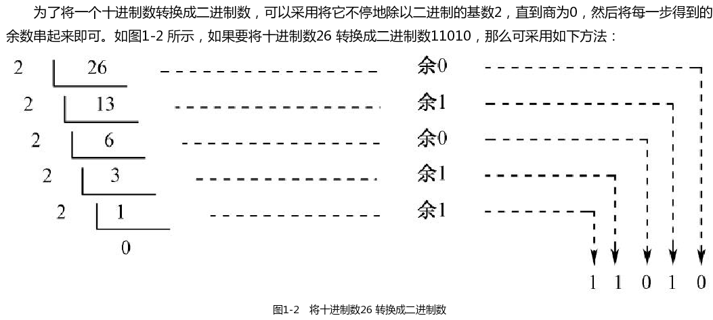
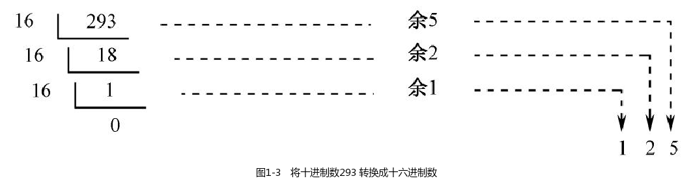
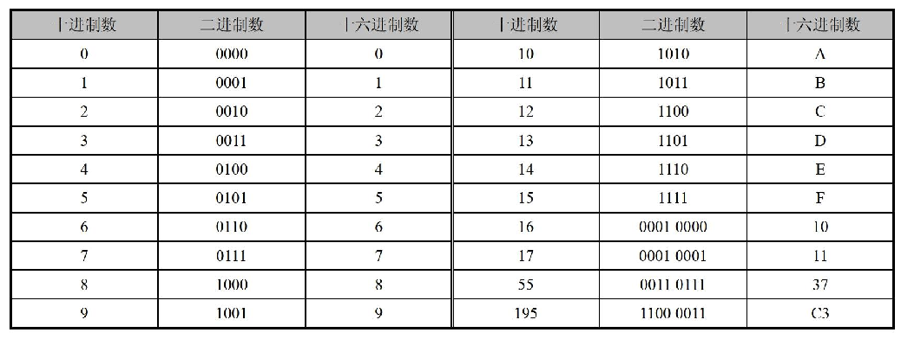

## 二进制计数法回顾

计算机用高、低两种电平的组合来表示数字。如图1-1所示，参与计算的数字通过电线送往计算机器，高电平被认为是“1”，低电平被认为是“0”，这样就形成了一个序列“11111010”，这就是一个二进制数，在数值上等于等于十进制数250。

从数学的角度来看，二进制计数法是现代主流计算机的基础。一方面，它简化了硬件设计，因为它只有两个符号“0”和“1”，要得到它们，可以用最少的电路元件来接通或者关断电路就行了；另一方面，二进制数与我们熟悉的十进制数之间有着一对一的关系，任何一个十进制数都对应着一个二进制数，不管它有多大。

组成二进制数的每一个数位，称为一个比特（bit），而一个二进制数也可以看成是一个比特串。很明显，它的数值越大，这个比特串就越长，这是二进制计数法不好的一面。

### 二进制到十进制的转换

二进制和十进制都是进位计数法。进位计数法的一个特点是，符号的值和它在这个数中所处的位置有关。

10110001B＝1×2^7＋0×2^6＋1×2^5＋1×2^4＋0×2^3＋0×2^2＋0×2^1＋1×2^0＝177D

10110001B 里的“B”表示这是一个二进制数，“D”则表示177 是个十进制数。“B”和“D”分别是英语单词Binary 和Decimal 的头一个字母，这两个单词分别表示二进位和十进位的意思。

### 十进制到二进制的转换

为了将一个十进制数转换成二进制数，可以采用将它不停地除以二进制的基数2，直到商为0，然后将每一步得到的余数串起来即可。如图1-2 所示，如果要将十进制数26 转换成二进制数11010，那么可采用如下方法：

## 十六进制计数法

### 十六进制计数法的原理

为什么要发明十六进制计数法，而不是依旧采用我们熟悉的十进制？

一旦知道二进制有两个数符“0”和“1”，十进制有十个数符“0”到“9”，那么我们就会很自然地认为十六进制一定有16 个数符。

一点没错，完全正确。这16 个数符分别是0、1、2、3、4、5、6、7、8、9、A、B、C、D、E、F。

很显然，一旦某个数位增加到9 之后，下一次，它将变成A，而不是向前进位，因为这里是逢16 才进位的。进位只发生在某个数位原先是F 的情况下，比如1F，它加一后将会变成20

### 十六进制到十进制的转换

125H＝1×16^2＋2×16^1＋5×16^0＝293D

125 后面的“H”用于表明这是一个十六进制数，它是英语单词Hexadecimal 的头一个字母，这个单词的意思是十六进制。

### 十进制到十六进制的转换

### 为什么需要十六进制

如果将一个二进制数从右往左，分成4 比特为一组的形式，分别将每一组的值转换成十六进制数，就可以得到这个二进制数所对应的十六进制数。

如果想保留二进制数的直观性，同时还要求写起来简短，十六进制数是最好的选择。
