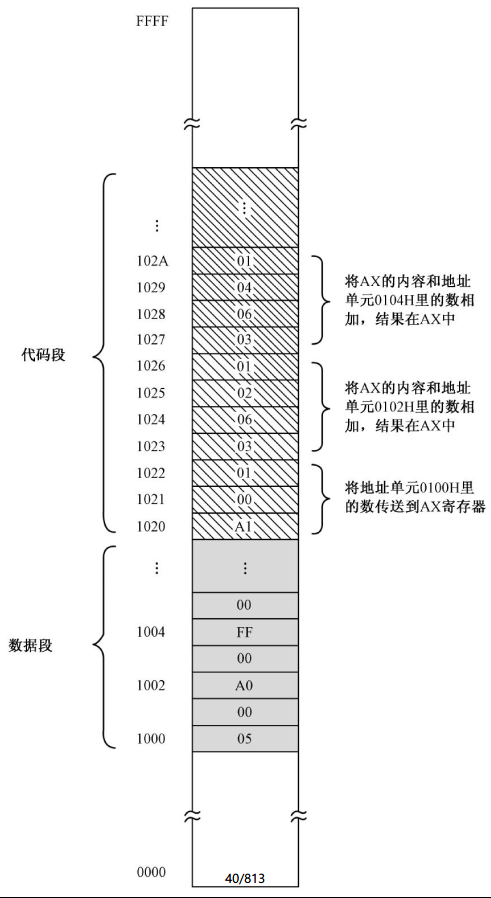
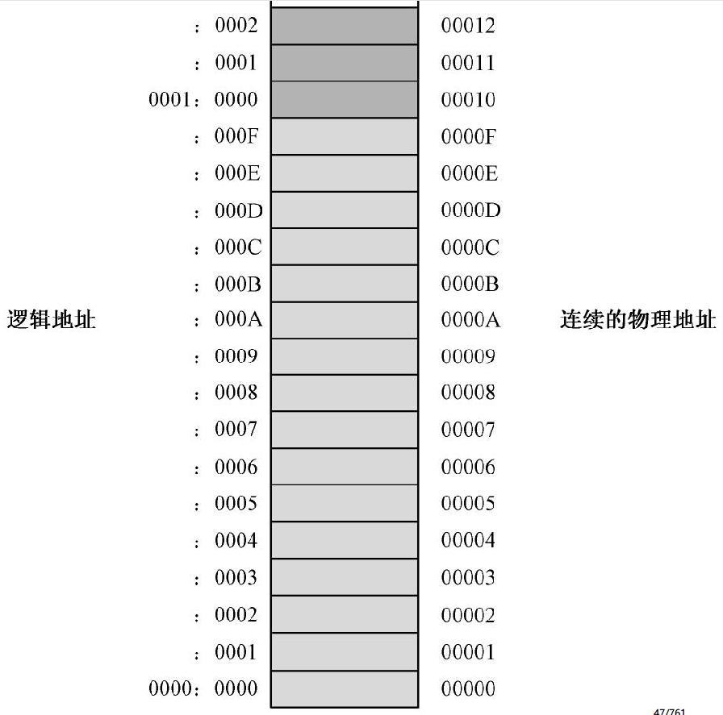

## 处理器

处理器（Processor）是一台电子计算机的核心，它会在振荡器脉冲的激励下，从内存中获取指令，并发起一系列由该指令所定义的操作。当这些操作结束后，它接着再取下一条指令。通常情况下，这个过程是连续不断、循环往复的。

## 寄存器和算术逻辑部件

如图 2-2 所示，在处理器的底部或者四周，有大量的引脚，可以接受从外面来的电信号，或者向外发出电信号。每个引脚都有自己的用处，在往电路板上安装的时候，不能接错。所以，如图中所示，处理器在生产的时候，都会故意缺一个角，这是一个参照标志，可以确保安装的人不会弄错。当然，并不是所有的处理器都会缺一个角，这不是一个固定不变的做法。

处理器的引脚很多，其中有一部分是用来将参与运算的数字送入处理器内部。有些引脚是复用的，假如现在要进行加法运算，那么我们要重复使用这些引脚，来依次将被加数和加数送入。

一旦被加数通过引脚送入处理器，代表这个二进制数字的一组电信号就会出现在与引脚相连的内部线路上。这是一排高低电平的组合，代表着二进制数中的每一位。这时候，必须用一个称为寄存器（Register）的电路锁住。之所以要这样做，是因为相同的引脚和线路马上还要用于输入加数。也正是因为这个原因，这些内部线路称为处理器内部总线。

同样地，加数也要锁进另一个寄存器中。如图 2-2 所示，寄存器 RA 和 RB 将分别锁存参与运算的被加数和加数。此后，RA 和 RB 中的内容不再受外部数据线的影响。

寄存器是双向器件，可以在一端接受输入并加以锁存，同时，它也会在另一端产生一模一样的输出。与寄存器 RA 和 RB 相连的，是算术逻辑单元，或者算术逻辑部件（Arithmetic Logic Unit，ALU），也就是图 2-2 中的桶形部分。它是专门负责运算的电路，可以计算加法、减法或者乘法，也可做逻辑运算。在这里，我们要求它做一次加法。

一旦寄存器 RA 和 RB 锁存了参与运算的两个数，算术逻辑部件就会输出相加的结果，这个结果可以临时用另外一个寄存器 RC 锁存，稍后再通过处理器数据总线送到处理器外面，或者再次送入 RA 或 RB。

处理器内部有一个控制器（图中没有画出），在指令的执行过程中，它负责给各个部件发送控制信号，使各个部件在某个正确的时间点上执行某个动作。同时，它还负责决定在某个时间点上哪个部件有权使用总线，以免彼此发生冲突。

处理器总是很繁忙的，在它操作的过程中，所有数据在寄存器里面都只能是临时存在一会儿，然后再被送往别处，这就是为什么它被叫做“寄存器”的原因。早期的处理器，它的寄存器只能保存 4 比特、8 比特或 16 比特，分别叫做 4 位、8 位和 16 位寄存器。现在的处理器，寄存器一般都是 32 位、64 位甚至更多。

如图 2-3 所示，8 位寄存器可以容纳 8 比特（bit）。

另外，我们还要为这个字节的每一位编上号，编号是从右往左进行的，从 0 开始，分别是 0、1、2、3、4、5、6、7。在这里，位 0（第 1 位）是最低位，在最右边；位 7（第 8 位）是最高位，在最左边。

为了更好地理解上面这些概念，图中假定 8 位寄存器里存放的是二进制数 10001101，即十六进制的 8D。这时，它的最低位和最高位都是 1。

16 位寄存器可以存放 **2 个字节**，这**称为 1 个字**（word），各个数位的编号分别是 0 ～ 15，其中 0 ～ 7 是低字节，8 ～ 15 是高字节。实际上，“字”的概念出现得很早，也并非指 16 个比特。只是到了后来，才**特指 16 个二进制位的长度**。

32 位寄存器可以存放 **4 个字节**，这**称为 1 个双字**（double word），各个数位的编号分别是 0 ～ 31，其中 0 ～ 15 是低字，16 ～ 31 是高字。

## 内存储器

如图 2-4 所示，是计算机内部最主要的存储器，通常只和处理器相连，所以叫做内存储器或者主存储器，简称内存或主存。

如图 2-5 所示，和寄存器不同，内存用于保存更多的比特。内存按字节来组织，单次访问的最小单位是 1 字节，这是最基本的存储单元。如图中所示，每个存储单元中，各位的编号分别是 0 ～ 7。

内存中的每字节都对应着一个地址，如图 2-5 所示，第 1 个字节的地址是 0000H，第 2 个字节的地址是 0001H，第 3 个字节的地址是 0002H，其他以此类推。注意，这里采用的是十六进制表示法。作为一个例子，因为这个内存的容量是 65536 字节，所以最后一个字节的地址是 FFFFH。

为了访问内存，处理器需要给出一个地址。访问包括读和写，为此，处理器还要指明，本次访问是读访问还是写访问。如果是写访问，则还要给出待写入的数据。

8 位处理器包含 8 位的寄存器和算术逻辑部件，16 位处理器拥有 16 位的寄存器和算术逻辑部件，64 位处理器则包含 64 位的寄存器和算术逻辑部件。尽管内存的最小组成单位是字节，但是，经过精心的设计和安排，它能够按字节、字、双字和四字进行访问。换句话说，仅通过**单次访问**就能处理 8 位、16 位、32 位或者 64 位的二进制数。

如图 2-5 所示，处理器发出字长控制信号，以指示本次访问的字长是 8、16、32 还是 64。如果字长是 8，而且给出的地址是 0002H，那么，本次访问只会影响到内存的一字节；如果字长是 16，给出的地址依然是 0002H，那么实际访问的将是地址 0002H 处的一个字，低 8 位在 0002H 中，高 8 位在 0003H 中。

## 指令和指令集

处理器的设计者用某些数来指示处理器所进行的操作，这称为指令（Instruction），或者叫机器指令，因为只有处理器才认得它们。处理器内部有寄存器和负责运算的部件，控制器“分析”一个个指令，然后确定在哪个时间点让哪些部件进行工作。比如，指令 F4H 表示让处理器停机，当处理器取到并执行这条指令后，就停止工作。指令是集中存放在内存里的，一条接着一条，处理器的工作是自动按顺序取出并加以执行。

如图 2-6 所示，从内存地址 0000H 开始（也就是内存地址的最低端）连续存放了一些指令。同时，假定执行这些指令的是一个 16 位处理器，拥有两个 16 位的寄存器 RA 和 RB。

一般来说，指令由操作码和操作数构成，但也有小部分指令仅有操作码，而不含操作数。如图 2-6 所示，停机指令仅包含 1 字节的操作码 F4，而没有操作数。指令的长度不定，短的指令仅有 1 字节，而长的指令则有可能达到 15 字节（对于 INTEL x86 处理器来说）。

对处理器来说，指令的操作码隐含了如何执行该指令的信息，比如它是做什么的，以及怎么去做。第一条指令的操作码是 B8，这表明，该指令是一条传送指令，第一个操作数是寄存器，第二个操作数是直接包含在指令中的，**紧跟在操作码之后，可以立即从指令中取得，所以叫做立即数**（Immediate Operand）。同时，操作码还直接指出该寄存器是 RA。RA 是 16 位寄存器，这条指令将按字进行操作。所以，当这条指令执行之后，该指令的操作数（立即数）005DH 就被传送到 RA 中。

既然操作码中隐含了这么多的信息，那么，处理器就可以“知道”每条指令的长度。这样，当它执行第一条指令 B8 5D 00 的时候，就已经知道，这是一个 3 字节指令，下一条指令位于 3 个字节之后，即内存地址 0003H 处。

注意字数据在内存中的存放特点。地址 0001H 和 0002H 里的内容分别是 5D 和 00，如果每次读一个字节，则从地址 0001H 里读出的是 5D，从 0002H 里读出的是 00。但如果以字的方式来访问地址 0001H，读到的就会是 005DH。这种差别，跟处理器和内存之间的数据线连接方式有关。对于 Intel 处理器来说，如果访问内存中的一个字，那么，它规定高字节位于高地址部分，低字节位于低地址部分，这称为**低端字节序**（Little Endian）。

对于复杂一些的指令来说，1 个字节的操作码可能不会够用。所以，第 2 条指令的操作码为 8B 1E，它隐含的意思是，这是一条传送指令，第一个操作数是寄存器，而且是 RB 寄存器，第二个操作数是内存地址，要传送到 RB 寄存器中的数存放在该地址中。同时，这是一个字操作指令，应当从第二个操作数指定的地址中取出一个字。

该指令的操作数部分是 3F 00，指定了一个内存地址 003FH。它相当于高级语言里的指针，当处理器执行这条指令时，会再次用 003FH 作为地址去访问内存，从那里取出一个字（1002H），然后将它传送到寄存器 RB。注意，“传送”这个词带有误导性。其实，传送的意思更像是“复制”，传送之后，003FH 单元里的数据还保持原样。

通过这两条指令的比较，很容易分清指令中的“立即数”是什么意思。指令执行和操作的对象是数。如果这个数已经在指令中给出了，不需要再次访问内存，那这个数就是立即数，比如第一条指令中的 005DH ；相反，如果指令中给出的是地址，真正的数还需要用这个地址访问内存才能得到，那它就不能称为立即数，比如第二条指令中的 003FH。

如图 2-6 所示，余下的三条指令同理。如果一开始内存地址 003FH 中存放的是 1002H，那么，当所有这些指令执行完后，003FH 里就是最终的结果 105FH。

指令和非指令的普通二进制数是一模一样的，在组成内存的电路中，都是一些高低电平的组合。因为处理器是自动按顺序取指令并加以执行的，在指令中混杂了非指令的数据会导致处理器不能正常工作。为此，指令和数据要分开存放，分别位于内存中的不同区域，**存放指令的区域叫代码区，存放数据的区域叫数据区**。

并非每一个二进制数都代表着一条指令。每种处理器在设计的时候，也只能拥有有限的指令，从几十条到几百条不等。一个处理器能够识别的指令的集合，称为该处理器的指令集。

## 古老的8086处理器

8086 是 Intel 公司第一款 16 位处理器，诞生于 1978 年。

### 8086 的通用寄存器

8086 处理器内部有 8 个 16 位的通用寄存器，分别被命名为 AX、BX、CX、DX、SI、DI、BP、SP。“通用”的意思是，它们之中的大部分都可以根据需要用于多种目的。

如图 2-7 所示，因为这 8 个寄存器都是 16 位的，所以通常用于进行 16 位的操作。比如，可以在这 8 个寄存器之间互相传送数据，它们之间也可以进行算术逻辑运算；也可以在它们和内存单元之间进行 16 位的数据传送或者算术逻辑运算。

同时，如图 2-7 所示，这 8 个寄存器中的前 4 个，即 AX、BX、CX 和 DX，又各自可以拆分成两个 8 位的寄存器来使用，总共可以提供 8 个 8 位的寄存器 AH、AL、BH、BL、CH、CL、DH 和 DL。这样一来，当需要在寄存器和寄存器之间，或者寄存器和内存单元之间进行 8 位的数据传送或者算术逻辑运算时，使用它们就很方便。

将一个 16 位的寄存器当成两个 8 位的寄存器来用时，对其中一个 8 位寄存器的操作不会影响到另一个 8 位寄存器。举个例子来说，当你操作寄存器 AL 时，不会影响到 AH 中的内容。

### 程序的重定位难题

处理器是自动化的器件，在给出了起始地址之后，它将从这个地址开始，自动地取出每条指令并加以执行。只要每条指令都正确无误，它就能准确地知道下一条指令的地址。这就意味着，**完成某个工作的所有指令，必须集中在一起，处于内存的某个位置，形成一个段，叫做代码段**。要是指令并没有一条挨着一条存放，中间夹杂了其他非指令的数据，处理器将因为不能识别而出错。

为了做某件事而编写的指令，它们一起形成了我们平时所说的程序。程序总要操作大量的数据，这些**数据也应该集中在一起，位于内存中的某个地方，形成一个段，叫做数据段**。

段的划分是逻辑上的，从本质上来说，是如何看待和组织内存中的数据。

段在内存中的位置并不重要，因为处理器是可控的，我们可以让它从内存的任何位置开始取指令并加以执行。这里有一个例子，如图2-8 所示，我们有一大堆数字，现在想把它们加起来求出一个总和。

假定我们有 16 个数要相加，这些数都是 16 位的二进制数，分别是 0005H、00A0H、00FFH、…。为了让处理器把它们加起来，我们应该先在内存中定义一个数据段，将这些数字写进去。数据段可以起始于内存中的任何位置，既然如此，我们将它定在 0100H 处。这样一来，第一个要加的数位于地址 0100H，第二个要加的数位于地址 0102H，最后一个数的地址是 011EH。

一旦定义了数据段，我们就知道了每个数的内存地址。然后，紧挨着数据段，我们从内存地址 0120H 处定义代码段。严格地说，数据段和代码段是不需要连续的，但这里把它们挨在一起更自然一些。为了区别数据段和代码段，我们使用了不同的底色。

代码段是从内存地址 0120H 处开始的，第一条指令是 A1 00 01，其功能是将内存单元 0100H 里的字传送到 AX 寄存器。指令执行后，AX 的内容为 0005H。

第二条指令是 03 06 02 01，功能是将 AX 中的内容和内存单元 0102H 里的字相加，结果在 AX 中。由于 AX 的内容为 0005H，而内存地址 0102H 里的数是 00A0H，这条指令执行后，AX 的内容为 00A5H。

第三条指令是 03 06 04 01，功能是将 AX 中的内容和内存单元 0104H 里的字相加，结果在 AX 中。此时，由于 AX 里的内容是 00A5H，内存地址 0104H 里的数是 00FFH，本指令执行后，AX 的内容为 01A4H。

后面的指令没有列出，但和前 2 条指令相似，依次用 AX 的内容和下一个内存单元里的字相加，一直到最后，在 AX 中得到总的累加和。在这个例子中，我们没有考虑 AX 寄存器容纳不下结果的情况。当累加的总和超出了 AX 所能表示的数的范围（最大为 FFFFH，即十进制的 65535）时，就会产生进位，但这个进位被丢弃。

在内存中定义了数据段和代码段之后，我们就可以命令处理器从内存地址 0120H 处开始执行。当所有的指令执行完后，就能在 AX 寄存器中得到最后的结果。

在前面的例子中，所有在执行时需要访问内存单元的指令，使用的都是真实的内存地址。比如 A1 00 01，这条指令的意思是从地址为 0100H 的内存单元里取出一个字，并传送到寄存器 AX。在这里，0100H 是一个真实的内存地址，又称物理地址。

整个程序（包括代码段和数据段）在内存中的位置，是由我们自己定的。我们把数据段定在 0100H，把代码段定在 0120H。

问题是，大多数时候，整个程序（包括代码段和数据段）在内存中的位置并不是我们能够决定的。在内存中被加载的位置完全是随机的，哪里有空闲的地方，它就会被加载到哪里，并从那里开始被处理器执行。

同样是那个程序，一旦它在内存中的位置发生了改变，灾难就出现了。

如图 2-9 所示，因为程序现在是从内存地址 1000H 处被加载的，所以，数据段的起始地址为 1000H。这就是说，第一个要加的数，其地址为 1000H，第二个则为 1002H，其他以此类推。代码段依然紧挨着数据段之后，起始地址相应地是 1020H。

只要所有的指令都是连续存放的，代码段位于内存中的什么地方都可以正常执行。所以，处理器可以按你的要求，从内存地址 1020H 处连续执行，但结果完全不是你想要的。

请看第一条指令 A1 00 01，它的意思是从内存地址 0100 处取得一个字，将其传送到寄存器 AX。但是，由于程序刚刚改变了位置，它要取的那个数，现在实际上位于 1000H，它取的是别人地盘里的数！

发生这样的事情，是因为我们在指令中使用了绝对内存地址（物理地址），这样的程序是无法重定位的。为了让程序可以在内存中的任何地方正确执行，就只能在编写程序的时候使用相对地址或者逻辑地址了，而不能使用真实的物理地址。当程序加载时，这些相对地址还要根据程序实际被加载的位置重新计算。

在任何时候，程序的重定位都是非常棘手的事情。

### 内存分段机制

如图 2-10 所示，整个内存空间就像长长的纸条，在内存中分段，就像从长纸条中裁下一小段来。根据需要，段可以开始于内存中的任何位置，比如图中的内存地址 A532H 处。

在这个例子中，分段开始于地址为 A532H 的内存单元处，这个起始地址就是段地址。

这个分段包含了 6 个存储单元。在分段之前，它们在整个内存空间里的物理地址分别是 A532H、A533H、A534H、A535H、A536H、A537H。

但是，在分段之后，它们的地址可以只相对于自己所在的段。这样，它们相对于段开始处的距离分别为 0、1、2、3、4、5，这叫做偏移地址。

于是，当采用分段策略之后，一个内存单元的地址实际上就可以用“段:偏移”或者“段地址:偏移地址”来表示，这就是通常所说的逻辑地址。比如，在图 2-10 中，段内第 1 个存储单元的地址为 `A532H:0000H`，第 3 个存储单元的地址为 `A532H:0002H`，而本段最后一个存储单元的地址则是 `A532H:0005H`。

为了在硬件一级提供对“段地址:偏移地址”内存访问模式的支持，处理器至少要提供两个段寄存器，分别是代码段寄存器（Code Segment，CS）和数据段寄存器（Data Segment，DS）。

对 CS 内容的改变将导致处理器从新的代码段开始执行。同样，在开始访问内存中的数据之前，也必须首先设置好 DS 寄存器，使之指向数据段。

除此之外，最重要的是，当处理器访问内存时，它把指令中指定的内存地址看成是段内的偏移地址，而不是物理地址。这样，一旦处理器遇到一条访问内存的指令，它将把 DS 中的数据段起始地址和指令中提供的段内偏移相加，来得到访问内存所需要的物理地址。

如图 2-11 所示，代码段的段地址为 1020H，数据段的段地址为 1000H。在代码段中有一条指令 A1 02 00，它的功能是将地址 0002H 处的一个字传送到寄存器 AX。在这里，处理器将 0002H 看成是段内的偏移地址，段地址在 DS 中，应该在执行这条指令之前就已经用别的指令传送到 DS 中了。

当执行指令 A1 02 00 时，处理器将把 DS 中的内容和指令中指定的偏移地址 0002H 相加，得到 1002H。这是一个物理地址，处理器用它来访问内存，就可以得到所需要的数 00A0H。

如果一下次执行这个程序时，代码段和数据段在内存中的位置发生了变化，只要把它们的段地址分别传送到 CS 和 DS，它也能够正确执行。

### 8086的内存分段机制

如图 2-12 所示，8086 内部有 8 个 16 位的通用寄存器，分别是 AX、BX、CX、DX、SI、DI、BP、SP。其中，前四个寄存器中的每一个，都还可以当成两个 8 位的寄存器来使用，分别是 AH、AL、BH、BL、CH、CL、DH、DL。

在进行数据传送或者算术逻辑运算的时候，使用算术逻辑部件（ALU）。比如，将 AX 的内容和 CX 的内容相加，结果仍在 AX 中，那么，在相加的结果返回到 AX 之前，需要通过一个叫数据暂存器的寄存器中转。

处理器能够自动运行，这是控制器的功劳。为了加快指令执行速度，8086 内部有一个 6 字节的指令预取队列，在处理器忙着执行那些不需要访问内存的指令时，指令预取部件可以趁机访问内存预取指令。这时，多达 6 个字节的指令流可以排队等待解码和执行。

8086 内部有 4 个**段寄存器**。

- CS 是**代码段寄存器**。
- DS 是**数据段寄存器**。
- ES 是**附加段（Extra Segment）寄存器**。附加段的意思是，当需要在程序中同时使用**两个数据段**时，DS 指向一个，ES 指向另一个。可以在指令中指定使用 DS 和 ES 中的哪一个，如果没有指定，则默认是使用 DS。
- SS 是**栈段寄存器**。

通用寄存器特殊用途：

- BX **基址寄存器**（Base Address Register）。
- AX **累加器**（Accumulator）。
- CX **计数器**（Counter）。
- DX **数据（Data）寄存器**。
- SI **源索引寄存器**（Source Index）。
- DI  **目标索引寄存器**（Destination Index）。
- SP **栈指针寄存器**（Stack Pointer）指示下一个数据应当压入栈内的什么位置，或者数据从哪里出栈。

IP 是**指令指针（Instruction Pointer）寄存器**，它只和 CS 一起使用，而且只有处理器才能直接改变它的内容。

当一段代码开始执行时，**CS 指向代码段的起始地址**，**IP 则指向段内偏移**。这样，**由 CS 和 IP 共同形成逻辑地址**，并由总线接口部件变换成物理地址来取得指令。然后，处理器会自动根据当前指令的长度来改变 IP 的值，使它指向下一条指令。

当然，如果在指令的执行过程中需要访问内存单元，那么，处理器将用 DS 的值和指令中提供的偏移地址相加，来形成访问内存所需的物理地址。

8086 的段寄存器和 IP 寄存器都是 16 位的，如果按照原先的方式，把段寄存器的内容和偏移地址直接相加来形成物理地址的话，也只能得到 16 位的物理地址。麻烦的是，8086 却提供了 20 根地址线。换句话说，它提供的是 20 位的物理地址。

提供 20 位地址线的原因很简单，16 位的物理地址只能访问 64KB 的内存，地址范围是 0000H ～ FFFFH，共 65536 个字节。这样的容量，即使是在那个年代，也显得捉襟见肘。注意，这里提到了一个表示内存容量的单位“KB”。为了方便，我们通常使用更大的单位来描述内存容量，比如千字节（KB）、兆字节（MB）和吉字节（GB）。

所以，65536 个字节就是 64KB，而 20 位的物理地址则可以访问多达 1MB 的内存，地址范围从 00000H 到 FFFFFH。问题是，16 位的段地址和 16 位的偏移地址相加，只能形成 16 位的物理地址，怎么得到这 20 位的物理地址呢？

为了解决这个问题，8086 处理器在形成物理地址时，**先将段寄存器的内容左移 4 位（相当于乘以十六进制的 10，或者十进制的 16），形成 20 位的段地址，然后再同 16 位的偏移地址相加，得到 20 位的物理地址**。比如，对于逻辑地址 `F000H:052DH`，处理器在形成物理地址时，将段地址 F000H 左移 4 位，变成 F0000H，再加上偏移地址 052DH，就形成了 20 位的物理地址 F052DH。

这样，因为段寄存器是 16 位的，在段不重叠的情况下，最多可以将 1MB 的内存分成 65536 个段，段地址分别是 0000H、0001H、0002H、0003H，……，一直到 FFFFH。在这种情况下，如图 2-13 所示，每个段正好 16 个字节，偏移地址从 0000H 到 000FH。

同样在不允许段之间重叠的情况下，每个段的最大长度是 64KB，因为偏移地址也是 16 位的，从 0000H 到 FFFFH。在这种情况下，1MB 的内存，最多只能划分成 16 个段，每段长 64KB，段地址分别是 0000H、1000H、2000H、3000H，…，一直到 F000H。

以上所说的只是两种最典型的情况。通常情况下，段地址的选择取决于内存中哪些区域是空闲的。举个例子来说，假如从物理地址 00000H 开始，一直到 82251H 处都被其他程序占用着，而后面一直到 FFFFFH 的地址空间都是自由的，那么，你可以从物理内存地址 82251H 之后的地方加载你的程序。

接着，你的任务是定义段地址并设置处理器的段寄存器，其中最重要的是段地址的选取。因为偏移地址总是要求从 0000H 开始，而 82260H 是第一个符合该条件的物理地址，因为它恰好对应着逻辑地址 `8226H:0000H`，符合偏移地址的条件，所以完全可以将段地址定为 8226H。

但是，举个例子来说，如果你从物理内存地址 82255H 处加载程序，由于它根本无法表示成一个偏移地址为 0000H 的逻辑地址，所以不符合要求，段不能从这里开始划分。这里面的区别在于，82260H 可以被十进制数 16（或者十六进制数 10H）整除，而 82255H 不能。通过这个例子可以看出，8086 处理器的逻辑分段，起始地址都是 16 的倍数，这称为是按 16 字节对齐的。

段的划分是自由的，它可以起始于任何 16 字节对齐的位置，也可以是任意长度，只要不超过 64KB。比如，段地址可以是 82260H，段的长度可以是 64KB。在这种情况下，该段所对应的逻辑地址范围是 `8226H:0000H ～ 8226H:FFFFH`，其所对应的物理地址范围是 82260 ～ 9225FH。

同时，正是由于段的划分非常自由，使得 8086 的内存访问也非常随意。同一个物理地址，或者同一片内存区域，根据需要，可以随意指定一个段来访问它，前提是那个物理地址位于该段的 64KB 范围内。也就是说，**同一个物理地址，实际上对应着多个逻辑地址**。
