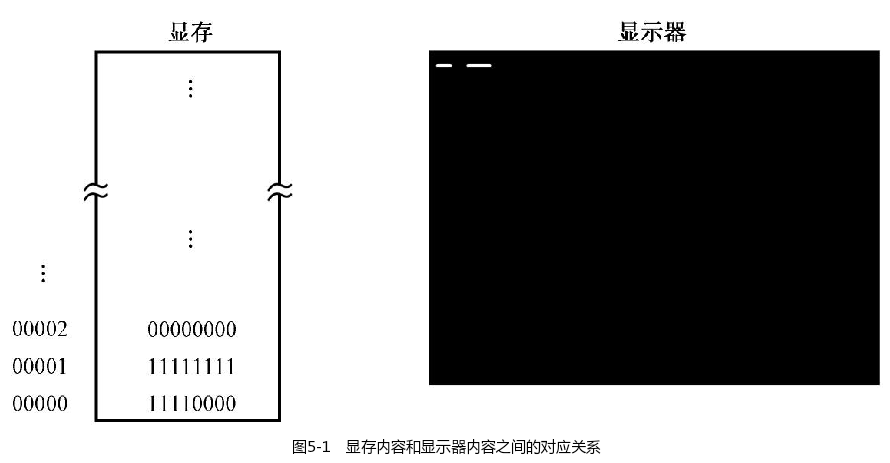
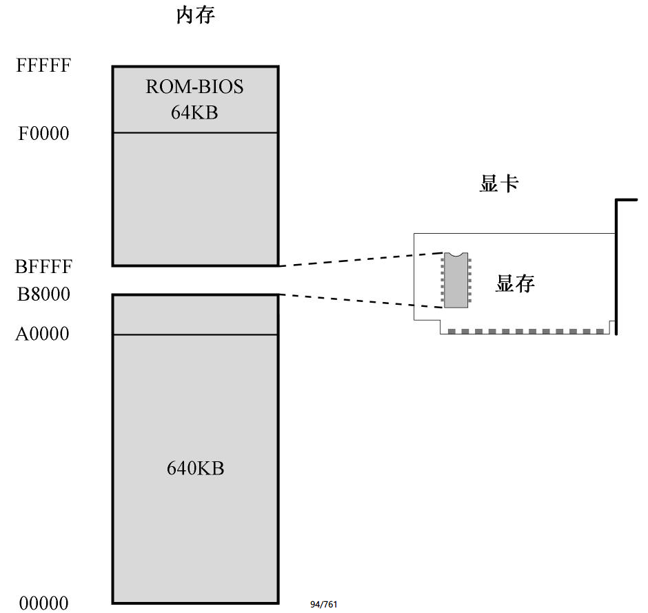
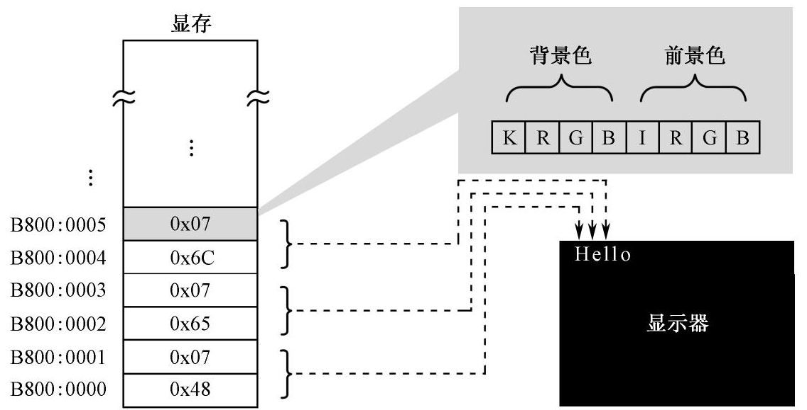
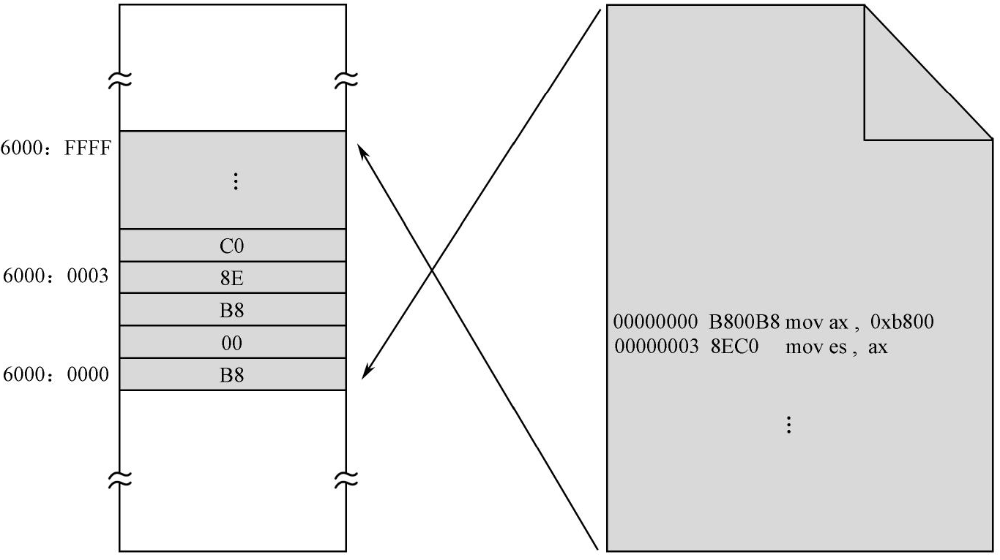
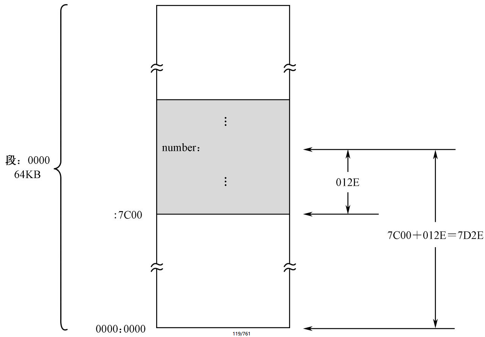
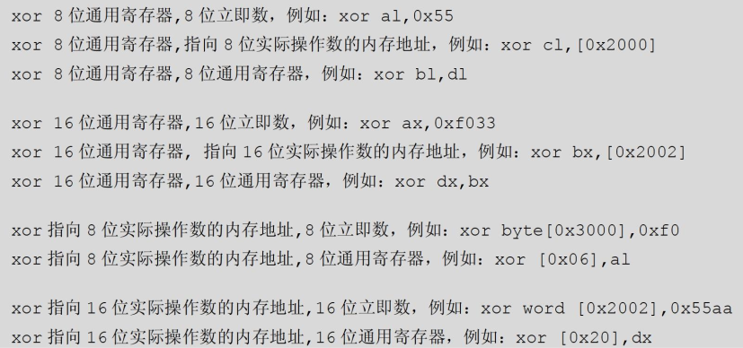
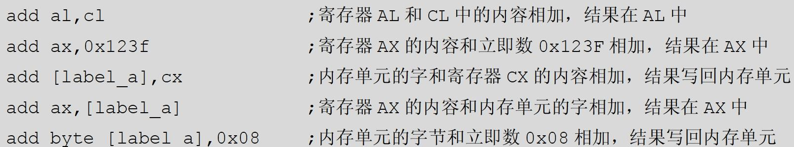

## 主引导扇区

处理器加电或者复位之后，如果硬盘是首选的启动设备，那么，ROM-BIOS 将试图读取硬盘的 0 面 0 道 1 扇区。传统上，这就是主引导扇区（Main Boot Sector，MBR）。

读取的主引导扇区数据有 512 字节，ROM-BIOS 程序将它加载到逻辑地址 `0x0000:0x7c00` 处，也就是物理地址 `0x07c00` 处，然后判断它是否有效。

一个有效的主引导扇区，其最后两字节应当是 `0x55` 和 `0xAA`。ROM-BIOS 程序首先检测这两个标志，如果主引导扇区有效，则以一个段间转移指令 `jmp 0x0000:0x7c00` 跳到那里继续执行。

一般来说，主引导扇区是由操作系统负责的。正常情况下，一段精心编写的主引导扇区代码将检测用来启动计算机的操作系统，并计算出它所在的硬盘位置。然后，它把操作系统的自举代码加载到内存，也用 jmp 指令跳转到那里继续执行，直到操作系统完全启动。

在本章中，我们将试图写一段程序，把它编译之后写入硬盘的主引导扇区，然后让处理器执行。当然，仅仅执行还不够，还必须在屏幕上显示点什么，要不然的话，谁知道我们的程序是不是成功运行了呢？

## 注释

注释必须以英文字母“;”开始。在源程序编译阶段，编译器将忽略所有注释。因此，在编译之后，这些和生成机器代码无关的内容都统统消失了。

## 在屏幕上显示文字

### 显卡和显存

为了显示文字，通常需要两种硬件，一是显示器，二是显卡。显卡的职责是为显示器提供内容，并控制显示器的显示模式和状态，显示器的职责是将那些内容以视觉可见的方式呈现在屏幕上。

显卡控制显示器的最小单位是像素，一个像素对应着屏幕上的一个点。屏幕上通常有数十万乃至更多的像素，通过控制每个像素的明暗和颜色，我们就能让这大量的像素形成文字和美丽的图像。

显卡都有自己的存储器，因为它位于显卡上，故称显示存储器（Video RAM：VRAM），简称显存，**要显示的内容都预先写入显存**。和其他半导体存储器一样，显存并没有什么特殊的地方，也是一个**按字节访问的存储器件**。

对显示器来说，显示黑白图像是最简单的，因为只需要控制每个像素是亮，还是不亮。如果把不亮当成比特“0”，亮看成比特“1”，那就好办了。因为，只要将显存里的每个比特和显示器上的每个像素对应起来，就能实现这个目标。

如图 5-1 所示，显存的第 1 个字节对应着屏幕左上角连续的 8 个像素；第 2 个字节对应着屏幕上后续的 8 个像素，后面的以此类推。



显卡的工作是周期性地从显存中提取这些比特，并把它们按顺序显示在屏幕上。如果是比特“0”，则像素保持原来的状态不变，因为屏幕本来就是黑的；如果是比特“1”，则点亮对应的像素。

继续观察图 5-1，假设显存中，第 1 个字节的内容是 11110000，第 2 个字节的内容是 11111111，其他所有的字节都是 00000000。在这种情况下，屏幕左上角先是显示 4 个亮点，再显示 4 个黑点，然后再显示 8 个亮点。因为像素是紧挨在一起的，所以我们看到的先是一条白短线，隔着一定距离（4 个像素）又是一条白长线。

黑色和白色只需要 1 个比特就能表示，但要显示更多的颜色，1 个比特就不够了。现在最流行的，是用 24 个比特，即 3 个字节，来对应一个像素。因为 2^24 = 16777216，所以在这种模式下，同屏可以显示16777216 种颜色，这称为真彩色。

上面所讨论的，是人们常说的图形模式。图形模式是最容易理解的，同时对显示器来说也是最自然的模式。

操作显存里的比特，使得屏幕上能显示出字符的形状，是非常麻烦、非常繁重的工作，因为你必须计算该字符所对应的比特位于显存里的什么位置。

为了方便，工程师们想出了一个办法。就像一个二进制数既可以是一个普通的数，也可以代表一条处理器指令一样，他们认为每个字符也可以表示成一个数。比如，数字 0x4C 就代表字符“L”，这个数被称为是字符“L”的 ASCII 代码，后面会讲到。

如图 5-2 所示，可以将字符的代码存放到显存里，第 1 个代码对应着屏幕左上角第 1 个字符，第 2 个代码对应着屏幕左上角第 2 个字符，后面的以此类推。剩下的工作是如何用代码来控制屏幕上的像素，使它们或明或暗以构成字符的轮廓，这是字符发生器和控制电路的事情。


传统上，这种专门用于显示字符的工作方式称为文本模式。文本模式和图形模式是显卡的两种基本工作模式，可以用指令访问显卡，设置它的显示模式。在不同的工作模式下，显卡对显存内容的解释是不同的。

为了给出要显示的字符，处理器需要访问显存，把字符的ASCII 码写进去。但是，显存是位于显卡上的，访问显存需要和显卡这个外围设备打交道。为了实现一些快速的游戏动画效果，或者播放高码率的电影，不直接访问显存是办不到的。

为此，计算机系统的设计者们，这些敢想敢干的人，决定把显存映射到处理器可以直接访问的地址空间里，也就是内存空间里。

如图 5-3 所示，我们知道，8086 可以访问 1MB 内存。其中，0x00000 ～ 9FFFF 属于常规内存，由内存条提供； 0xF0000 ～ 0xFFFFF 由主板上的一个芯片提供，即 ROM-BIOS。



这样一来，中间还有一个 320KB 的空洞，即 0xA0000 ～ 0xEFFFF。传统上，这段地址空间由特定的外围设备来提供，其中就包括显卡。因为显示功能对于现代计算机来说实在是太重要了。

由于历史的原因，所有在个人计算机上使用的显卡，在加电自检之后都会把自己初始化到 80 × 25 的文本模式。在这种模式下，屏幕上可以显示 25 行，每行 80 个字符，每屏总共 2000 个字符。

所以，如图 5-3 所示，一直以来，0xB8000 ～ 0xBFFFF 这段物理地址空间，是留给显卡的，由显卡来提供，用来显示文本。除非显卡出了毛病，否则这段空间总是可以访问的。如果显卡出了毛病怎么办呢？很简单，计算机一定不会通过加电自检过程，这就是传说中的严重错误，计算机是无法启动的，更不要说加载并执行主引导扇区的内容了。

### 初始化段寄存器

和访问主内存一样，为了访问显存，也需要使用逻辑地址，也就是采用“段地址：偏移地址”的形式，这是处理器的要求。考虑到文本模式下显存的起始物理地址是 0xB8000，这块内存可以看成是段地址为 0xB800，偏移地址从 0x0000 延伸到 0xFFFF 的区域，因此我们可以把段地址定为 0xB800。

访问内存可以使用段寄存器 DS，但这不是强制性的，也可以使用 ES。因为 DS 还有别的用处，所以在这里我们使用 ES 来指向显存所在的段。

源程序第 6、7 行，首先把立即数 0xB800 传送到 AX，然后再把 AX 的值传送到 ES。这样，附加段寄存器 ES 就指向 0xB800 段（段基地址为 0xB800）。

你可能会想，为什么不直接这样写：

```
mov es, 0xb800
```

而要用寄存器AX 来中转呢？

原因是不存在这样的指令，Intel 的处理器不允许将一个立即数传送到段寄存器，它只允许这样的指令：

```
mov 段寄存器, 通用寄存器
mov 段寄存器, 内存单元
```

没有人能够说清楚这里面的原因，Intel 公司似乎也从没有提到过这件事，尽管从理论上，这是可行的。我们只能想，也许 Intel 是出于好心，避免我们无意中犯错，毕竟，段地址一旦改变，后面对内存的访问都会受到影响。理论上，麻烦一点的方法，可以保证你确实知道自己在做什么。

### 显存的访问和ASCII代码

一旦将显存映射到处理器的地址空间，那么，我们就可以使用普通的传送指令（mov）来读写它，这无疑是非常方便的，但需要首先将它作为一个段来看待，并将它的基地址传送到段寄存器。

为此，源程序的第 10、11 行，我们把 0xB800 作为段地址传送到附加段寄存器 ES，以后就用 ES 来读写显存。这样，段内偏移为 0 的位置就对应着屏幕左上角的字符。

在计算机中，每个用来显示在屏幕上的字符，都有一个二进制代码。这些代码和普通的二进制数字没有什么不同，唯一的区别在于，发送这些数字的硬件和接收这些数字的硬件把它们解释为字符，而不是指令或者用于计算的数字。

这就是说，在计算机中，所有的东西都是无差别的数字，它们的意义，只取决于生成者和使用者之间的约定。为了在终端和大型主机，以及主机和打印机、显示器之间交换信息，1967 年，美国国家标准学会制定了美国信息交换标准代码（American Standard Code for Information Interchange，ASCII），如表 5-1 所示。


值得注意的是，ASCII 是 7 位代码，只用了一个字节中的低 7 比特，最高位通常置 0。这意味着，ASCII 只包含 128 个字符的编码。所以，在表中，水平方向给出了代码的高 3 比特，而垂直方向给出了代码的低 4 比特。比如字符“*”，它的代码是二进制数的 010 1010，即 0x2A。

ASCII 表中有相当一部分代码是不可打印和显示的，它们用于控制通信过程。比如，LF 是换行； CR 是回车； DEL 和 BS 分别是删除和退格，在我们平时用的键盘上也是有的； BEL 是振铃（使远方的终端响铃，以引起注意）； SOH 是文头； EOT 是文尾； ACK 是确认，等等。

屏幕上的每个字符对应着显存中的两个连续字节，前一个是字符的 ASCII 代码，后面是字符的显示属性，包括字符颜色（前景色）和底色（背景色）。如图 5-4 所示，字符“H”的 ASCII 代码是 0x48，其显示属性是 0x07 ；字符“e”的 ASCII 代码是 0x65，其显示属性是 0x07。

如图 5-4 所示，字符的显示属性（1 字节）分为两部分，低 4 位定义的是前景色，高 4 位定义的是背景色。色彩主要由 R、G、B 这 3 位决定，毕竟我们知道，可以由红（R）、绿（G）、蓝（B）三原色来配出其他所有颜色。K 是闪烁位，为 0 时不闪烁，为 1 时闪烁； I 是亮度位，为 0 时正常亮度，为 1 时呈高亮。表 5-2 给出了背景色和前景色的所有可能值。




从表 5-2 来看，图 5-4 中的字符属性 0x07 可以解释为黑底白字，无闪烁，无加亮。

你可能觉得奇怪，当屏幕上一片漆黑，什么内容都没有的时候，显存里会是什么内容呢？

实际上，这个时候，屏幕上显示的全是黑底白字的空白字符，也叫空格字符（Space），ASCII 代码是 0x20，当你用大拇指按动键盘上最长的那个键时，就产生这个字符。因为它是空白，自然就无法在黑底上看到任何痕迹了。

### 显示字符

从源程序的第 10 行开始，到第 35 行，目的是显示一串字符“Label offset :”。为此，需要把它们每一个的 ASCII 码顺序写到显存中。

为了方便，多数汇编语言编译器允许在指令中直接使用字符的字面值来代替数值形式的 ASCII 码，比如源程序第 10 行：

```
mov byte [es:0x00],'L'
```

这等效于

```
mov byte [es:0x00],0x4c
```

在指令中使用字符的字面值，这个字符必须用引号围起来，就像上面一样。在源程序的编译阶段，汇编语言编译器会将它转换成 ASCII 码的形式。

当前的 mov 指令是将立即数传送到内存单元，目的操作数是内存单元，源操作数是立即数（ASCII 代码）。为了访问内存单元，需要给出段地址和偏移地址。在这条指令中，偏移地址 0x00，段地址在哪里呢？一般情况下，如果没有附加任何指示，段地址默认在段寄存器 DS 中。比如：

```
mov byte [0x00],'L'
```

当执行这条指令后，处理器把段寄存器DS 的内容左移4 位（相当于乘以十进制数16 或者十六进制数0x10），加上这里的偏移地址0x00，就得到了物理地址。

但是实际上，在我们的程序中，显存的段地址位于段寄存器ES 中，我们希望使用ES 来访问内存。因此，这里使用了段超越前缀“es:”。这就是说，我们明确要求处理器在生成物理地址时，使用段寄存器ES，而不是默认情况下的DS。

因为指令中给出的偏移地址是0x00，且ES 的值已经在前面被设为0xB800，故它指向ES 段中，偏移地址为0 的内存单元，即0xB800:0x0000，也就是物理地址0xB8000，这个内存单元对应着屏幕左上角第一个字符的位置。

还需要注意的是，因为目的操作数给出的是一个内存地址，我们要用源操作数来修改这个地址里的内容，所以，目的操作数必须用方括号围起来，以表明它是一个地址，处理器应该用这个地址再次访问内存，将源操作数写进这个单元。实际上，这类似于高级语言里的指针。

最后，关键字“byte”用来修饰目的操作数，指出本次传送是以字节的方式进行的。在 16 位的处理器上，单次操作的数据宽度可以是 8 位，也可以是 16 位。到底是 8 位，还是 16 位，可以根据目的操作数或者源操作数来判断。遗憾的是，在这里，目的操作数是偏移地址 0x00，它可以是字节单元，也可以是字单元，到底是哪一种，无法判断；而源操作数呢，是立即数 0x4C，它既可以解释为 8 位的 0x4C，也可以解释为 16 位的 0x004C。在这种情况下，编译器将无法搞懂你的真实意图，只能报告错误，所以必须用“byte”或者“word”进行修饰（明确指示）。于是，一旦目的操作数被指明是“byte”的，那么，源操作数的宽度也就明确了。相反地，下面的指令就不需要任何修饰：

```
mov [0x00],a1 ;按字节操作
mov al,[0x02] ;按字操作
```

因为屏幕上的一个字符对应着内存中的两个字节：ASCII 代码和属性，所以，源程序第 11 行的功能是将属性值 0x07 传送到下一个内存单元，即偏移地址 0x01 处。这个属性可以解释为黑底白字，无闪烁，也无加亮，请参阅表 5-2。

后面，从第 12 行开始，到第 35 行，用于向显示缓冲区填充剩余部分的字符。注意，在这个过程中，偏移地址一直是递增的。

### MOV指令的格式

mov 指令用于数据传送。既然是数据传送，那么，目的操作数的作用应该相当于一个“容器”，故必须是通用寄存器或者内存单元；源操作数呢，也可以是和目的操作数具有相同数据宽度的通用寄存器和内存单元，还可以是立即数。传送指令只影响目的操作数的内容，不改变源操作数的内容。比如：

```
mov ah,bh
mov ax,dx
```

以上，第一条指令的目的操作数和源操作数都是8 位寄存器，指令执行后，寄存器AH 的内容和BH 相同；第二条指令的目的操作数和源操作数都是16 位寄存器，指令执行后，寄存器AX的内容和DX 相同。但是，由于数据宽度不同，下面这条指令就是错误的：

```
mov ax,bl
```

再来看下面两条指令：

```
mov [0x02],bh
mov ax,[0x06]
```

以上，第一条指令是把寄存器BL 中的内容传送到偏移地址为0x02 的8 位内存单元；第二条指令是把偏移地址为0x06 的16 位内存单元里的内容传送到寄存器AX 中。由于这两条指令中都有寄存器操作数，故不需要用“byte”或者“word”来修饰。

传送指令的源操作数也可以是立即数。比如：

```
mov ah,0x05
mov word [0x1c], 0xf000
```

以上，第一条指令是把立即数 0x05 传送到寄存器 AH 中，指令执行后，AH 中的内容为 0x05 ；第二条指令是把立即数 0xf000 传送到偏移地址为 0x1c 的 16 位内存单元中。因为上一节所说的原因，这里要用 word 来修饰。

mov 指令的目的操作数不允许为立即数，而且，目的操作数和源操作数不允许同时为内存单元。因此，下面两条指令都是不正确的：

```
mov 0x1c,a1
mov [0x01],[0x02]
```

以上，说第一条指令是错误的，这很好理解。想想看，你把寄存器AL 中的内容传送给一个立即数，这是什么意思呢？于理不通。至于第二条指令为什么不正确，那是因为处理器不允许在两个内存单元之间直接进行传送操作。事实上，这条指令的功能可以用两条指令实现（假设传送的是一个字）：

```
mov ax,[0x02]
mov [0x01],ax
```

就算处理器支持在两个内存单元之间直接传送数据，那么，它依然是在内部按上面的两个步骤进行操作的。而且，支持这种直接传送操作还需要增加额外的电路。

不单单是 mov 指令，其他指令都不支持在两个内存单元之间直接进行操作，包括加、减、乘、除和逻辑运算等指令。事情是明摆着的，既然增加了处理器的复杂性之后和用两条指令没什么区别，干脆就用两条指令好了。

## 显示标号的汇编地址

### 标号

处理器访问内存时，采用的是“段地址：偏移地址”的模式。对于任何一个内存段来说，段地址可以开始于任何 16 字节对齐的地方，偏移地址则总是从 0x0000 开始递增。

为了支持这种内存访问模式，在源程序的编译阶段，编译器会把源程序 5-1 整体上作为一个独立的段来处理，并从 0 开始计算和跟踪每一条指令的地址。因为该地址是在编译期间计算的，故称为汇编地址。汇编地址是在源程序编译期间，编译器为每条指令确定的汇编位置（Assembly Position），指示该指令相对于程序或者段起始处的距离，以字节计。当编译后的程序装入物理内存后，它又是该指令在内存段内的偏移地址。

如表 5-3 所示，在用我们的配书工具 Nasmide 书写并编译代码清单 5-1 后，除了生成一个以“.bin”为扩展名的二进制文件，还会生成一个以“.lst”为扩展名的列表文件。这张表列出的，就是本章代码清单 5-1 编译后生成的列表文件内容。

表 5-3 共分五栏，从左到右依次是行号、指令的汇编地址、指令编译后的机器代码、源程序代码和注释。可以看出，第一条指令 mov ax,0xb800 的汇编地址是 0x00000000, 对应的机器代码为 B8 00 B8 ；第二条指令 mov es,ax 的汇编地址是 0x00000003，机器代码为 8E C0。



从表5-3 中可以看出，在编译阶段，每条指令都被计算并赋予了一个汇编地址，就像它们已经被加载到内存中的某个段里一样。实际上，如图5-5 所示，当编译好的程序加载到物理内存后，它在段内的偏移地址和它在编译阶段的汇编地址是相同的。

正如图5-5 所示，编译后的程序是整体加载到内存中某个段的，交叉箭头用于指示它们之间的映射关系。之所以箭头是交叉的，是因为源程序的编译是从上往下的，而内存地址的增长是从下往上的（从低地址往高地址方向增长）。
图5-5 中假定程序是从内存物理地址0x60000 开始加载的。因为该物理地址也对应着逻辑地址0x6000:0x0000，因此我们可以说，该程序位于段0x6000 内。
在编译阶段，源程序的第一条指令mov ax,0xb800 的汇编地址是0x00000000，而它在整个程序装入内存后，在段内的偏移地址是0x0000，即逻辑地址0x6000:0000，两者的偏移地址是一致的。
再看源程序的第二条指令，是mov es,ax，它在编译阶段的汇编地址是0x00000003。在整个程序装入内存后，它在段内的偏移地址是0x0003，也没有变化。
这就很好地说明了汇编地址和偏移地址之间的对应关系。理解这一点，对后面的编程很重要。
在NASM 汇编语言里，每条指令的前面都可以拥有一个标号，以代表和指示该指令的汇编地址。毕竟，由我们自己来计算和跟踪每条指令所在的汇编地址是极其困难的。这里有一个很好的例子，比如源程序第98 行：

```
infi: jmp near infi
```

在这里，行首带冒号的是标号是“infi”。请看表5-3，这条指令的汇编地址是0x0000012B，故infi 就代表数值0x0000012B，或者说是0x0000012B 的符号化表示。
标号之后的冒号是可选的。所以下面的写法也是正确的：

```
infi jmp near infi
```

标号并不是必需的，只有在我们需要引用某条指令的汇编地址时，才使用标号。正是因为这样，本章源程序中的绝大多数指令都没有标号。
标号可以单独占用一行的位置，像这样：

```
infi:
    jmp near infi
```

这种写法和第98 行相比，效果并没有什么不同，因为infi 所在的那一行没有指令，它的地址就是下一行的地址，换句话说，和下一行的地址是相同的。

标号可以由字母、数字、“_”、“$”、“#”、“@”、“～”、“.”、“？”组成，但必须以字母、“.”、“_”和“？”中的任意一个打头。

### 如何显示十进制数字

我们已经知道，标号代表并指示它所在位置处的汇编地址。现在，我们要编写指令，在屏幕上把这个地址的数值显示出来。为此，源程序的第37 行用于获取标号所代表的汇编地址：

```
mov ax,number
```

标号“number”位于源程序的第100 行，只不过后面没有跟着冒号“:”。你当然可以加上冒号，但这无关紧要。注意，传送到寄存器AX 的值是在源程序编译时确定的，在编译阶段，编译器会将标号number 转换成立即数。如表5-3 所示，标号number 处的汇编地址是0x012E，因此，这条语句其实就是（等效于）

```
mov ax,0x012E
```

问题在于，如果不是借助于别的工具和手段，你不可能知道此处的汇编地址是0x012E。所以，在汇编语言中使用标号的好处是不必关心这些。
因此，当这条指令编译后，得到的机器指令为B8[2E01]，或者B8 2E 01。B8 是操作码，后面是字操作数0x012E，只不过采用的是低端字节序。
十六进制数0x012E 等于十进制数302，但是，通过前面对字符显示原理的介绍，我们应该清楚，直接把寄存器AX 中的内容传送到显示缓冲区，是不可能在屏幕上出现“302”的。

解决这个问题的办法是将它的每个数位单独拆分出来，这需要不停地除以10。
考虑到寄存器AX 是16 位的， 可以表示的数从二进制的0000000000000000 到1111111111111111，也就是十进制的0～65535，故它可以容纳最大5 个数位的十进制数，从个位到万位，比如61238。那么，假如你并不知道它是多少，只知道它是一个5 位数，那么，如何通过分解得到它的每个数位呢？
首先，用61238 除以10，商为6123，余8，本次相除的余数8 就是个位数字；
然后，把上一次的商数6123 作为被除数，再次除以10，商为612，余3，余数3 就是十位上的数字；
接着，再用上一次的商数612 除以10，商为61，余2，余数2 就是百位上的数字；
同上，再用61 除以10，商为6，余1，余数1 就是千位上的数字；
最后，用6 除以10，商为0，余6，余数6 就是万位上的数字。
很显然，只要把AX 的内容不停地除以10，只需要5 次，把每次的余数反向组合到一起，就是原来的数字。同样，如果反向把每次的余数显示到屏幕上，应该就能看见这个十进制数是多少了。
不过，即使是得到了单个的数位，也还是不能在屏幕上显示，因为它们是数字，而非ASCII代码。比如，数字0x05 和字符“5”是不同的，后者实际上是数字0x35。
观察表5-1，你会发现，字符“0”的ASCII 代码是0x30，字符“1”的ASCII 代码是0x31，字符“9”的ASCII 代码是0x39。这就是说，把每次相除得到的余数加上0x30，在屏幕上显示就没问题了。

### 在程序中声明并初始化数据

可以用处理器提供的除法指令来分解一个数的各个数位，但是每次除法操作后得到的数位需要临时保存起来以备后用。使用寄存器不太现实，因为它的数量很少，且还要在后续的指令中使用。因此，最好的办法是在内存中专门留出一些空间来保存这些数位。
尽管我们的目的仅仅是分配一些空间，但是，要达到这个目的必须初始化一些初始数据来“占位”。这就好比是排队买火车票，你可以派任何无关的人去帮你占个位置，真正轮到你买的时候，你再出现。源程序的第100 行用于声明并初始化这些数据，而标号number 则代表了这些数据的起始汇编地址。
要放在程序中的数据是用DB 指令来声明（Declare）的，DB 的意思是声明字节（Declare Byte），所以，跟在它后面的操作数都占一个字节的长度（位置）。注意，如果要声明超过一个以上的数据，各个操作数之间必须以逗号隔开。
除此之外，DW（Declare Word）用于声明字数据，DD（Declare Double Word）用于声明双字（两个字）数据，DQ（Declare Quad Word）用于声明四字数据。DB、DW、DD 和DQ 并不是处理器指令，它只是编译器提供的汇编指令，所以称做伪指令（pseudo Instruction）。伪指令是汇编指令的一种，它没有对应的机器指令，所以它不是机器指令的助记符，仅仅在编译阶段由编译器执行，编译成功后，伪指令就消失了，所以在程序执行时，伪指令是得不到处理器光顾的，实际上，程序执行时，伪指令已不存在。
声明的数据可以是任何值，只要不超过伪指令所指示的大小。比如，用DB 声明的数据，不能超过一个字节所能表示的数的大小，即0xFF。我们在此声明了5 个字节，并将它们的值都初始化为0。
和指令不同，对于在程序中声明的数值，在编译阶段，编译器会在它们被声明的汇编地址处原样保留。
按照标准的做法，程序中用到的数据应当声明在一个独立的段，即数据段中。但是在这里，为方便起见，数据和指令代码是放在同一个段中的。不过，方便是方便了，但也带来了一个隐患，如果安排不当，处理器就有可能执行到那些非指令的数据上。尽管有些数碰巧和某些指令的机器码相同，也可以顺利执行，但毕竟不是我们想要的结果，违背了我们的初衷。
好在我们很小心，在本程序中把数据声明在所有指令之后，在这个地方，处理器的执行流程无法到达。

### 分解数的各个数位

源程序第41、42 行，是把代码段寄存器CS 的内容传送到通用寄存器CX，然后再从CX 传送到数据段寄存器DS。在此之后，数据段和代码段都指向同一个段。之所以这么做，是因为我们刚才声明的数据是和指令代码混在一起的，可以认为是位于代码段中。尽管在指令中访问这些数据可以使用段超越前缀“CS:”，但习惯上，通过数据段来访问它们更自然一些。
前面已经说过，要分解一个数的各个数位，需要做除法。8086 处理器提供了除法指令div，它可以做两种类型的除法。

第一种类型是用16 位的二进制数除以8 位的二进制数。在这种情况下，被除数必须在寄存器AX 中，必须事先传送到AX 寄存器里。除数可以由8 位的通用寄存器或者内存单元提供。指令执行后，商在寄存器AL 中，余数在寄存器AH 中。比如：

```
div cl
div byte [0x0023]
```

前一条指令中，寄存器CL 用来提供8 位的除数。假如AX 中的内容是0x0005，CL 中的内容是0x02，指令执行后，CL 中的内容不变，AL 中的商是0x02，AH 中的余数是0x01。
后一条指令中，除数位于数据段内偏移地址为0x0023 的内存单元里。这条指令执行时，处理器将数据段寄存器DS 的内容左移4 位，加上偏移地址0x0023 以形成物理地址。然后，处理器再次访问内存，从那个物理地址处取得一个字节，作为除数同寄存器AX 做一次除法。
任何时候，只要是在指令中涉及内存地址的，都允许使用段超越前缀。比如：

```
div byte [cs:0x0023]
div byte [es:0x0023]
```

话又说回来了，在一个源程序中，通常不可能知道汇编地址的具体数值，只能使用标号。所以，指令中的地址部分更常见的形式是使用标号。比如：

```
dividnd dw 0x3f0
divisor db 0x3f

mov ax, [dividnd]
div byte [divisor]
```

上面的程序很有意思，首先，声明了标号dividnd 并初始化了一个字0x3f0 作为被除数；然后，又声明了标号divisor 并初始化一个字节0x3f 作为除数。
在后面的mov 和div 指令中，是用标号dividnd 和divisor 来代替被除数和除数的汇编地址。在编译阶段，编译器用具体的数值取代括号中的标号dividnd 和divisor。现在，假设dividnd 和divisor 所代表的汇编地址分别是0xf000 和0xf002，那么，在编译阶段，编译器在生成这两条指令的机器码之前，会先将它们转换成以下的形式：

```
mov ax, [0xf000]
div byte [0xf002]
```

当第一条指令执行时，处理器用0xf000 作为偏移地址，去访问数据段（段地址在段寄存器DS 中），来取得内存中的一个字0x3F0，并把它传送到寄存器AX 中。
当第二条指令执行时，处理器采用同样的方法取得内存中的一个字节0x3F，用它来和寄存器AX 中的内容做除法。当然，除法指令div 的功能你是知道的。
说了这么多，其实是在强调标号和汇编地址的对应关系，以及如何在指令中使用符号化的偏移地址。
第二种类型是用32 位的二进制数除以16 位的二进制数。在这种情况下，因为16 位的处理器无法直接提供32 位的被除数，故要求被除数的高16 位在DX 中，低16 位在AX 中。


这里有一个例子，如图5-6 所示，假如被除数是十进制数2218367590，那么，它对应着一个32 位的二进制数10000100001110011001101001100110。在做除法之前，先要分成两段进行“切割”，以分别装入寄存器DX 和AX 。为了方便， 我们通常用“DX:AX”来描述32 位的被除数。
同时，除数可以由16 位的通用寄存器或者内存单元提供，指令执行后，商在AX 中，余数在DX 中。比如下面的指令：

```
div cx
div word [0x0230]
```

源程序第45 行把0 传送到DX 寄存器，这意味着，我们是想把DX:AX 作为被除数，即被除数的高16 位是全零。至于被除数的低16 位，已经在第37 行的代码中被置为标号number 的汇编地址。
回到前面的第38 行，该指令把10 作为除数传送到通用寄存器BX 中。
一切都准备好了，源程序第46 行，div 指令用DX:AX 作为被除数，除以BX 的内容，执行后得到的商在AX 中，余数在DX 中。因为除数是10，余数自然比10 小，我们可以从DL 中取得。
第1 次相除得到的余数是个位上的数字，我们要将它保存到声明好的数据区中。所以，源程序第47 行，我们又一次用到了传送指令，把寄存器DL 中的余数传送到数据段。
可以看到，指令中没有使用段超越前缀，所以处理器在执行时，默认地使用段寄存器DS 来访问内存。偏移地址是由标号number 提供的，它是数据区的首地址，也可以说是数据区中第一个数据的地址。因此，number 和number+0x00 是一样的，没有区别。
因为我们访问的是number 所指向的内存单元，故要用中括号围起来，表明这是一个地址。
令人不解的是， 第47 行中， 偏移地址并非理论上的number+0x00 ， 而是0x7c00+ number+0x00。这个0x7c00 是从哪里来的呢？
标号number 所代表的汇编地址，其数值是在源程序编译阶段确定的，而且是相对于整个程序的开头，从0 开始计算的。请看一下表5-3 的第37 行，这个在编译阶段计算出来的值是0x012E。在运行的时候，如果该程序被加载到某个段内偏移地址为0 的地方，这不会有什么问题，因为它们是一致的。
但是，事实上，如图5-7 所示，这里显示的是整个0x0000 段，其中深色部分为主引导扇区所处的位置。主引导扇区代码是被加载到0x0000:0x7C00 处的，而非0x0000:0x0000。对于程序的执行来说，这不会有什么问题，因为主引导扇区的内容被加载到内存中并开始执行时，CS=0x0000， IP=0x7C00。



加载位置的改变不会对处理器执行指令造成任何困扰，但会给数据访问带来麻烦。要知道，当前
数据段寄存器DS 的内容是0x0000，因此，number 的偏移地址实际上是0x012E+0x7C00=0x7D2E。当正在执行的指令仍然用0x012E 来访问数据，灾难就发生了。

所以，在编写主引导扇区程序时，我们就要考虑到这一点，必须把代码写成

```
mov [0x7c00+number+0x00],dl
```

指令中的目的操作数是在编译阶段确定的，因此，在编译阶段，编译器同样会首先将它转换成以下的形式，再进一步生成机器码：

指令中的目的操作数是在编译阶段确定的，因此，在编译阶段，编译器同样会首先将它转换成以下的形式，再进一步生成机器码：

```
mov [0x7d2e],dl
```

这样，如表5-3 的第47 行所示，在编译后，编译器就会将这条指令编译成88 16 2E 7D，其中前两个字节是操作码，后两个字节是低端字节序的0x7D2E。当这条指令执行时，处理器将段寄存器DS 的内容（和CS 一样，是0x0000）左移4 位，再加上指令中提供的偏移地址0x7D2E，就得到了实际的物理地址（0x07D2E）。
关于这条指令的另外一个问题是，虽然目的操作数也是一个内存单元地址，但并没有用关键字“byte”来修饰。这是因为源操作数是寄存器DL，编译器可以据此推断这是一个字节操作，不存在歧义。
现在已经得到并保存了个位上的数字，下一步是计算十位上的数字，方法是用上一次得到的商作为被除数，继续除以10。恰好，AX 已经是被除数的低16 位，现在只需要把DX 的内容清零即可。
为此，代码清单5-1 第50 行，用了一个新的指令xor 来将DX 寄存器的内容清零。
xor，在数字逻辑里是异或（eXclusive OR）的意思，或者叫互斥或、互斥的或运算。

xor 指令的目的操作数可以是通用寄存器和内存单元，源操作数可以是通用寄存器、内存单元和立即数（不允许两个操作数同时为内存单元）。而且，异或操作是在两个操作数相对应的比特之间单独进行的。
一般地，xor 指令的两个操作数应当具有相同的数据宽度。因此，其指令格式可以总结为以下几种情况：



因为异或操作是在两个操作数相对应的比特之间单独进行，故，以下指令执行后，AX 寄存器中的内容为0xF0F3。

```
mov ax, 0000_0000_0000_0010B
xor ax, 1111_0000_1111_0001B ;AX<-1111_0000_1111_0001B(0xf0f3)
```

注意，这两条指令的源操作数都采用了二进制数的写法，NASM 编译器允许使用下画线来分开它们，好处是可以更清楚地观察到那些感兴趣的比特。
回到当前程序中，因为指令xor dx,dx 中的目的操作数和源操作数相同，那么，不管DX 中的内容是什么，两个相同的数字异或，其结果必定为0，故这相当于将DX 清零。
值得一提的是，尽管都可以用于将寄存器清零，但是编译后，mov dx,0 的机器码是BA 00 00；而xor dx,dx 的机器码则是31 D2，不但较短，而且，因为xor dx,dx 的两个操作数都是通用寄存器，所以执行速度最快。
第二次相除的结果可以求得十位上的数字，源程序第52 行用来将十位上的数字保存到从number 开始的第2 个存储单元里，即number+0x01。
从源程序第55 行开始，一直到第67 行，做的都是和前面相同的事情，即，分解各位上的数字，并予以保存，这里不再赘述。

### 显示分解出来的各个数位

经过5 次除法操作，可以将寄存器AX 中的数分解成单独的数位，下面的任务是将这些数位显示出来，方法是从DS 指向的数据段依次取出这些数位，并写入ES 指向的附加段（显示缓冲区）。
因为在分解并保存各个数位的时候，顺序是“个、十、百、千、万”位，当在屏幕上显示时，却要反过来，先显示万位，再显示千位，等等，因为屏幕显示是从左往右进行的。所以，源程序第70 行，先从数据段中，偏移地址为number+0x04 处取得万位上的数字，传送到AL 寄存器。当然，因为程序是加载到0x0000:0x7C00 处的，所以正确的偏移地址是0x7C00+number+0x04。
然后，源程序第71 行，将AL 中的内容加上0x30，以得到与该数字对应的ASCII 代码。在这里，add 是加法指令，用于将一个数与另一个数相加。
add 指令需要两个操作数，目的操作数可以是8 位或者16 位的通用寄存器，或者指向8 位或者16 位实际操作数的内存地址；源操作数可以是相同数据宽度的8 位或者16 位通用寄存器、指向8 位或者16 位实际操作数的内存地址，或者立即数，但不允许两个操作数同时为内存单元。相加后，结果保存在目的操作数中。比如：



源程序第72 行，将要显示的ASCII 代码传送到显示缓冲区偏移地址为0x1A 的位置，该位置紧接着前面的字符串“Label offset:”。显示缓冲区是由段寄存器ES 指向的，因此使用了段超越前缀。
源程序第73 行，将该字符的显示属性写入下一个内存位置0x1B。属性值0x04 的意思是黑底红字，无闪烁，无加亮。
从源程序的第75 行开始，到第93 行，用于显示其他4 个数位。
源程序第95、96 行，用于以黑底白字显示字符“D”，意思是所显示的数字是十进制的。

## 使程序进入无限循环状态

数字显示完成后，原则上整个程序就结束了，但对处理器来说，它并不知道。对它来说，取指令、执行是永无止境的。程序有大小，执行无停息，它这么做的结果，就是会执行到后面非指令的数据上，然后……
问题在于我们现在的确无事可做。为避免发生问题，源程序第98 行，安排了一个无限循环：

```
infi: jmp near infi                 ;无限循环
```

jmp 是转移指令，用于使处理器脱离当前的执行序列，转移到指定的地方执行，关键字near表示目标位置依然在当前代码段内。上面这条指令唯一特殊的地方在于它不是转移到别处，而是转移到自己。也就是说，它将会不停地重复执行自己。不要觉得奇怪，这是允许的。
处理器取指令、执行指令是依赖于段寄存器CS 和指令指针寄存器IP 的，8086 处理器取指令时，把CS 的内容左移4 位，加上IP 的内容，形成20 位的物理地址，取得指令，然后执行，同时把IP 的内容加上当前指令的长度，以指向下一条指令的偏移地址。
但是，一旦处理器取到的是转移指令，情况就完全变了。
很容易想到，指令jmp near infi 的意图是转移到标号infi 所在的位置执行。可是，正如我们前面所说的，程序在内存中的加载位置是0x0000:0x7C00，所以，这条指令应当写成

```
jmp near 0x7c00+infi
```

实际上，不加还好，加上了0x7C00，就完全错了。
jmp 指令有多种格式。最典型地，它的操作数可以是直接给出的段地址和偏移地址，这称为绝对地址。比如：

```
jmp 0x5000:0xf0c0
```

此时，要转移到的目标位置是非常明确的，即，段地址为0x5000，段内偏移地址为0xf0c0。在这种情况下，指令的操作码为0xEA，故完整的机器指令是：

```
EA C0 F0 00 50
```

处理器执行时，发现操作码为0xEA，于是，将指令中给出的段地址传送到段寄存器CS；将偏移地址传送到指令指针寄存器IP，从而转移到目标位置处接着执行。
但是，在此处，jmp 指令使用了关键字“near”，且操作数是以标号（infi）的形式给出。这很容易让我们想到，这又是另一种形式的转移指令，转移的目标位置处在当前代码段内，指令中的操作数应当是目标位置的偏移地址。实际上，这是不正确的。
实际上，这是一个3 字节指令，操作码是0xE9，后跟一个16 位（两字节）的操作数。但是，该操作数并非目标位置的偏移地址，而是目标位置相对于当前指令处的偏移量（以字节为单位）。在编译阶段，编译器是这么做的：用标号（目标位置）处的汇编地址减去当前指令的汇编地址，再减去当前指令的长度（3），就得到了jmp near infi 指令的实际操作数。也不是编译器愿意费这个事，这是处理器的要求。这样看来，jmp near infi 的机器指令格式和它的汇编指令格式完全不同，颇具迷惑性，所以一定要认清它的本质。这种转移是相对的，操作数是一个相对量，如果你人为地加上0x7C00，那反而不对了。
那么，编译器是如何区分这两种不同的转移方式呢？很简单，当它看到JMP 之后是一个绝对地址，如0xF000:0x2000 时，它就知道应当编译成使用操作码0xEA 的直接绝对转移指令。相反地，如果它发现JMP 之后是一个标号，那么，它就会编译成使用操作码为0xE9 的相对转移指令。关键字“near”不是最主要的，它仅仅用于指示相对量是16 位的。
在这里，目标位置就是当前指令自己的位置，间隔的长度为0。再用0 减去当前指令长度3，这是一个负数。打开Windows 计算器程序，实际减一下看看，你会发现，用二进制的0 减去二进制的11，结果是

```
111111111111
```

由于是在不断地向左边借位，除了最右边是01 外，左边都是无休止的“1”。
再切换到十六进制计算一下0x0 减去0x3，结果是

```
FFFFFFFFFFFFFFFFFFFFFFFFFF
```

同样由于是在不断地向左边借位，除了最右边是D 外，左边都是无休止的F。
由于在指令中使用了near 关键字，因此，以上无休止的结果将被截断，只保留右边16 位，即0xFFFD。又因为x86 处理器使用低端字节序，所以，jmp near infi 指令编译后的机器代码为 E9 FD FF。
你可能觉得疑惑：0xFFFD 等于十进制数65533，而这条指令需要的操作数实际是负3，我们这样做的原理是什么呢？计算机又是怎么表示负数的呢？不要着急，下一章我们就要介绍负数，并回过头来重新认识这个问题。
在指令执行阶段，处理器用指令指针寄存器IP 的内容加上该指令的操作数，再加上该指令的长度（3），就得到了要转移的实际偏移地址，同时CS 寄存器的内容不变。因为改变了IP 的内容，这直接导致处理器的指令执行流程转向目标位置。
就jmp near infi 指令来说，当它执行时，转移到的目标位置是IP＋0xFFFD＋3。用Windows计算器程序实际做一下，0xFFFD＋3 的结果是0x10000，但处理器只使用16 位的偏移地址，故只保留16 位的结果0x0000。因此传送到指令指针寄存器IP 的内容依然是它原来的内容，这导致处理器再次执行当前指令。
jmp 指令具有多种格式，我们现在所用的，只是其中的一种，叫做相对近转移。有关其他格式，以及这些格式之间的差异，我们将在后面的章节里结合具体的实例进行讲解。

## 完成并编译主引导扇区代码

### 主引导扇区有效标志

主引导扇区在系统启动过程中扮演着承上启下的角色，但并非是唯一的选择。如果硬盘的主引导扇区不可用，系统还有其他选择，比如可以从光盘和U 盘启动。
然而，如果不试试水的深浅就一个猛子扎下池塘，这并非一个明智之举。同样地，如果主引导扇区是无效的，上面并非是一些处理器可以识别的指令，而处理器又不加鉴别地执行了它，其结果是陷入宕机状态，更不要提从其他设备启动了。
为此，计算机的设计者们决定，一个有效的主引导扇区，其最后两个字节的数据必须是0x55 和0xAA。否则，这个扇区里保存的就不是一些有意而为的数据。

定义这两个字节很简单，伪指令db 和dw 就可以实现。源程序第103 行就是db 版本的实现，但没有标号。标号的作用是提供当前位置的汇编（偏移）地址供其他指令引用，如果没有任何指令引用这个地址，标号可以省略。这是两个单独的字节，所以0x55 在前，0xAA 在后，即使编译之后也是这个顺序。
但是，如果采用dw 版本，应该这样写：

```
dw 0xaa55
```

因为，在Intel 处理器上，将一个字写入内存时，是采用低端字节序的，低字节0x55 置入低地址端（在前），高字节0xAA 在高地址端（在后）。
麻烦在于，如何使这两个字节正好位于512 字节的最后。前面的代码有多少个字节我们不知道，那是由NASM 编译器计算和跟踪的。
我们当然有非常好的办法，但还不宜在这里说明。但是，经过计算和尝试，我知道，在前面的内容和结尾的0xAA55 之间，有203 字节的空洞。因此，源程序的第102 行，用于声明203 为0的数值来填补。
为了方便，伪指令times 可用于重复它后面的指令若干次。比如

```
times 20 mov ax,bx
```

将在编译时重复生成mov ax,bx 指令20 次，即重复该指令的机器码（89 D8）20 次。
因此

```
times 203 db 0
```

将会在编译时保留203 个为0 的字节。

### 代码的保存和编译

```shell
nasm -f bin c05_mbr.asm -o c05_mbr.bin
```

显而易见，在编译之后，源程序中的标号、注释、伪指令都统统消失了，只剩下纯粹的机器指令和数据。那些需要在编译阶段决定的内容，也都有了确切的值。

## 加载和运行主引导扇区代码

```shell
vhdwriter -r 'c05_mbr.bin' -w 'e:/VMachines/LEARN-ASM/LEARN-ASM.vhd' -a 0
```
