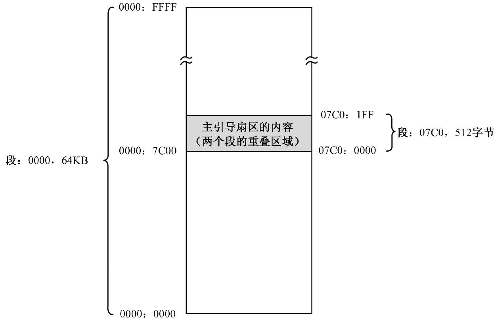
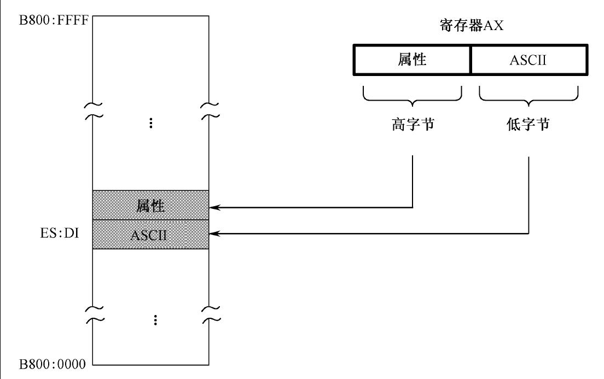
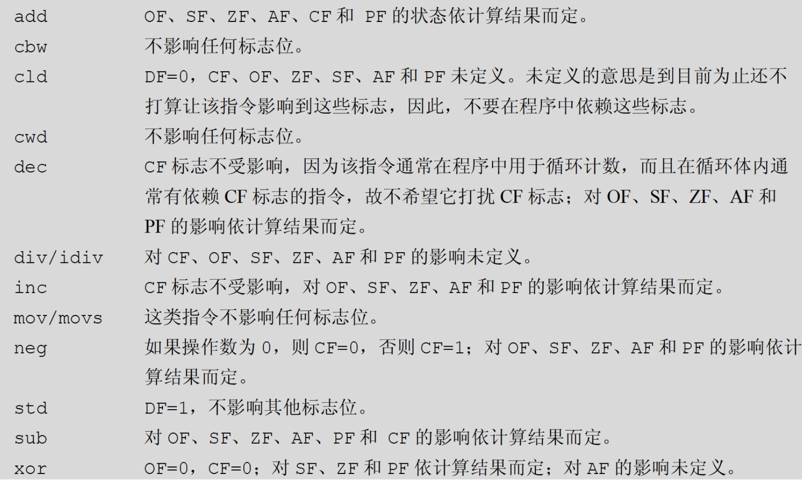
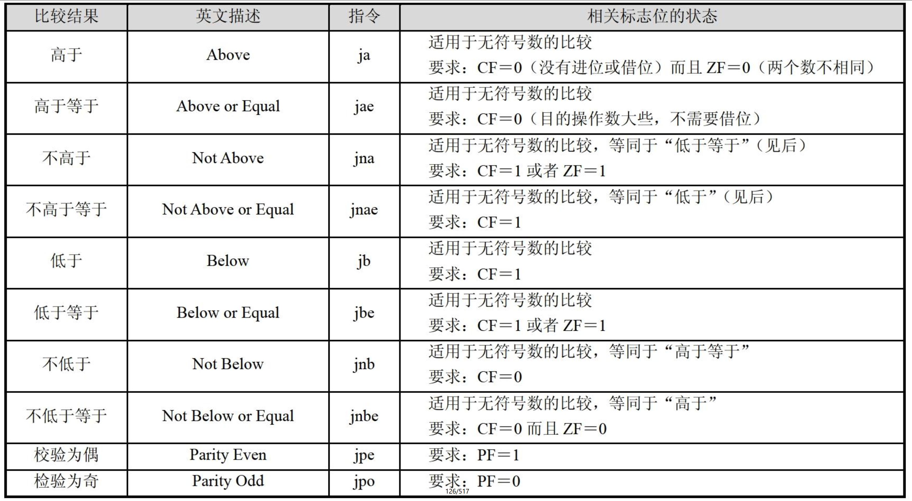

## 跳过非指令的数据区

如代码清单 6-1 所示，从源程序第 8 行到第 10 行，声明了非指令的数据。一般来说，所有处理器指令都应当顺序存放，在它们中间不允许夹杂非指令的普通数据，因为它们不能作为指令执行。但是，如果有办法让处理器执行不到这些非指令的内容，则又另当别论。为此，在这些数据之前，源程序的第 6 行，是一条转移指令：

```nasm
jmp near start
```

在这里，该指令用来使处理器的执行流越过这些不可执行的数据，转移到后面标号 start 处的代码接着执行。

像 `jmp near start` 这种指令，机器指令的操作码是 0xE9，操作数是一个 16 位的相对偏移量，这叫做相对近转移。

## 在数据声明中使用字面值

在第 5 章中，显示字符串“Label offset :”的方法是将每个字符的 ASCII 码包含在每条指令中，即它们是作为每条指令的操作数出现的。这种方法很原始，也很笨拙。而且，如果要改变显示的内容，则必须重新编写指令，很不方便。

在本章中，我们将要改变这种做法，使得显示字符串的手段更灵活，具体做法是专门定义一个存放字符串的数据区，当要显示它们的时候，再用指令取出来，一个一个地传送到显示缓冲区。这样一来，负责在屏幕上显示的指令就和要显示的内容无关了。

源程序的第 8、9 行，这两行的目的是声明要显示的内容。在 NASM 里，“\”是续行符，当一行写不下时，可以在行尾使用这个符号，以表明下一行与当前行应该合并为一行。

和上一章相同，在用伪指令 db 声明字符的 ASCII 码数据时也可以使用字面值。在编译阶段，编译器将把’ L ’、’ a ’等转换成与它们等价的 ASCII 代码。

除了 ASCII 码，这里还声明了每个字符的显示属性值 0x07。

## 段地址的初始化

汇编语言源程序的编译符合一种假设，即编译后的代码将从某个内存段中，偏移地址为 0 的地方开始加载。这样一来，如果有一个标号“label_a”，它在编译时计算的汇编地址是 0x05，那么，当程序被加载到内存后，它在段内的偏移地址仍然是 0x05，任何使用这个标号来访问内存的指令都不会产生问题。

但是，如果程序加载时，不是从段内偏移地址为 0 的地方开始的，而是 0x7c00，那么，label_a 的实际偏移地址就是 0x7c05。这时，所有访问 label_a 的指令仍然会访问偏移地址 0x05，因为这是在编译时就决定了的。实际上，这样的问题在上一章就遇到过。在那里，因为我们已经知道程序将来的加载位置是 `0x0000:0x7c00`，所以才有了这样古怪的写法：

```nasm
mov [0x7c00+number+0x00],dl   ;保存个位上的数字
```

在主引导程序中，访问内存的指令很多，如果都要加上 0x7c00 无疑是很麻烦的，这个我们已经看到了。其实，产生这个问题的根源，就是因为程序在加载时，没有从段内偏移地址为 0 的地方开始。

好在 Intel 处理器的分段策略还是很灵活的，逻辑地址 `0x0000:0x7c00` 对应的物理地址是 0x07c00，该地址又是段 0x07C0 的起始地址。因此，这个物理地址其实还对应着另一个逻辑地址 `0x07c0:0000`，如图6-1 所示。



我们可以把这 512 字节的区域看成一个单独的段，段的基地址是 0x07C0，段长 512 字节。注意，该段的最大长度可以为 64KB，但是在这里，我们实际上仅使用 512 个字节。尽管 BIOS 将主引导扇区加载到物理地址 0x07c00 处，但我们却可以认为它是从 `0x07c0:0x0000` 处开始加载的。

在这种情况下，如果执行指令

```nasm
mov [0x05], dl
```

那么，处理器将把数据段寄存器 DS 的内容（0x07c0）左移 4 位（不理解就再看一遍[8086的内存分段机制](../第1部分_预备知识/第2章_处理器、内存和指令.md#8086的内存分段机制)），加上指令中指定的偏移地址（005），形成物理内存地址 0x07c05，并将寄存器 DL 中的内容传送到该处。

所以，源程序第 13、14 行，通过传送指令将数据段寄存器 DS 的内容设置为 0x07c0。和以前一样，源程序第 16、17 行，使附加段寄存器 ES 的内容指向显示缓冲区所在的段 0xb800。

## 段之间的批量数据传送

在本章中，要在屏幕上显示的内容，连同它们的显示属性值，都集中声明在一起。想显示它们？那就要将它们“搬”到 0xB800 段。有多种方法可以做到这一点，但 8086 处理器提供了最好的方法，那就是使用 movsb 或者 movsw 指令。

这两个指令通常用于把数据从内存中的一个地方批量地传送（复制）到另一个地方，处理器把它们看成是数据串。但是，movsb 的传送是以字节为单位的，而 movsw 的传送是以字为单位的。

movsb 和 movsw 指令执行时，原始数据串的段地址由 DS 指定，偏移地址由 SI 指定，简写为 DS:SI ；要传送到的目的地址由 ES:DI 指定；传送的字节数（movsb）或者字数（movsw）由 CX 指定。除此之外，还要指定是正向传送还是反向传送，正向传送是指传送操作的方向是从内存区域的低地址端到高地址端；反向传送则正好相反。正向传送时，每传送一个字节（movsb）或者一个字（movsw），SI 和 DI 加 1 或者加 2 ；反向传送时，每传送一个字节（movsb）或者一个字（movsw）时，SI 和 DI 减去 1 或者减去 2。不管是正向传送还是反向传送，也不管每次传送的是字节还是字，每传送一次，CX 的内容自动减一。


如图 6-2 所示，在 8086 处理器里，有一个特殊的寄存器，叫做标志寄存器 FLAGS。作为一个例子，它的第 6 位是 ZF（Zero Flag），即零标志。当处理器执行一条算术或者逻辑运算指令后，算术逻辑部件送出的结果除了送到指令中指定位置（目的操作数指定的位置）外，还送到一个或非门。学过逻辑电路课程，或者看过《穿越计算机的迷雾》这本书的人都知道，或非门的输入全为 0 时，输出为 1 ；输入不全为 0，或者全部为 1 时，输出为 0。或非门的输出送到一个触发器，这就是标志寄存器的 ZF 位。这就是说，如果计算结果为 0，这一位被置成 1，表示计算结果为零是“真”的；否则清除此位（0）。

除此之外，它也允许通过指令设置一些标志，来改变处理器的运行状态。比如，第 10 位是方向标志 DF（Direction Flag），通过将这一位清零或者置 1，就能控制 movsb 和 movsw 的传送方向。

源程序第 19 行是方向标志清零指令 cld。这是个无操作数指令，与其相反的是置方向标志指令 std。cld 指令将 DF 标志清零，以指示传送是正方向的。和 cld 功能相反的是 std 指令，它将 DF 标志置位（1）。此时，传送的方向是从高地址到低地址。

源程序第 20 行，设置 SI 寄存器的内容到源串的首地址，也就是标号 mytext 处的汇编地址。

源程序第 21 行，设置目的地的首地址到 DI 寄存器。屏幕上第一个字符的位置对应着 0xB800 段的开始处，所以设置 DI 的内容为 0。

第 22 行，设置要批量传送的字节数到 CX 寄存器。因为数据串是在两个标号 number 和 mytext 之间声明的，而且标号代表的是汇编地址，所以，汇编语言允许将它们相减并除以 2 来得到这个数值。需要说明的是，这个计算过程是在编译阶段进行的，而不是在指令执行的时候。除以 2 的原因是每个要显示的字符实际上占两字节：ASCII 码和属性，而 movsw 每次传送一个字。

第 23 行，是 movsw 指令，操作码是 0xA5，该指令没有操作数。使用 movsw 而不是 movsb 的原因是每次需要传送一个字（ASCII 码和属性）。单纯的 movsb 和 movsw 只能执行一次，如果希望处理器自动地反复执行，需要加上指令前缀 rep（repeat），意思是 CX 不为零则重复。rep movsw 的操作码是 0xF3 0xA5，它将重复执行 movsw 直到 CX 的内容为零。

## 使用循环分解数位

为了显示标号 number 所代表的汇编地址，源程序第 26 行用于将它的数值传送到寄存器 AX，这个和以前是一样的。

声明标号 number 并从此处开始初始化 5 字节的目的主要是保存数位，但同时我们还想显示它的汇编地址。为了访问标号 number 处的数位，需要获取它在内存段中的偏移地址。

为此，源程序第 29 行，通过将 AX 的内容传送到 BX，来使 BX 指向该处的偏移地址。实际上，这等效于

```nasm
mov bx, number
```

只不过用寄存器传递来得更快，更方便。

第 29 ～ 37 行依旧做的是分解数位的事，但用了和以往不同的方法。简单地说，就是循环。循环依靠的是循环指令 loop，该指令出现在源程序的第 37 行：

```nasm
loop digit
```

loop 指令的功能是重复执行一段相同的代码，处理器在执行它的时候会顺序做两件事：

```
将寄存器 cx 的内容减一；

如果 cx 的内容不为零，转移到指定的位置处执行，否则顺序执行后面的指令。
```

和源程序第 6 行的 `jmp near start` 一样，`loop digit` 指令也是颇具迷惑性的指令，它的机器指令操作码是 0xE2，后面跟着一个字节的操作数，而且也是相对于标号处的偏移量，是在编译阶段，编译器用标号 digit 所在位置的汇编地址减去 loop 指令的汇编地址，再减去 loop 指令的长度（2）来得到的。

为了使 loop 指令能正常工作，需要一些准备。源程序第 30 行，将循环次数传送到 CX 寄存器。因为分解 AX 中的数需要循环 5 次，故传送的值是 5。

源程序第 31 行，将除数 10 传送到寄存器 SI。

源程序第 33 ～ 37 行是循环体，每次循环都会执行这些代码，主要是做除法并保存每次得到的余数。每次除法之前都要先将 DX 清零以得到被除数的高 16 位，这是源程序第 33 行所做的事情。

做完除法之后，第 35 行，将 DL 中得到的余数传送到由 BX 所指示的内存单元中去。这是我们第一次接触到偏移地址来自于寄存器的情况，而在此之前，我们仅仅是使用类似于下面的指令：

```nasm
mov [0x05], dl
mov [number], al
mov [number+0x02], cl
```

尽管方式不同，但 `mov [bx],dl` 做相同的事情，那就是把 DL 中的内容，传送到以 DS 的内容为段地址，以 BX 的内容为偏移地址的内存单元中去。注意，指令中的中括号是必需的，否则就是传送到 BX 中，而不是 BX 的内容所指示的内存单元了。

在 8086 处理器上，如果要用寄存器来提供偏移地址，只能使用 BX、SI、DI、BP，不能使用其他寄存器。所以，以下指令都是非法的：

```nasm
mov [ax], dl
mov [dx], bx
```

原因很简单，寄存器 BX 最初的功能之一就是用来提供数据访问的基地址，所以又叫基址寄存器（Base Address Register）。之所以不能用 SP、IP、AX、CX、DX，这是一种硬性规定，说不上有什么特别的理由。而且，在设计 8086 处理器时，每个寄存器都有自己的特殊用途，比如 AX 是累加器（Accumulator），与它有关的指令还会做指令长度上的优化（较短）； CX 是计数器（Counter）； DX 是数据（Data）寄存器，除了作为通用寄存器使用外，还专门用于和外设之间进行数据传送； SI 是源索引寄存器（Source Index）； DI 是目标索引寄存器（Destination Index），用于数据传送操作，我们已经在 movsb 和 movsw 指令的用法中领略过了。

注意，可以在任何带有内存操作数的指令中使用 BX、SI 或者 DI 提供偏移地址。

做完一次除法，并保存了数位之后，源程序第 36 行，用于将 BX 中的内容加一，以指向下一个内存单元。inc 是加一指令，操作数可以是 8 位或者 16 位的寄存器，也可以是字节或者字内存单元。从功能上讲，它和

```nasm
add bx, 1
```

是一样的，但前者的机器码更短，速度更快。下面是两个例子：

```nasm
inc al
inc byte [x]
inc word [label_a]
```

以上，第一条指令执行时，处理器将寄存器AL 中的内容加一；第二条指令执行时，将寄存器BX 所指向的内存单元的内容加一。就是说，处理器用段寄存器DS 的内容左移4 位，加上寄存器BX 的内容，形成20 位物理地址。然后，将该地址处的内容（字节）加一。
第三条指令做和第二条指令相同的事情，但是偏移地址是用标号给出的。关键字“word”表明它操作的是内存中的一个字，段地址在段寄存器DS 中，偏移地址等于标号label_a 在编译阶段的汇编地址。
和inc 指令相对的是dec 指令，用于将目标操作数的内容减一，它们的指令格式相同，不再赘述。
源程序第37 行，正是loop 指令。就像我们刚才说的，它将CX 的内容减一，并判断是否为零。如果不为零，则跳转到标号digit 所在的位置处执行。
很显然，在指令的地址部分使用寄存器，而不是数值或者标号（其实标号是数值的等价形式，在编译后也是数值）有一个明显的好处，那就是可以在循环体里方便地改变偏移地址，如果使用数值就不能做到这一点。

## 计算机中的负数

### 无符号数和有符号数


一个良好的解决方案是，将计算机中的数分成两大类：无符号数和有符号数。无符号数的意思是我们不关心这些数的符号，因此也就无所谓正负，反正它们就是数而已，就像小学生一样，眼中只有自然数。在8 位的字节运算中，无符号数的范围是00000000～11111111，即十进制的0～255；在16 位的字运算中，无符号数的范围是0000000000000000～1111111111111111，即十进制的0～65535；在将来要讲到的32 位运算中，无符号数的范围是000000000000000000000000～ 11111111111111111111111111111111，即十进制的0～4294967295。很显然，我们以前使用的一直是无符号数。
相反地，有符号数是分正、负的，而且规定，数的正负要通过它的最高位来辨别。如果最高位是0，它就是正数；如果是1，就是负数。如此一来，在8 位的字节运算环境中，正数的范围是00000000～01111111，即十进制的0～127；负数的范围是10000000～11111111，即十进制的－128～－1。
正的有符号数，和与它同值的无符号数相同，这没什么好说的，毕竟它们形式上相同，按相同的方式处理最为方便。但是，负数就不同了，在这里，10000000～11111111 这些负数，都是用0减去它们相对应的正数得到的。想知道它们各自对应的正数是谁吗？很简单，因为“负数的负数”是正数，所以只需要用0 减去这个负数就行。
所以，10000000～11111111 这个范围内的有符号数，对应着十进制数－128～－1。
顺便说一下，在8086 处理器中，有一条指令专门做这件事，它就是neg。neg 指令带有一个操作数，可以是8 位或者16 位的寄存器，或者内存单元。如

```nasm
neg al
neg dx
```

它的功能很简单，用0 减去指令中指定的操作数。例子：如果AL 中的内容是00001000（十进制数8），执行neg al 后，AL 中的内容变为11111000（十进制数－8）；如果AL 中的内容为11000100（十进制数－60），执行neg al 后，AL 中的内容为00111100（十进制数60）。
相应地，在16 位的字运算环境中，正数的范围是0000000000000000～0111111111111111，即十进制的0～32767，负数的范围是1000000000000000～1111111111111111，即十进制的－32768～－1。
不要给计算机和编译器添麻烦。既然你已经知道一个字节可以容纳的数据范围是十进制的－128～127，就不要这样写：

```nasm
mov al, -200
```

寄存器AL 只有8 位，因此，编译后，－200 将被截断，机器码为B0 38。你可以这样写：

```nasm
mov ax, -200
```

这时，编译后的机器码为B8 38 FF。

同样的规则也适用于伪指令db 和dw。举例（以下均为十进制数）：

```nasm
db 255；正确，可以看成声明无符号数
db -125；正确，数据未超范围
db -240；错误，超过字节所能容纳的数据范围，会被截断
dw -240；正确，数据未超范围
dw -30001；正确，数据未超范围
```

32 位有符号数是16 位和8 位有符号数的超集，16 位有符号数又是8 位有符号数的超集，它们互相之间有重叠的部分。正数还好说，十进制数15，在8 位运算环境中是00001111，在16位运算环境中是0000000000001111，没有什么区别。但是，同一个负数，其表现形式略有差别。比如十进制数－3，它在8 位运算中是11111101，即0xFD；在16 位运算中，则是1111111111111101，即0xFFFD。这种差别的来源很简单，我们已经讲过了，在计算机中，－3 是用0 减去3 得到的，在8 位运算中只能保留结果的低8 位，即11111101（0xFD）；在16 位运算中只能保留结果的低16 位，即1111111111111101（0xFFFD）。
很显然，一个8 位的有符号数，要想用16 位的形式来表示，只需将其最高位，也就是用来辨别符号的那一位（几乎所有的书上都称之为符号位，实际上这并不严谨），扩展到高8 位即可。为了方便，处理器专门设计了两条指令来做这件事：cbw（Convert Byte to Word）和cwd（Convert Word to Double-word）。
cbw 没有操作数，操作码为98。它的功能是，将寄存器AL 中的有符号数扩展到整个AX。举个例子，如果AL 中的内容为01001111，那么执行该指令后，AX 中的内容为0000000001001111；如果AL 中的内容为10001101，执行该指令后，AX 中的内容为1111111110001101。
cwd 也没有操作数，操作码为99。它的功能是，将寄存器AX 中的有符号数扩展到DX:AX。举个例子，如果AX 中的内容为0100111101111001，那么执行该指令后，DX 中的内容为0000000000000000，AX 中的内容不变；如果AX 中的内容为1000110110001011，那么执行该指令后，DX 中的内容为
1111111111111111，AX 中的内容同样不变。
尽管有符号数的最高位通常称为符号位，但并不意味着它仅仅用来表示正负号。事实上，通过上面的讲述和实例可以看出，它既是数的一部分，和其他比特一起共同表示数的大小，同时又用来判断数的正负。

### 处理器视角中的数据类型

无符号数和有符号数的划分并没有从根本上打消我们的疑虑，即假如寄存器AX 中的内容是0xB23C，那么，它到底是无符号数45628 呢，还是应当将其看成是－19908？
答案是，这是你自己的事，取决于你怎么看待它。对于处理器的多数指令来说，执行的结果和操作数的类型没有关系。换句话说，无论你是从无符号数的角度来看，还是从有符号数的角度来看，指令的执行结果都是正确无误的。比如

```nasm
mov ah, al
```

这条指令显然根本不考虑操作数的类型。再比如

```nasm
mov ah, 0xf0
inc ah
```

在这里，0xf0 的二进制形式是11110000，它既可以解释为无符号数240（十进制），也可以解释为有符号数－16，毕竟它的符号位是1。无论如何，inc 是加一指令，这条指令执行后，AH 中的内容是二进制数11110001，既是无符号数241，也是有符号数－15。

再考虑加法运算。比如

```nasm
mov ax, 0x8c03
add ax, 0x05
```

0x8c03 的二进制形式是1000110000000011，既可以看做无符号数35843（十进制），也可以看成是有符号数－29693（十进制）。在运算过程中，数的视角要统一，如果把0x8c03 看成是无符号数，那么0x05 也是无符号数；如果0x8c03 是有符号数，那么0x05 也是有符号数。
关键是运算后的结果。很幸运的是，add 指令同样适用于无符号数和有符号数。所以，这两条指令执行后，AX 中的内容是0x8c08，分别可以看成是无符号数35848 和有符号数－29688。
再来考虑一下减法。考虑一下，如果要计算10－3，这其实可以看成是10＋（－3）。因此，使用以下三条指令就可以完成减法运算：

```nasm
mov ah, 10
mov al, -3
add ah, al
```

正是因为这个原因，很多处理器内部不构造减法电路，而是使用加法电路来做减法。
尽管如此，为了方便起见，处理器还是提供了减法指令sub，该指令和加法指令add 相似，目的操作数可以是8 位或者16 位通用寄存器，也可以是8 位或者16 位的内存单元；源操作数可以是通用寄存器，也可以是内存单元或者立即数（不允许两个操作数同时为内存单元）。比如

```nasm
sub ah, al
sub dx, ax
sub [label_a], ch
```

因为处理器没有减法运算电路，所以，举例来说，sub ah,al 指令实际上等效于下面两条指令：

```nasm
neg al
add ah, al
```

可以这么说，几乎所有的处理器指令既能操作无符号数，又能操作有符号数。但是，有几条指令除外，比如除法指令和乘法指令。
我们已经学过除法指令div。严格地说，它应该叫做无符号除法指令（Unsigned Divide），因为这条指令只能工作于无符号数。换句话说，只有从无符号数的角度来解释它的执行结果才能说得通。举个例子：

```nasm
mov ax, 0x0400
mov bl, 0xf0
div b1 ;执行后，AL 中的内容为 0x04，即十进制数 4
```

从无符号数的角度来看，0x0400 等于十进制数1024，0xf0 等于十进制数240。相除后，寄存器AL 中的商为0x04，即十进制数4，完全正确。
但是，从有符号数的角度来看，0x0400 等于十进制数1024，0xf0 等于十进制数－16。理论上，相除后，寄存器AL 中结果应当是0xc0。因其最高位是“1”，故为负数，即十进制数为－64。
为了解决这个问题，处理器专门提供了一个有符号数除法指令idiv（Signed Divide）。idiv 的指令格式和div 相同，除了它是专门用于计算有符号数的。如果你决定要进行有符号数的计算，必须采用如下代码：

```nasm
mov ax, 0x0400
mov bl, 0xf0
idiv bl ;执行后，AL 中的内容为 0xc0，即十进制数 -64
```

在用idiv 指令做除法时，需要小心。比如用0xf0c0 除以0x10，也就是十进制数的除法－3904÷ 16。你的做法可能会是这样的：

```nasm
mov ax, 0xf0c0
mov bl, 0x10
idiv bl
```

以上的代码是16 位二进制数除法，结果在寄存器AL 中。除法的结果应当是十进制数－244，遗憾的是，这样的结果超出了寄存器AL 所能表示的范围，必然因为溢出而不正确。为此，你可能会用32 位的除法来代替以前的做法：

```nasm
xor dx, dx
mov ax, 0xf0c0
mov bx, 0x10
idiv bl
```

很遗憾，这依然是错的。十进制数－3904 的16 位二进制形式和32 位二进制形式是不同的。前者是0xf0c0，后者是0xfffff0c0。还记得cwd 吗？你应该用这条指令把寄存器AX 中数的符号扩展到DX。所以，完全正确的写法是这样的：

```nasm
mov ax, 0xf0c0
cwd
mov bx, 0x10
idiv bx
```

以上指令全部执行后，寄存器AX 中的内容为0xff0c，即十进制数－244。
主动权在你自己手上，在写程序的时候，你要做什么，什么目的，你自己最清楚。如果是无符号数计算，必须使用div 指令；如果你是在做有符号数计算，就应当使用idiv 指令。

## 数位的显示

一旦各个数位都分解出来了，下面的工作就是在屏幕上显示它们。源程序第40 行，将保存有各个数位的数据区首地址传送到基址寄存器BX。
一共有5 个数字要显示，它们在当前数据段内的起始偏移地址就是number 的汇编地址，且已传送到寄存器BX 中。为了依次得到这5 个数字，程序中使用的指令是

```nasm
mov al, [bx+si]
```

在这里，我们的意图是，寄存器BX 中的内容是基地址，保持不变，当寄存器SI 的内容从0逐次增加到4，或者反过来，从4 递减到0 时，就可以通过BX+SI 来连续访问这5 个数字。在这里，SI 的作用相当于索引，因此它被称为索引寄存器（Index Register），或者叫变址寄存器。另一个常用的变址寄存器是DI。
注意，INTEL8086 处理器只允许以下几种基址寄存器和变址寄存器的组合：

```nasm
[bx+si]
[bx+di]
[bp+si]
[bp+di]
```

这些组合可以用于任何带有内存操作数的指令中。其他任何组合，比如[bx+ax]、[cx+dx]、[ax+cx]等等，都是非法的。
因此，源程序第41 行，把初始的索引值4 传送到SI 寄存器，这是由于要先显示万位上的数字。
源程序第43 行，从指定的内存单元取出一个字节，传送到AL 寄存器，偏移地址是BX+SI。但是，它们之间的运算并非是在编译阶段进行的，而是在指令实际执行的时候，由处理器完成的。
源程序第44 行，将AL 中的数字加上0x30，以得到它对应的ASCII 码。
源程序第45 行，将数字0x04 传送到寄存器AH。0x04 是显示属性，即前面讲过的黑底红字，无加亮，无闪烁。到此，AX 中是一个完整的字，前8 位是显示属性值，后8 位是字符的ASCII 码。
源程序第46 行，将AX 中的内容传送到由段寄存器ES 所指向的显示缓冲区中，偏移地址由DI 指定。还记得吗，在前面使用movsw 传送字符串“Label offset:”到显示缓冲区时，也使用了DI，当时DI 是指向显示缓冲区首地址的（0），而且每传送一次就自动加2。传送结束后，DI 正好指向字符“:”的下一个存储单元。之后，DI 一直没用过，还保持着原先的内容。



注意，如图6-5 所示，数据的传送是按低端字节序的，寄存器的低字节传送到显示缓冲区的低地址部分（字节），寄存器的高字节传送到显示缓冲区的高地址部分（字节）。
源程序第47 行，将DI 的内容加上2，以指向显示缓冲区的下一个单元。
源程序第48 行，将SI 的内容减1，使得下一次的BX+SI 指向千位数字。dec 是减一指令，和inc 指令一样，后面跟一个操作数，可以是8 位或者16 位的通用寄存器或者内存单元。
源程序第49 行，指令jns show 的意思是，如果未设置符号位，则转移到标号“show”所在的位置处执行。如图6-2 所示，Intel 处理器的标志寄存器里有符号位SF（Sign Flag），很多算术逻辑运算都会影响到该位，比如这里的dec 指令。如果计算结果的最高位是比特“0”，处理器把SF 位置“0”，否则SF 位置“1”。
处理器的任务是忠实地执行指令，多数时候，它不会知道你的意图，也不会知道你进行的是有符号数运算，还是无符号数运算。如果运算结果的最高位是“1”，它唯一所能做的，就是将SF标志置“1”，以示提醒，剩下的事，你自己看着办，它已经尽力了。
由于SI 的初始值为4，故第一次执行dec si 后，si 的内容为3，即二进制数0000000000000011，符号位是比特“0”，处理器将标志寄存器的SF 位清“0”。于是，当执行jns show 时，符合条件，于是转移到标号“show”所在的位置处执行，等于是开始显示下一个数位。
当显示完最后一个数位后，SI 的内容是零。执行dec si 指令后，由于产生了借位，实际的运算结果是0xffff（SI 只能容纳16 个比特），因其最高位是“1”，故处理器将标志位SF 置“1”，表明当前SI 中的结果可以理解为一个负数（－1）。于是，执行jns show 时，条件不满足，接着执行后面第51 行的指令。
jns 是条件转移指令，处理器在执行它的时候要参考标志寄存器的SF 位。除了只是在符合条件的时候才转移之外，它和jmp 指令很相似，它也是相对转移指令，编译后的机器指令操作数也是一个相对偏移量，是用标号处的汇编地址减去当前指令的汇编地址，再减去当前指令的长度得到的。

## 其他标志位和条件转移指令

在处理器内进行的很多算术逻辑运算，都会影响到标志寄存器的某些位。比如我们已经学过的加法指令add、逻辑运算指令xor 等。在下面的讲述中，请自行参考图6-2。

### 奇偶标志位PF

当运算结果出来后，如果最低8 位中，有偶数个为1 的比特，则PF=1；否则PF=0。例如：

```nasm
mov ax, 10001001000101110B ;ax <- 0x892e
xor ax, 3 ;结果为 0x892d（1000100100101101B）
```

顺序执行以上两条指令后，因为结果是1000100100101101B，低8 位是00101110B，有偶数个1，所以PF=1。

再如：

```nasm
mov ah, 00100110B ;ah <- 0x26
mov al, 10000001B ;al <- 0x81
add ah, al ;al<-0xa7
```

以上，因为最后ah 的内容是0xa7（10100111B），包含奇数个1，故PF=0。

### 进位标志CF

对于无符号数运算来说，进位标志CF 通常意味着得到了错误的计算结果，因为目的操作数没能容纳那个进位。这里有一个例子：

```nasm
mov ah, 0xff
add ah,2 ; ah <-0x01
```

执行以上两条指令后，进位标志CF 为1，这是肯定的了，因为最高位有进位。从无符号数的角度来看，是255+2，结果应当是257。但是你看，因为寄存器AH 只有8 位，所以进位丢失，得到的结果是1，这明显是错的。
但是，如果上面进行的是有符号数运算，那么，这实际上是在计算-1+2（十进制），AH 中的最终的结果是1，这是正确的。

很显然，同样的运算，从无符号数和有符号数的视角来看，是不同的。但是，在所有的情况下，处理器都不可能知道你的意图，不知道你进行的是有符号数运算，还是无符号数运算。为此，它提供了溢出标志OF，该标志的意思是，假定你进行的是有符号数运算，如果运算结果是正确的，那么OF=0，否则OF=1。比如上面的例子，因为从有符号数的角度来看，是-1 和2 相加，结果为1，未溢出，故OF=0。简单地说，OF 标志用于指示两个有符号数的运算结果是否错误。
再看一个例子：

```nasm
mov ah, 0x70
add ah, ah
```

首先，本次相加，用二进制数来说就是01110000+01110000=11100000，最高位没有进位，故CF=0。
其次，从无符号数的角度来看（十进制），即112+112=224，并未超出一个字节所能容纳的数值上限255，结果是正确的。
但是，从有符号数运算的角度来看（十进制），即112+112=-32，两正数相加，结果为负，明显是错的，在这种情况下，OF=1。错误的原因是，两个正数112 和112 相加，理论上的计算结果224 超出了寄存器AH 所能容纳的有符号数的范围-128～127，所以破坏了符号位，使得结果变成了负数（-32）
既然如此，可以使用16 位寄存器AX，毕竟它能容纳的数据范围更大一些：

```nasm
mov ax, 0x70
add ax, ax
```

这次，无论它是有符号数运算，还是无符号数运算，结果都是正确的。故CF=0，OF=0。
因为在任何时候，处理器都不可能知道你的意图，不知道你进行的是有符号数运算，还是无符号数运算。因此，它所能做的，就是假定进行的是有符号数运算，并根据结果提供OF 标志，至于如何处理，是你自己的事。比如说，如果你进行的是无符号数运算，那么，你可以不用理会该标志。

### 现有指令对标志位的影响



### 条件转移指令

jcc”不是一条指令，而是一个指令族（簇），功能是根据某些条件进行转移，比如前面讲过的jns，意思是SF≠1（那就是SF=0 了）则转移。方便起见，处理器一般提供相反的指令，如js，意思是SF=1 则转移。爱上网的朋友们容易把它理解成“奸商”。
在汇编语言源代码里，条件转移指令的操作数是标号。编译成机器码后，操作数是一个立即数，是相对于目标指令的偏移量。在16 位处理器上，偏移量可以是8 位（短转移）或者16 位（相对近转移）。
相似地，jz 的意思是ZF 标志为1 则转移；jnz 的意思是ZF 标志不为1（为0）则转移。
jo 的意思是OF 标志为1 则转移，jno 的意思是OF 标志不为1（为0）则转移。
jc 的意思是CF 标志为1 则转移，jnc 的意思是CF 标志不为1（为0）则转移。
jp 的意思是PF 标志为1 则转移，jnp 的意思是PF 标志不为1（为0）则转移。爱上网的朋友们注意了，jp 可不是“极品”的意思。
转移指令必须出现在影响标志的指令之后，比如：

```nasm
dec si
jns show
```

多数时候，你会遇到一些和标志位关系不太明显的问题，比如，当AX 寄存器里的内容为0x30 的时候转移，或者当AX 寄存器里的内容小于0xf0的时候转移，再或者，当AX 寄存器里的内容大于寄存器BX 里的内容时转移，这该怎么办呢？
好在处理器提供了比较指令cmp，它需要两个操作数，目的操作数可以是8 位或者16 位通用寄存器，也可以是8 位或者16 位内存单元；源操作数可以是与目的操作数宽度一致的通用寄存器、内存单元或者立即数，但两个操作数同时为内存单元的情况除外。比如：

```nasm
cmp al, 0x08
cmp dx, bx
cmp [label_a], cx
```

cmp 指令在功能上和sub 指令相同，唯一不同之处在于，cmp 指令仅仅根据计算的结果设置相应的标志位，而不保留计算结果，因此也就不会改变两个操作数的原有内容。cmp 指令将会影响到CF、OF、SF、ZF、AF 和PF 标志位。
比较是拿目的操作数和源操作数比，重点关心的是目的操作数。拿指令cmp ax,bx 来说，我们关心的是AX 中的内容是否等于BX 中的内容，AX 中的内容是否大于BX 中的内容，AX 中的内容是否小于BX 中的内容，等等，AX 是被测量的对象，BX 是测量的基准。比较的结果如表6-1 所示。




最后一个要讲述的条件转移指令是jcxz（jump if CX is zero），意思是当CX 寄存器的内容为零时则转移。执行这条指令时，处理器先测试寄存器CX 是否为零。例如：

```nasm
jcxz show
```

这里，“show”是程序中的一个标号。执行这条指令时，如果CX 寄存器的内容为零，则转移；否则不转移，继续往下执行。

## NASM编译器的$和$$标记

源程序第51 行，用于在显示了各个数位之后，再显示一个字符“D”。目的地址是由ES:DI 给出的，源操作数是立即数0x0744，其中，高字节0x07 是黑底白字的显示属性，低字节0x44 是字符“D”的ASCII 码。字的写入是按低端字节序的，请自行参照图6-5。
整个程序到此结束。为了使处理器还有事做，源程序第53 行，是一个无限循环。NASM 编译器提供了一个标记“$”，该标记等同于标号，你可以把它看成是一个隐藏在当前行行首的标号。因此，jmp near $的意思是，转移到当前指令继续执行，它和

```nasm
infi: jmp near infi
```

是一样的，没有区别，但不需要使用标号，更不必为给标号起一个有意义的名字而伤脑筋。
和第5 章一样，为了得到不多不少，正好512 字节的编译结果，同时最后两个字节还必须是0x55 和0xAA，需要在所有指令的后面填充一些无用的数据。
源程序第55 行，用于重复伪指令“db 0”若干次。重复的次数是由510-($-$$)得到的，除去0x55 和0xAA 后，剩余的主引导扇区内容是510 字节；$是当前行的汇编地址；$$是NASM 编译器提供的另一个标记，代表当前汇编节（段）的起始汇编地址。当前程序没有定义节或段，就默认地自成一个汇编段，而且起始的汇编地址是0（程序起始处）。这样，用当前汇编地址减去程序开头的汇编地址（0），就是程序实体的大小。再用510 减去程序实体的大小，就是需要填充的字节数。
就像处理器把内存划分成逻辑上的分段一样，源程序也应当按段来组织，划分成独立的代码段、数据段等。

```nasm

```

```nasm

```

```nasm

```

```nasm

```

```nasm

```

```nasm

```

```nasm

```

```nasm

```
