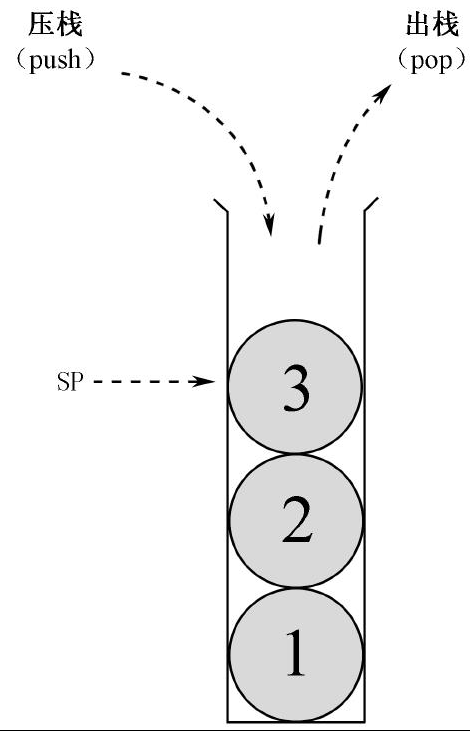
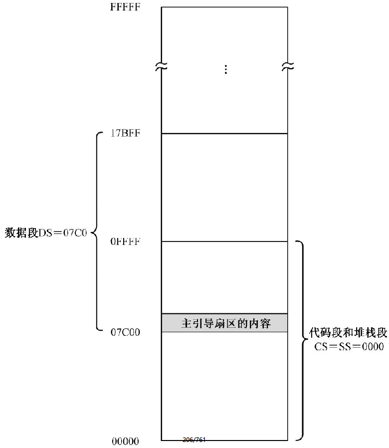

## 显示字符串

源程序第8 行，声明并初始化了一串字符（字符串），它的最终用途是要显示在屏幕上。我们可以直接用单引号把一串字符围起来：

```
message db '1+2+3+...+100='
```

NASM 支持这样的做法，同前一章相比，以这种方法声明字符串显得更方便、更直接。在编译阶段，编译器将把它们拆开，以形成一个个单独的字节。

为了跳过没有指令的数据区，源程序第 6 行是 `jmp near start` 指令。

源程序第 11 ～ 15 行用于初始化数据段寄存器 DS 和附加段寄存器 ES。

源程序第 18 ～ 28 行同样用于显示字符串，但采用了不同的方法，首先是用索引寄存器 SI 指向 DS 段内待显示字符串的首地址，即标号“message”所代表的汇编地址。然后，再用另一个索引寄存器 DI 指向 ES 段内的偏移地址 0 处，ES 是指向 0xB800 段的。

字符串的显示需要依赖循环。本次采用的是循环指令 loop。loop 指令的工作又依赖于 CX 寄存器，所以，源程序第 20 行，用于在编译阶段计算一个循环次数，该循环次数等于字符串的长度（字符个数）。

循环体是从源程序第 22 行开始的。首先从数据段中，逻辑地址为 DS : SI 的地方取得第一个字符，将其传送到逻辑地址 ES : DI，后者指向显示缓冲区。

紧接着，源程序第 24 行，将 DI 的内容加一，以指向该字符在显示缓冲区内的属性字节；第 25 行，在该位置写入属性值 0x07，即黑底白字。

源程序第 26、27 行，分别将寄存器 SI 和 DI 的内容加一，以指向源位置和目标位置的下一个单元。

源程序第 28 行，执行循环。loop 指令在执行时先将 CX 的内容减一，然后，处理器根据 CX 是否为零来决定是否开始下一轮循环。当 CX 为 0 的时候，说明所有的字符已经显示完毕。

## 计算1到100的累加和

要计算 1 到 100 的累加和，可以采取这样的办法：先将寄存器 AX 清零，再用 AX 的内容和 1 相加，结果在 AX 中；接着，再用 AX 的内容和 2 相加，结果依旧在 AX 中，……，就这样一直加到 100。

为此，源程序第 31 行，用 xor 指令将寄存器 AX 清零；源程序第 32 行，将第一个被累加的数“1”传送到寄存器 CX。

源程序第 34 行就开始累加了，每次相加之后，源程序第 35 行，将 CX 的内容加一，以得到下一个将要累加的数。

源程序第 36 行，将 CX 的内容同 100 进行比较，看是不是已经累加到 100 了。如果小于等于 100，则继续重复累加过程，如果大于 100，就不再累加，直接往下执行。

最后，AX 中将得到最终的累加和。需要特别说明的是，AX 可以容纳的无符号数最大是 65535，再大就不行了。由于我们已经知道最终的结果是 5050，所以很放心地使用了寄存器 AX。要是你从 1 加到 1000，就得考虑使用两个寄存器来计算了。

## 累加和各个数位的分解与显示

得到了累加和之后，下面的工作是将它的各个数位分解出来，并准备在屏幕上显示，好让我们知道这个数到底是多少。

和前两章不同，分解出来的各个数位并不保存在数据段中，而保存在一个叫做栈的地方。



栈（Stack）是一种特殊的数据存储结构，数据的存取只能从一端进行。这样，最先进去的数据只能最后出来，最后进去的数据倒是最先出来，这称为后进先出（Last In First Out，LIFO）。

实际上，我们还是在讲内存，只不过是另一种特殊的读写方式而已。

和代码段、数据段和附加段一样，栈也被定义成一个内存段，叫栈段（Stack Segment），由段寄存器SS 指向。

针对栈的操作有两种，分别是将数据推进栈（push）和从栈中弹出数据（pop）。简单地说，就是压栈和出栈。压栈和出栈只能在一端进行，所以需要用栈指针寄存器 SP（Stack Pointer）来指示下一个数据应当压入栈内的什么位置，或者数据从哪里出栈。

定义栈需要两个连续的步骤，即初始化段寄存器 SS 和栈指针 SP 的内容。源程序第 40 ～ 42 行用于将栈段的段地址设置为 0x0000，栈指针的内容设置为 0x0000。

到目前为止，我们已经定义了 3 个段，图 7-2 是当前的内存布局。总的内存容量是 1MB，物理地址的范围是 0x00000 ～ 0xFFFFF，其中，假定数据段的长度是 64KB（实际上它的长度无关紧要），占据了物理地址 0x07C00 ～ 0x17BFF，对应的逻辑地址范围是 0x07C0 : 0x0000 ～ 0x07C0 : 0xFFFF ；代码段和栈段是同一个段，占据着物理地址 0x00000 ～ 0x0FFFF，对应的逻辑地址范围是 0x0000 : 0x0000 ～ 0x0000 : 0xFFFF。



虽然代码段和栈段在本质上指向同一块内存区域，但是不要担心，主引导程序只占据着中间的一小部分，我们有办法让它们互不干扰。

### 分解各个数位并压栈

数位的分解还是得靠做除法。源程序第 44 行用于把除数 10 传送到寄存器 BX。

以往分解寄存器 AX 中的数时，固定是分解 5 次，得到 5 个数位。但这也存在一个缺点，如果 AX 中的数很小时，在屏幕上显示的数左边都是“0”，这当然是很别扭的。为此，本章的源程序做了改善，每次除法结束后，都做一次判断，如果商为 0 的话，分解过程可以提前结束。

但是，由于每次得到的数位是压入栈的，将来还要反序从栈中弹出，为此，必须记住实际上到底有多少个数位。源程序第 45 行，将寄存器 CX 清零，并在后面的代码中用于累计有多少个数位。

源程序第 47 ～ 53 行也是一个循环体，每执行一次，分解出一个数位。每次分解时，CX 加一，表明数位又多了一个，这是源程序第 47 行所做的事。

源程序第 48、49 行，将 DX 清零，并和 AX 一起形成 32 位的被除数。

分解出的数位将来要显示在屏幕上，为了方便，源程序第 50 行，直接将 AL 中的商“加上”0x30，以得到该数字所对应的 ASCII 码。

注意上一段话中的引号。这并不是真正的加法，or 并不是相加的指令，但由于此处的特殊情况，使得 or 指令的执行结果和相加是一样的。

与 xor 一样，or 也是逻辑运算指令。不同之处在于，or 执行的是逻辑“或”。数字逻辑中的“或”用于表示两个命题并列的情况。

在处理器内部，or 指令的目的操作数可以是 8 位或者 16 位的通用寄存器，或者包含 8/16 位实际操作数的内存单元，源操作数可以是与目的操作数数据宽度相同的通用寄存器、内存单元或者立即数。

和其他指令一样，or 指令不允许目的操作数和源操作数都是内存单元的情况。当 or 指令执行时，两个操作数相对应的比特之间分别进行各自的逻辑“或”运算，结果位于目的操作数中。

再来看源程序第 50 行，因为每次是除以 10，所以在寄存器 DL 中得到的余数，其高 4 位必定为 0。又由于 0x30 的低 4 位是 0，高 4 位是 3，所以，DL 中的内容和 0x30 执行逻辑“或”后，相当于是将 DL 中的内容和 0x30 相加。这是用逻辑“或”指令做加法的一个特例。

or 指令对标志寄存器的影响是：OF 和 CF 位被清零，SF、ZF、PF 位的状态依计算结果而定，AF 位的状态未定义。

与 or 相对应的是逻辑与“and”。

相应地，处理器设计了 and 指令。在 16 位处理器上，and 指令的两个操作数都应当是字节或者字。其中，目的操作数可以是通用寄存器和内存单元；源操作数可以是通用寄存器、内存单元或者立即数，但不允许两个操作数同时为内存单元，而且它们在数据宽度上应当一致。

当这些指令执行时，两个操作数对应的各个比特位分别进行逻辑“与”，结果保存在目的操作数中。

and 指令执行后，OF 和 CF 位被清零，SF、ZF、PF 位的状态依计算结果而定，AF 位的状态未定义。各个数位的 ASCII 码是压入栈中的。源程序第 51 行，push 指令的作用是将寄存器 DX 的内容压入栈中。在 16 位的处理器上，push 指令的操作数可以是 16 位的寄存器或者内存单元。

你可能觉得奇怪，push 指令只接受 16 位的操作数，为什么要对内存操作数使用关键字“word”。事实上，8086 处理器只能压入一个字；但其后的 32 位和 64 位处理器允许压入字、双字或者四字，因此，关键字是必不可少的。

处理器在执行 push 指令时，首先将栈指针寄存器 SP 的内容减去操作数的字长（以字节为单位的长度，在 16 位处理器上是 2），然后，把要压入栈的数据存放到逻辑地址 SS : SP 所指向的内存位置（和其他段的读写一样，把栈段寄存器 SS 的内容左移 4 位，加上栈指针寄存器 SP 提供的偏移地址）。

如图 7-3 所示，代码段和栈段是同一个段，所以段寄存器 CS 和 SS 的内容都是 0x0000。而且，栈指针寄存器 SP 的内容在源程序第 42 行被置为 0。所以，当 push 指令第一次执行时，SP 的内容减 2，即 0x0000 － 0x0002 ＝ 0xFFFE，借位被忽略。于是，被压入栈的数据，在内存中的位置实际上是 0x0000 : 0xFFFE。push 指令的操作数是字，而且 Intel 处理器是使用低端字节序的，故低字节在低地址部分，高字节在高地址部分，正好占据了栈段的最高两个字节位置。

这只是第一次压栈操作时的情况。以后每次压栈时，SP 都要依次减 2。很明显，不同于代码段，代码段在处理器上执行时，是由低地址端向高地址端推进的，而压栈操作则正好相反，是从高地址端向低地址端推进的。

push 指令不影响任何标志位。


源程序第 52、53 行，判断本次除法结束后，商是否为 0。如果不为零，则再循环一次；如果为零，则表明不需要再继续分解了。

### 出栈并显示各个数位

压栈的次数（数位的个数）取决于 AX 中的数有多大，位于寄存器 CX 中。数位是按“个位”、“十位”、“百位”、“千位”、“万位”的顺序依次压栈的（实际情况取决于数的大小），出栈正好相反。所以，可以顺序将它们弹出栈并显示在屏幕上。

源程序第 57 行，pop dx 指令的功能是将逻辑地址 SS : SP 处的一个字弹出到寄存器 DX 中，然后将 SP 的内容加上操作数的字长（2）。

和 push 指令一样，pop 指令的操作数可以是 16 位的寄存器或者内存单元。

pop 指令执行时，处理器将栈段寄存器 SS 的内容左移 4 位，再加上栈指针寄存器 SP 的内容，形成 20 位的物理地址访问内存，取得所需的数据。然后，将 SP 的内容加操作数的字长，以指向下一个栈位置。

pop 指令不影响任何标志位。

源程序第 58 行将弹出的数据写入显示缓冲区。索引寄存器 DI 的内容是在前面显示字符串时用过的，期间一直没有改变过，它现在指向显示缓冲区中字符串之后的位置。

接着，源程序第 59 ～ 61 行，将字符显示属性写入字符之后的单元，并再次递增 DI 以指向显示缓冲区中下一个字符的位置。

源程序第 62 行，每次执行 loop 指令时，处理器都是先将寄存器 CX 减一。当所有的数位都弹出和显示以后，CX 必定为零，这将导致退出循环。

当处理器最后一次执行出栈操作后，栈指针寄存器 SP 的内容将恢复到最开始设置时的状态，即它的内容重新为 0。

### 进一步认识栈

学习栈的知识，最好是先有一些感性认识，本章就是这么做的。现在，感性认识已经有了，剩下的，就是总结一下，做几点说明。

第一，push 指令的操作数可以是 16 位寄存器或者 16 位内存单元，push 指令执行后，压入栈中的仅仅是该寄存器或者内存单元里的数值，与该寄存器或内存单元不再相干。如果不理解这一点，就容易错误地以为压入了某个寄存器的值，比如 AX 之后，将来还要再弹回 AX 才行，这是不对的。所以，下面的指令是合法而且正确的：

```
push cs
pop ds
```

这两条指令的意思是，将代码段寄存器的内容压栈，并弹出到数据段寄存器 DS。如此一来，代码段和数据段将属于同一个内存段。实际上，这两条指令的执行结果，和以下指令的执行结果相同：

```
mov ax,cx
mov ds,ax
```

第二，栈在本质上也只是普通的内存区域，之所以要用push 和pop 指令来访问，是因为你把它看成栈而已。实际上，如果你把它看成是普通的数据段而忘掉它是一个栈，那么它将不再神秘。

引入栈和 push、pop 指令只是为了方便程序开发。临时保存一个数值到栈中，使用 push 指令是最简洁、最省事的，但如果你不怕麻烦，可以不使用它。所以，下面的代码可以用来取代 push ax 指令：

```
sub sp,2
mov bx,sp
mov [ss:bx],ax
```

同样，pop ax 指令的执行结果和下面的代码相同：

```
mov bx,sp
mov ax,[ss:bx]
add sp,2
```

你可能还有另一种想法，即，我连栈段都不用，SP 也省了，我自己把临时数据都保存在数据段中。好吧，如果是这样的话，你必须在数据段中开辟一些空间，并亲自维护一个指针来跟踪这些数据的存入和取出。当程序变得越来越复杂时，这些维护工作同样让你焦头烂额。

因此，显而易见的是，push 和 pop 指令更方便，毕竟与栈访问有关的一切都是由处理器自动维护的。而且，总有一天你会发现，有些工作不使用栈来进行的话，是非常困难的。
第三，要注意保持栈平衡。如果在做某件事的时候要使用栈，那么，栈指针寄存器 SP 在做这件事之前的值，应当和这件事做完后的值相同。就是说，push 指令和 pop 指令的数量应当是相同的。栈是反复使用的内存区域，如果使用不当，将会出现问题，下面就是一个例子：

```
repeat:
    push ax
    ...
    pop bx
    pop ax
    loop repeat
```

以上的循环是干什么用的，做什么事情，这个不重要。因为每次循环时，都要用到寄存器 AX 和 BX 的原始内容，所以，循环体的开头要压栈保存它们，在循环体的末尾要出栈恢复它们。但是你看到了，由于一时疏忽，只压入了寄存器 AX，而在出栈时，却多弹了一个数值到 BX 中。在这种情况下，栈是不平衡的，程序的运行结果当然也不会正确。

第四，在编写程序前，必须充分估计所需要的栈空间，以防止破坏有用的数据。特别是在栈段和其他段属于同一个段的时候。如图 7-3 所示，栈段和代码段属于同一个内存段，段地址都是 0x0000，段的长度都是 64KB。主引导程序的长度是 512（0x200）字节，从偏移地址 0x7c00 延伸到 0x7e00。栈是向下增长的，它们之间有 0xffff － 0x7e00 ＋ 1 ＝ 0x8200 字节的空档。通常来说，我们的程序是安全的，因为不可能压入这么多的数据。但是，不能掉以轻心，栈定义得过小，而且程序编写不当，导致栈破坏了有用数据的情况也时有发生。

第五，尽管不能完全阻止程序中的错误，但是，通过将栈定义到一个单独的 64KB 段，可以使错误仅局限于栈，而不破坏其他段的有用数据。假如栈的段地址是 0x0000，大小是 64KB，那么，无论 SP 怎样变化，压栈和出栈操作始终会在该段内进行，而不会影响到其他无关的内存区域。这样，无论任何时候，即使是 push 指令位于一个无限循环中，栈指针寄存器 SP 的内容也永远只会在 0x0000 ～ 0xFFFF 之间来回滚动，不会影响到其他内存段。

### 在调试过程中察看栈中内容

很多程序错误与栈的不当使用有关。因此，在调试程序的过程中，不可避免地要察看栈的状态，从中发现一些导致程序出错的蛛丝马迹。

在Bochs 中察看栈的命令是“print-stack”，它可以带一个参数，用于指定显示多少数据。如果不使用参数，则默认显示当前栈中的16 个字。

如图7-5 所示，当单步执行了“push dx”指令后，我们立即用“print-stack”命令来察看当前栈。当前栈是由段寄存器SS 指示的，栈顶是由栈指针寄存器SP 指示的。

Bochs 并不知道栈的实际大小，因此，它只是显示栈顶（由SP 指示）以下的16 个字。如图中所示，栈顶数据是0x0030，其物理内存地址是0xFFFE，这是刚压入的寄存器DX 的内容。

因为栈是从高地址向低地址推进的，因此，所谓的“栈顶以下”，实际上指的是高地址方向。因此，下一个栈单元的物理内存地址是0xFFFE 加2，即0x10000。实际上，那里并不属于当前栈段，当前栈段的物理地址范围是0x00000~0x0FFFF，而且实际上我们只使用0x07E00~0x0FFFF 之间的区域，但Bochs 并不知道这些。

## 8086处理器的寻址方式

既然操作和处理的是数值，那么，必定涉及数值从哪里来，处理后送到哪里去，这称为寻址方式（Addressing Mode）。简单地说，寻址方式就是如何找到要操作的数据，以及如何找到存放操作结果的地方。

### 寄存器寻址

最简单的寻址方式是寄存器寻址。就是说，指令执行时，操作的数位于寄存器中，可以从寄存器里取得。这种寻址方式的例子还是很多的，比如：

```
mov ax,cx
add bx,0xf000
inc dx
```

以上，第一条指令的两个操作数都是寄存器，是典型的寄存器寻址；第二条指令的目的操作数是寄存器，因此，该操作数也是寄存器寻址；第三条指令就更不用说了。

### 立即寻址

立即寻址又叫立即数寻址。也就是说，指令的操作数是一个立即数。比如：

```
add bx,0xf000
mov dx,label_a
```

以上，第一条指令的目的操作数采用了寄存器寻址方式，用于提供被加数；第二个操作数（源操作数）用于给出加数 0xf000。这是一个直接给出的数值，是立即在指令中给出的，最终参与加法运算的就是它，不需要通过其他方式寻找，故称为立即数。这也是一种寻址方式，称为立即寻址。

在第二条指令中，目的操作数也采用的是寄存器寻址方式。尽管源操作数是一个标号，但是，标号是数值的等价形式，代表了它所在位置的汇编地址。因此，在编译阶段，它会被转化为一个立即数。因此，该指令的源操作数也采用了立即寻址方式。

### 内存寻址

寄存器寻址的操作数位于寄存器中，立即寻址的操作数位于指令中，是指令的一部分。传统上，这是两种速度较快的寻址方式。但是，它们也有局限性。一方面，我们不可能总是知道要操作的数是多少，因此也就不可能总是在指令中使用立即数；另一方面，寄存器的数量有限，不可能总指望在寄存器之间来回倒腾。

考虑到内存容量巨大，所以，在指令中使用内存地址，来操作内存中的数据，是最理想不过了。正是因为内存访问如此重要，处理器才拥有好几种内存寻址方式。

我们知道，8086 处理器访问内存时，采用的是段地址左移4 位，然后加上偏移地址，来形成20位物理地址的模式，段地址由4 个段寄存器之一来提供，偏移地址要由指令来提供。

因此，所谓的内存寻址，实际上就是寻找偏移地址，这称为有效地址（Effective Address，EA）。换句话说，就是如何在指令中提供偏移地址，供处理器访问内存时使用。

#### 直接寻址

使用该寻址方式的操作数是一个偏移地址，而且给出了该偏移地址的具体数值。比如：

```
mov ax, [0x5c0f]
add word [0x0230], 0x5000
xor byte [es:label_b], 0x05
```

但凡是表示内存地址的，都必须用中括号括起来。

以上，在第一条指令中，源操作数使用的是直接寻址方式，当这条指令执行时，处理器将数据段寄存器DS 的内容左移4 位，加上这里的0x5c0f，形成20 位物理地址。接着，从该物理地址处取得一个字，传送到寄存器AX 中。

在第二条指令中，目的操作数采用的是直接寻址方式。当这条指令执行时，处理器用同样的方法，访问由段寄存器DS 指向的数据段，并把指令中的立即数加到该段中偏移地址为0x0230 的字单元里。

尽管在第三条指令中，目的操作数使用了标号和段超越前缀，但它依然属于直接寻址方式。原因很简单，标号是数值的等价形式，在指令编译阶段，会被转换成数值；而段超越前缀仅仅用来改变默认的数据段。

#### 基址寻址

很多时候，我们会有一大堆的数据要处理，而且它们通常都是挨在一起，顺序存放的。比如：

```
buffer dw 0x20,0x100,0x0f,0x300,0xff00
```

假如要将这些数据统统加一，那么，使用直接寻址的指令序列肯定是这样的：

```
inc word[buffer]
inc word[buffer+2]
inc word[buffer+4]
```

这样做好吗？当然，程序本身是没有问题的。但是，考虑到它的效率和代码的简洁性，特别是这些工作用循环来完成会更好，可以使用基址寻址。所谓基址寻址，就是在指令的地址部分使用基址寄存器BX 或者BP 来提供偏移地址。比如：

```
mov [bx], dx
add byte [bx], 0x55
```

以上，第一条指令中的目的操作数采用了基址寻址。在指令执行时，处理器将数据段寄存器DS 的内容左移4 位，加上基址寄存器BX 中的内容，形成20 位的物理地址。然后，把寄存器DX中的内容传送到该地址处的字单元里。
第二条指令中的目的操作数也采用的是基址寻址。指令执行时，将数据段寄存器DS 的内容左移4 位，加上寄存器BX 中的内容，形成20 位的物理地址。然后，将指令中的立即数0x55 加到该地址处的字节单元里。
使用基址寻址可以使代码变得简洁高效。比如，可以用以下的代码来处理上面的批量加一任务：

```
    mov bx, buffer
    mov cx, 4
lpinc:
    inc word [bx]
    add bx, 2
    loop lpinc
```

基址寻址的寄存器也可以是BP。比如：

```
mov ax, [bp]
```

这条指令的源操作数采用了基址寻址方式。但是，与前面的指令相比，它稍微有些特殊。原因在于，它采用是基址寄存器BP，在形成20 位的物理地址时，默认的段寄存器是SS。也就是说，它经常用于访问栈。这条指令执行时，处理器将栈段寄存器SS 的内容左移4 位，加上寄存器BP 的内容，形成20 位的物理地址，并将该地址处的一个字传送到寄存器AX 中。
我们知道，栈是后进先出的数据结构，访问栈的一般方法是使用push 和pop 指令。比如我们用以下的指令压入两个数据：

```
mov ax, 0x5000
push ax
mov ax, 0x7000
push ax
```

很显然，如果要用 pop 指令弹出数据，就必须先弹出 0x7000，才能弹出 0x5000，除非你改变了栈指针 SP 的内容，否则这个顺序是不可能改变的。

但是，有时候我们希望，而且必须得越过这种限制，去访问栈中的内容，还不能破坏栈的状态，特别是栈指针寄存器SP 的内容，使得push 和pop 操作能正常进行。一个典型的例子是高级语言里的函数调用，所有的参数都位于栈中。为了能访问到那些被压在栈底的参数，这时，BP 就能派上用场：

```
mov ax, 0x5000
push ax
mov bp, sp
mov ax, 0x7000
push ax
mov dx, [bp]
```

以上，在压入0x5000 之后，立即将栈指针SP 保存到BP。后面，尽管栈顶的数据0x7000 没有出栈，但依然可以用BP 取出压在栈下面的0x5000。如此一来，正常的push 和pop 操作照样进行，同时，还能访问到栈中的参数。
基址寻址允许在基址寄存器的基础上使用一个偏移量。有时候，这使得它更加灵活。比如：

```
mov dx, [bp-2]
```

处理器在执行时，将段寄存器SS 的内容左移4 位，加上BP 的内容，再减去偏移量2 以形成物理地址。这样一来，在保持基址寄存器BP 内容不变的情况下，就可以访问栈中的任何元素。这里，偏移量仅用于在指令执行时形成有效地址，不会改变寄存器BP 的原有内容。
这种增加偏移量的做法也适用于基址寄存器BX。以下代码是前面那个批量加一任务的新版本：

```

```

以上代码和前一个版本相比，没有太大变化，区别仅仅在于，BX 现在是从0 开始递增的，inc 指令操作数的偏移地址由BX 和标号buffer 所代表的值相加得到。相加操作在指令执行时进行，仅用于形成有效偏移地址，不会影响到BX 寄存器的内容。

#### 变址寻址

变址寻址类似于基址寻址，唯一不同之处在于这种寻址方式使用的是变址寄存器（或称索引寄存器）SI 和DI。

和基址寻址一样，当带有这种操作数的指令执行时，除非使用了段超越前缀，处理器会访问由段寄存器DS 指向的数据段，偏移地址由寄存器SI 或者DI 提供。

同样地，变址寻址方式也允许带一个偏移量：

```

```

以上第二条指令中，尽管使用的是标号，但本质上属于一个编译阶段确定的数值。

#### 基址变址寻址

让处理器支持多种寻址方式会增加硬件上的复杂性，但可以增强它的数据处理能力，这么做是值得的。说到数据处理，下面是一个稍微复杂一些的任务：


```

```

这的确是个好办法。不过，8086 处理器也支持一种基址加变址的寻址方式，简称基址变址寻址，可能用起来更方便。
使用基址变址的操作数可以使用一个基址寄存器（BX 或者BP），外加一个变址寄存器（SI 或者DI）。它的基本形式是这样的：

```

```

以上，第一条指令的源操作数采用了基址变址寻址。当处理器执行这条指令时，把数据段寄存器DS 的内容左移4 位，加上基址寄存器BX 的内容，再加上变址寄存器SI 的内容，共同形成20 位的物理地址。然后，从该地址处取得一个字，传送到寄存器AX 中。

```

```

第二条指令与第一条指令类似，只不过是加法指令，它的目的操作数采用了基址变址寻址，源操作数采用的是立即寻址。这条指令执行时，处理器访问由段寄存器DS 指向的数据段，加上由BX 和DI 相加形成的偏移地址，共同形成20 位的物理地址，然后将立即数0x3000 加到该地址处的字单元里。
采用基址变址寻址方式的排序代码如下：

```

```

和前面使用栈的代码相比，指令的数量没有明显减少，这说明任务还不够复杂，也许只能这么解释了。但是，它同样很方便，很有效，不是吗？
同样地，基址变址寻址允许在基址寄存器和变址寄存器的基础上带一个偏移量。比如：

```

```


```

```


```

```


```

```


```

```


