主引导扇区是处理器迈向广阔天地的第一块跳板。离开主引导扇区之后，通常是操作系统，也就是我们经常听说的 DOS、Windows、Linux、UNIX 等。

和主引导扇区程序一样，操作系统也位于硬盘上。操作系统是需要安装到硬盘上的，这个安装过程不但要把操作系统的指令和数据写入硬盘，通常还要更新主引导扇区的内容，好让这块跳板直接连着操作系统。

操作系统通常肩负着处理器管理、内存分配、程序加载、进程（即已经位于内存中的程序）调度、外围设备（显卡、硬盘、声卡等）的控制和管理等任务。

凭个人之力，写一个非常完善的操作系统，这几乎是不可能的事。但是，写个小程序，模拟一下它的某个功能，还是可以的。

我们知道，编译好的程序通常都存放在像硬盘这样的载体上，需要加载到内存之后才能执行。这个过程并不简单，首先要读取硬盘，然后决定把它加载到内存的什么位置。最重要的是，程序通常是分段的，载入内存之后，还要重新计算段地址，这叫做段的重定位。

在本章，我们把主引导扇区改造成一个程序加载器，或者说是一个加载程序，它的功能是加载用户程序，并执行该程序（将处理器的控制权交给该程序）。

- [用户程序的结构](#用户程序的结构)
  - [分段、段的汇编地址和段内汇编地址](#分段段的汇编地址和段内汇编地址)
  - [用户程序头部](#用户程序头部)
- [加载程序（器）的工作流程](#加载程序器的工作流程)
  - [初始化和决定加载位置](#初始化和决定加载位置)
  - [准备加载用户程序](#准备加载用户程序)
  - [外围设备及其接口](#外围设备及其接口)
  - [I/O 端口和端口访问](#io-端口和端口访问)
  - [通过硬盘控制器端口读扇区数据](#通过硬盘控制器端口读扇区数据)
  - [过程调用](#过程调用)
  - [加载用户程序](#加载用户程序)
  - [用户程序重定位](#用户程序重定位)
  - [将控制权交给用户程序](#将控制权交给用户程序)
  - [8086 处理器的无条件转移指令](#8086-处理器的无条件转移指令)
    - [相对短转移](#相对短转移)
    - [16 位相对近转移](#16-位相对近转移)
    - [16 位间接绝对近转移](#16-位间接绝对近转移)
    - [16 位直接绝对远转移](#16-位直接绝对远转移)
    - [16 位间接绝对远转移（jmp far）](#16-位间接绝对远转移jmp-far)
- [用户程序的结构](#用户程序的结构-1)
- [用户程序的结构](#用户程序的结构-2)
  - [三级](#三级)
- [用户程序的结构](#用户程序的结构-3)
  - [三级](#三级-1)
- [用户程序的结构](#用户程序的结构-4)
  - [三级](#三级-2)
- [用户程序的结构](#用户程序的结构-5)
  - [三级](#三级-3)
- [用户程序的结构](#用户程序的结构-6)
  - [三级](#三级-4)

## 用户程序的结构

### 分段、段的汇编地址和段内汇编地址

处理器的工作模式是将内存分成逻辑上的段，指令的获取和数据的访问一律按“段地址:偏移地址”的方式进行。相对应地，**一个规范的程序，应当包括代码段、数据段、附加段和栈段**。这样一来，段的划分和段与段之间的界限在程序加载到内存之前就已经准备好了。

和我们以前编写的源程序不同，代码清单 8-2 很长。当然，真正的不同之处在于，**代码和数据是以段的形式组织**的。为了清楚起见，图 8-1 给出了整个源程序的组织结构。

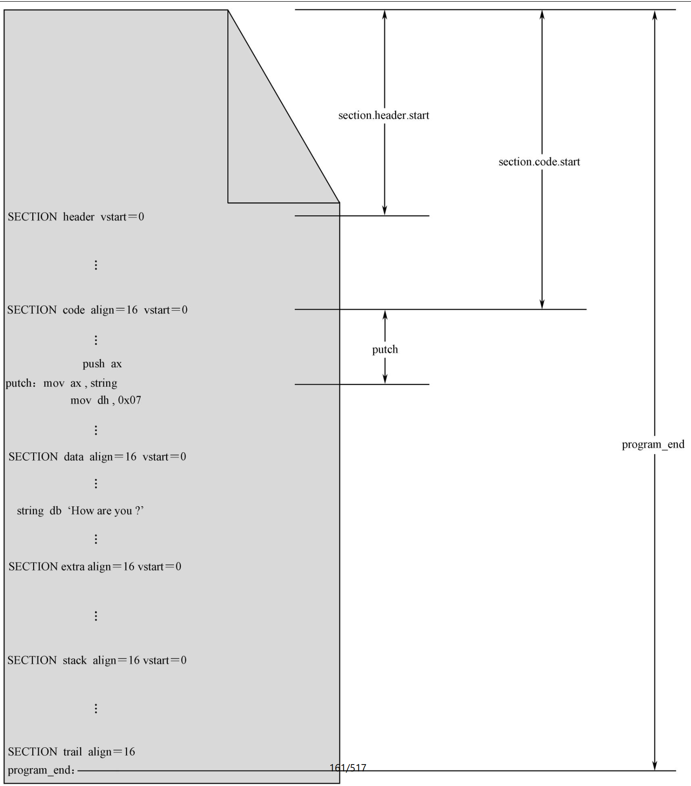

NASM 编译器使用汇编指令“SECTION”或者“SEGMENT”来定义段。它的一般格式是

```nasm
SECTION 段名称
```

```shell
SEGMENT 段名称
```

每个段都要求给出名字，这就是段名称，它主要用来引用一个段，可以是任意名字，只要它们彼此之间不会重复和混淆。

NASM 编译器不关心段的用途，可能也根本不知道段的用途，不知道它是数据段，还是代码段，或是栈段。事实上，这都不重要，段只用来分隔程序中的不同内容。

如图 8-1 所示，第一个段的名字是“header”，表明它是整个程序的开头部分；第二个段的名字是“code”，表明这是代码段；第三个段的名字是“data”，表明这是数据段。

比较重要的是，一旦定义段，那么，后面的内容就都属于该段，除非又出现了另一个段的定义。有时候，程序并不以段定义语句开始。在这种情况下，这些内容默认地自成一个段。最为典型的情况是，整个程序中都没有段定义语句。这时，整个程序自成一个段。

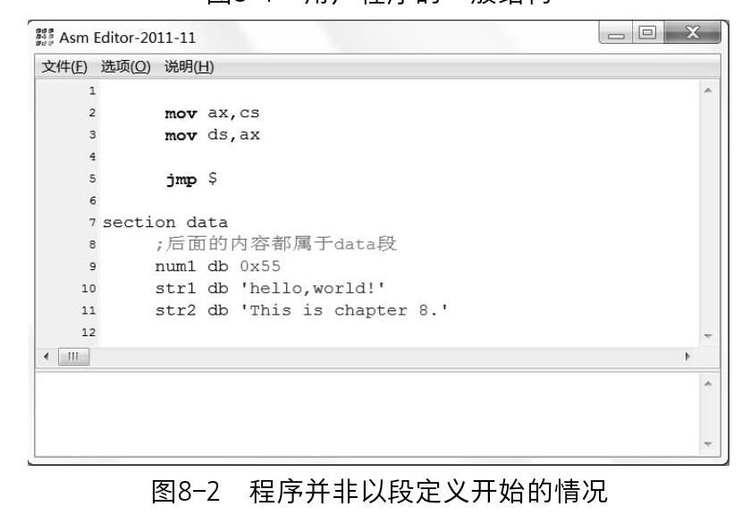

NASM 对段的数量没有限制。一些大的程序，可能拥有不止一个代码段和数据段。

Intel 处理器要求**段在内存中的起始物理地址起码是 16 字节对齐的**。这句话的意思是，必须是 16 的倍数，或者说该物理地址必须能被 16 整除。

相应地，汇编语言源程序中定义的各个段，也有对齐方面的要求。具体做法是，在段定义中使用“align =”子句，用于指定某个 SECTION 的汇编地址对齐方式。比如说，“align = 16”就表示段是 16 字节对齐的，“align = 32”就表示段是 32 字节对齐的。

在源程序编译阶段，编译器将根据 align 子句确定段的起始汇编地址。如图 8-3 所示，这里定义了三个段，分别是 data1、data2 和 data3，每个段里只有一个字节的数据，分别是 0x55、0xaa 和 0x99。

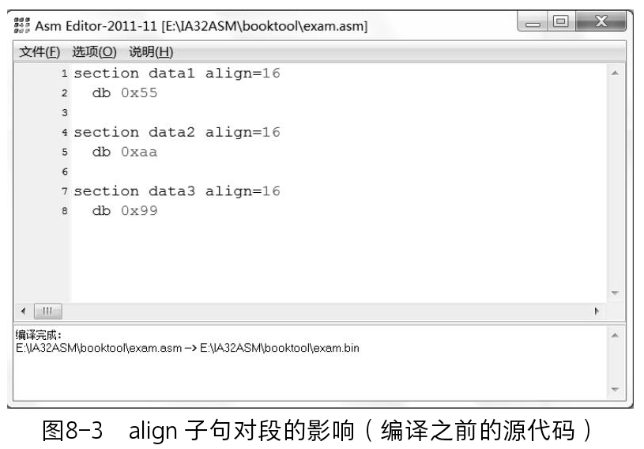

理论上，如果不考虑段的对齐方式，那么段 data1 的汇编地址是 0，段 data2 的汇编地址是 1，段 data3 的汇编地址是 2。

但是，在这里，每个段的定义中都包含了要求 16 字节对齐的子句，情况便不同了。如图 8-4 所示，这是编译后的结果，因为在段 data1 之前没有任何内容，故段 data1 的起始汇编地址是 0（在图中是 0x00000000），而且地址 0 本身就是 16 字节对齐的，符合 align 子句的要求。

段的汇编地址其实就是段内第一个元素（数据、指令）的汇编地址。因此，在段 data1 中声明和初始化的 0x55 位于汇编地址 0x00000000 处。

段 data2 也要求是 16 字节对齐的。问题是，从汇编地址 0x00000001 开始，只有 0x00000010（十进制的 16）才能被 16 整除。于是，编译器将 0x00000010 作为段 data2 的汇编地址，并在两个段之间填充 15 字节的 0x00（段 data1 只有 1 字节的长度）。

段 data3 的处理与前面两个段相同。因为段 data2 只有 1 字节，故也需要在它们之间填充 15 字节。这样，段 data3 的汇编地址就是 0x00000020（十进制的 32）。段 data3 也只有 1 字节（0x99），所以，汇编地址 0x00000020 处是 0x99，这也是编译结果中的最后一字节。

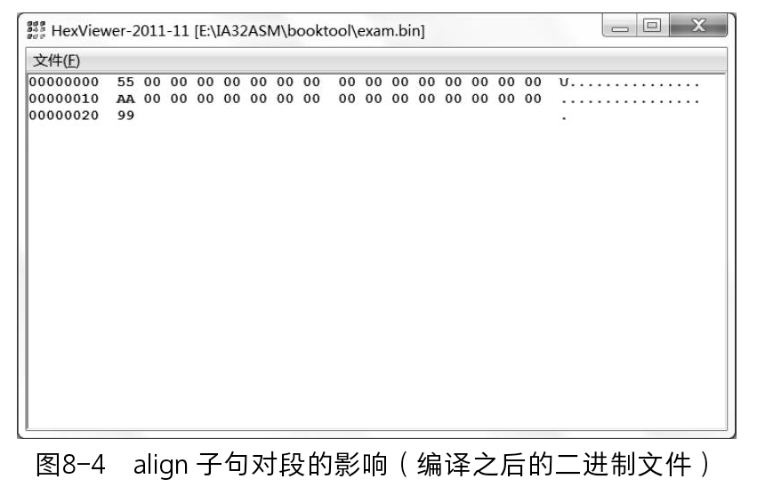

正如我们刚刚讨论过的，**每个段都有一个汇编地址**，它是相对于整个程序开头（0）的。为了方便取得该段的汇编地址，NASM 编译器提供了以下的表达式，可以用在你的程序中：

```nasm
secton.段名称.start
```

如图 8-1 所示，段“header”相对于整个程序开头的汇编地址是 `section.header.start`，段“code”相对于整个程序开头的汇编地址是 `section.code.start`。在这个例子中，因为段“header”是在程序的一开始定义的，它的前面没有其他内容，故 `section.header.start = 0`。

如图 8-1 所示，段定义语句还可以包含“vstart =”子句。尽管定义了段，但是，引用某个标号时，该标号处的汇编地址依然是从整个程序的开头计算的，而不是从段的开头处计算的。

因此，vstart 可以解决这个问题。如图 8-1 所示，“putch”是段 code 中的一个标号，原则上，该标号代表的汇编地址应该从程序开头计算。但是，因为段 code 的定义中有“vstart = 0”子句，所以，标号“putch”的**汇编地址要从它所在段的开头计算，而且从 0 开始计算**。

如图 8-1 所示，同样的情形也出现在段 data 中。段 data 的定义中也有“vstart = 0”子句，因此，当我们在段 code 中引用段 data 中的标号“string”时（mov ax,string），尽管在图中没有标明，标号“string”所代表的汇编地址是相对于其所在段 data 的。也就是说，传送到寄存器 AX 中的数值是标号 string 相对于段 data 起始处的长度。

但是，图中最后一个段 trail 的定义中没有包含“vstart = 0”子句。那就对不起了，该段内有一个标号“program_end”，它的汇编地址就要从整个程序开头计算。因为它是整个程序中的最后一行，从这个意义上来说，它所代表的汇编地址就是整个程序的大小（以字节计）。

### 用户程序头部

浏览一下本章代码清单 8-2，你会发现，本章的用户程序实际上定义了 7 个段，分别是第 7 行定义的段 header、第 27 行定义的段 code_1、第 163 行定义的段 code_2、第 173 行定义的段 data_1、第 194 行定义的段 data_2、第 201 行定义的段 stack 和第 208 行定义的段 trail。

一般来说，加载器和用户程序是在不同的时间、不同的地方，由不同的人或公司开发的。这就意味着，它们彼此并不了解对方的结构和功能。

如图 8-5 所示，它们彼此看对方都是一个黑盒子，并不了解对方是怎么编写的，是做什么的。但是，也不能完全是黑的，加载器必须了解一些必要的信息，虽然不是很多，但足以知道如何加载用户程序。

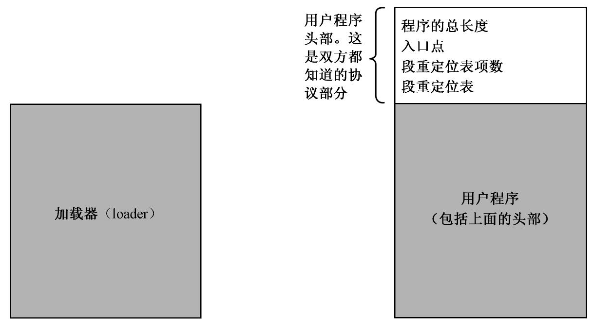

这就涉及加载器的编写者，以及用户程序的编写者，他们之间是怎么协商的。他们之间必须有一个协议，或者说协定，比如说，在用户程序内部的某个固定位置，包含一些基本的结构信息，每个用户程序都必须把自己的情况放在这里，而加载器也固定在这个位置读取。经验表明，把这个约定的地点放在用户程序的开头，对双方，特别是对加载器来说比较方便，这就是用户程序头部。

头部需要在源程序以一个段的形式出现。这就是代码清单 8-2 的第7 行：

```nasm
SECTION header vstart=0                     ;定义用户程序头部段
```

而且，因为它是“头部”，所以，该段当然必须是第一个被定义的段，且总是位于整个源程序的开头。

用户程序头部起码要包含以下信息。

① **用户程序的尺寸**，即以字节为单位的大小。这对加载器来说是很重要的，加载器需要根据这一信息来决定读取多少个逻辑扇区。

代码清单 8-2 中第 8 行，伪指令 dd 用于**声明和初始化一个双字**，即一个 32 位的数据。用户程序可能很大，16 位的长度不足以表示 65535 以上的数值。

程序的长度取自程序中的一个标号“program_end”，这是允许的。在编译阶段，编译器将该标号所代表的汇编地址填写在这里。该标号位于整个源程序的最后，从属于段“trail”。由于该段并没有 vstart 子句，所以，标号“program_end”所代表的汇编地址是从整个程序的开头计算的。换句话说，program_end 所代表的汇编地址，在数值上等于整个程序的长度。

**双字在内存中的存放也是按低端序的**。如图 8-6 所示，低字保存在低地址，高字保存在高地址。同时，每个字又按低端字节序，低字节在低地址，高字节在高地址。

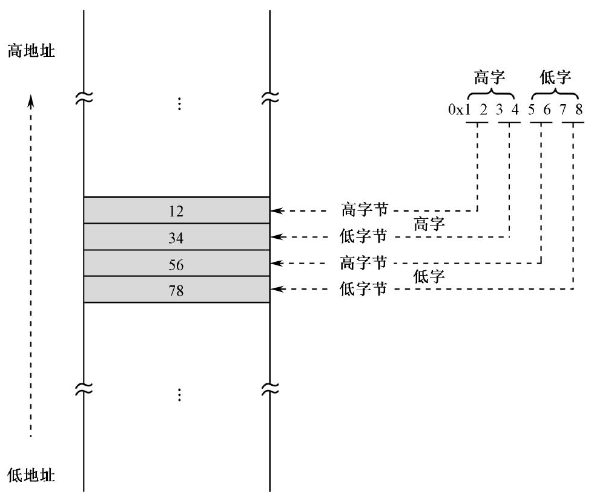

② **应用程序的入口点**，包括**段地址和偏移地址**。加载器并不清楚用户程序的分段情况，更不知道第一条要执行的指令在用户程序中的位置。因此，必须在头部给出**第一条指令的段地址和偏移地址**，这就是所谓的**应用程序入口点**（Entry Point）。

理想情况下，当用户程序开始运行时，执行的第一条指令是其代码段内的第一条指令。换句话说，入口点位于其代码段内偏移地址为 0 的地方。但是，情况并非总是如此。尤其是，很多程序并非只有一个代码段，比如本章源代码清单 8-2 就包含了两个代码段。所以，需要在用户程序头部明确给出用户程序在刚开始运行时，第一条指令的位置，也就是第一条指令在用户程序代码段内的偏移地址。

代码清单 8-2 第 11、12 行，依次声明并初始化了入口点的偏移地址和段地址。**偏移地址取自代码段 code_1 中的标号“start”**，段地址是用表达式 `section.code_1.start` 得到的。

代码段 code_1 是在代码清单 8-2 的第 27 行定义的：

```nasm
SECTION code_1 align=16 vstart=0         ;定义代码段1（16字节对齐）
```

显而易见的是，因为段定义中包含了“vstart = 0”子句，故标号 start 所代表的汇编地址是相对于当前代码段 code_1 的起始位置，从 0 开始计算的。

入口点的段地址是用伪指令 dd 声明的，并初始化为汇编地址 `section.code_1.start`，这是一个 32 位的地址。不过，它仅仅是编译阶段确定的汇编地址，在用户程序加载到内存后，需要根据加载的实际位置重新计算（浮动）。

尽管在 16 位的环境中，一个段最长为 64KB，但它却可以起始于任何 20 位的物理地址处。你不可能用 16 位的单元保存 20 位的地址，所以，只能保存为 32 位的形式。

③ **段重定位表**。用户程序可能包含不止一个段，比较大的程序可能会包含多个代码段和多个数据段。这些段如何使用，是用户程序自己的事，但前提是程序加载到内存后，每个段的地址必须重新确定一下。

段的重定位是加载器的工作，它需要知道每个段在用户程序内的位置，即它们分别位于用户程序内的多少字节处。为此，需要在用户程序头部建立一张段重定位表。

用户程序可以定义的段在数量上是不确定的，因此，段重定位表的大小，或者说表项数是不确定的。为此，代码清单 8-2 第 14 行，声明并初始化了段重定位表的项目数。因为段重定位表位于两个标号 header_end 和 code_1_segment 之间，而且每个表项占用 4 字节，故实际的表项数为

```nasm
realloc_tbl_len dw (header_end-code_1_segment)/4
```

这个值是在程序编译阶段计算的，先用两个标号所代表的汇编地址相减，再除以每个表项的长度紧接着表项数的，是实际的段重定位表，每个表项用伪指令 dd 声明并初始化为 1 个双字。代码清单 8-2 一共定义了 5 个段，所以这里有 5 个表项，依次计算段开始汇编地址的表达式并进行初始化。

## 加载程序（器）的工作流程

### 初始化和决定加载位置

从大的方面来说，加载器要加载一个用户程序，并使之开始执行，需要决定两件事。第一，看看内存中的什么地方是空闲的，即从哪个物理内存地址开始加载用户程序；第二，用户程序位于硬盘上的什么位置，它的起始逻辑扇区号是多少。

现在，让我们把目光转移到代码清单 8-1，来看看加载器都做了哪些工作。

代码清单 8-1 第 6 行，加载器程序的一开始声明了一个常数（const）：

```nasm
app_lba_start equ 100           ;声明常数（用户程序起始逻辑扇区号）
```

常数是用伪指令 equ 声明的，它的意思是“等于”。本语句的意思是，用标号 app_lba_start 来代表数值 100，今后，当我们要用到 100 的时候，不这样写：

```nasm
mov al, 100
```

而是这样写：

```nasm
mov al, app_lba_start
```

常数的意思是在程序运行期间不变的数。和其他伪指令 db、dw、dd 不同，用 equ 声明的数值不占用任何汇编地址，也不在运行时占用任何内存位置。它仅仅代表一个数值。

加载用户程序需要确定一个内存物理地址，这是在代码清单 8-1 第 151 行用伪指令 dd 声明的，并初始化为 0x10000 的。和前面一样，是用 32 位的单元来容纳一个 20 位的地址：

```nasm
phy_base dd 0x10000
```

尽管我们用了 0x10000，但你完全可以把用户程序加载到其他地方，只要它是空闲的。比如，可以将这个数值改成 0x12340，唯一的要求是该地址的最低 4 位必须是 0，换句话说，**加载的起始地址必须是 16 字节对齐的**，这样将来才能形成一个有效的段地址。

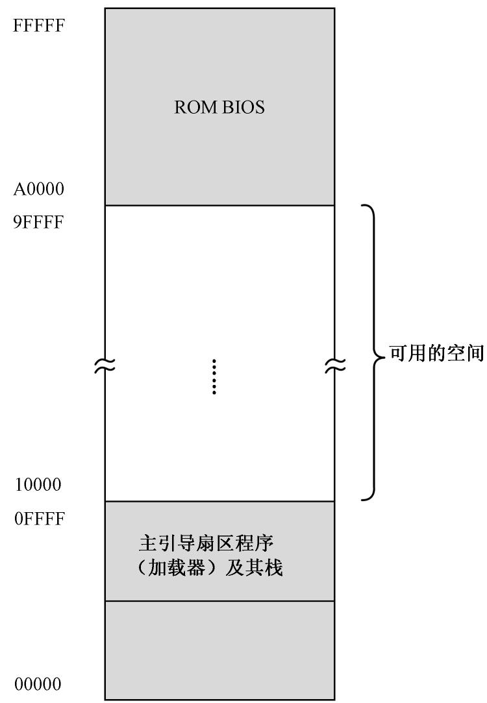

如图 8-7 所示，物理地址 0x0FFFF 以下，是加载器及其栈的势力范围；物理地址 A0000 以上，是 BIOS 和外围设备的势力范围，有很多传统的老式设备将自己的存储器和只读存储器映射到这个空间。

如此一来，可用的空间就位于 0x10000 ～ 9FFFF，差不多 500 多 KB。事实上，如果将低端的内存空间合理安排一下，还可以腾出更多空间，但是没有必要，我们用不了多少。

### 准备加载用户程序

和以往不同，我们将主引导扇区程序定义成一个段。代码清单 8-1 第 9 行：

```nasm
SECTION mbr align=16 vstart=0x7c00
```

整个程序只定义了这一个段，所以它略显多余。之所以这么说，是因为，即使你不定义这个段，编译器也会自动把整个程序看成一个段。

但是，因为该定义中有“vstart = 0x7c00”子句，所以，它就不那么多余了。一旦有了该子句，段内所有元素的汇编地址都将从 0x7c00 开始计算。否则，因为主引导程序的实际加载地址是 0x0000 : 0x7c00，当我们引用一个标号时，还得手工加上那个落差 0x7c00。

代码清单 8-1 第 12 ～ 14 行，用于初始化栈段寄存器 SS 和栈指针 SP。之后，栈的段地址是 0x0000，段的长度是 64KB，栈指针将在段内 0xFFFF 和 0x0000 之间变化。

代码清单 8-1 第 16、17 行，用于取得一个地址，用户程序将要从这个地址处开始加载。

该地址实际上是保存在标号 phy_base 处的一个双字单元里。这是一个 32 位的数，在 16 位的处理器上，只能用两个寄存器存放。如图 8-8 所示，32 位数内存中的存放是按低端序列的，高 16 位处在 phy_base ＋ 0x02 处，可以放在寄存器 DX 中；低 16 位处在 phy_base 处，可以用寄存器 AX 存放。

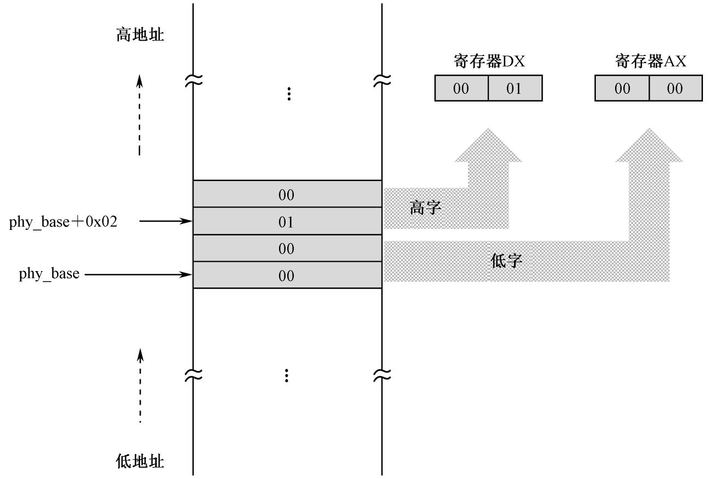

这两条指令中都使用了段超越前缀“cs :”。这是允许的，意味着在访问内存单元时，使用 CS 的内容作为段基址。之所以没有使用 DS 和 ES，是因为它们另有安排。

另外注意，因为段寄存器 CS 的内容是 0x0000，而且主引导扇区是位于 0x0000 : 0x7c00 处的，所以，理论上指令中的偏移地址应当是 0x7c00 ＋ phy_base。不过，因为我们定义段 mbr 的时候，使用了“vstart = 0x7c00”子句，故段内所有汇编地址都是在 0x7c00 的基础上增加的，就不用再加上这个 0x7c00 了，直接是

```shell
mov ax,[cs:phy_base]            ;计算用于加载用户程序的逻辑段地址
mov dx,[cs:phy_base+0x02]
```

紧接着，代码清单 8-1 第 18 ～ 21 行，用于将该物理地址变成 16 位的段地址，并传送到 DS 和 ES 寄存器。因为该物理地址是 16 字节对齐的，直接右移 4 位即可。实际上，右移 4 位相当于除以 16（0x10），所以程序中的做法将这个 32 位物理地址（DX : AX）除以 16（在寄存器 BX 中），寄存器 AX 中的商就是得到的段地址（在本程序中是 0x1000）。

### 外围设备及其接口

加载器的下一个工作是从硬盘读取用户程序，说白了就是访问其他硬件。和处理器打交道的硬件很多，不单单是硬盘，还有显示器、网络设备、扬声器（喇叭）和话筒（麦克风）、键盘、鼠标等。

所有这些和计算机主机连接的设备，都围绕在主机周围，争着跟计算机说话，叫做外围设备（Peripheral Equipment）。一般来说，我们把这些设备分成两种，一种是输入设备，比如键盘、鼠标、麦克风、摄像头等；另一种是输出设备，比如显示器、打印机、扬声器等。输入设备和输出设备统称输入输出（Input/Output，I/O）设备。

每一种设备都有都有和别的设备不一样的工作方式。比如，扬声器需要的是模拟信号，每个扬声器需要两根线，用的插头也是无线电行业里的标准，话筒也是如此；老式键盘只用一根线向主机传送按键的 ASCII 码，而且一直采用 PS/2 标准；新式的 USB 键盘尽管也使用串行方式工作，但信号却和老式键盘完全不同。至于网络设施，现在流行的是里面有 8 根线芯的五类双绞线，里面的信号也有专门的标准。

一句话，不同的设备，有不同的连线数量，线里面传送的信号也不一样，而且各自的插头和插孔也千差万别，这该如何让处理器跟它打交道？

话虽这么说，但这些东西不让处理器访问和控制却不行。很明显，这里需要一些信号转换器和变速齿轮，这就是 I/O 接口。举几个例子，麦克风和扬声器需要一个 I/O 接口，即声卡，才能与处理器沟通；显示器也需要一个 I/O 接口，即显卡，才能与处理器沟通； USB 键盘同样需要一个 I/O 接口，即 USB 接口，才能与处理器沟通。很显然，不同的外围设备，都有各自不同的 I/O 接口。

I/O 接口可以是一个电路板，也可能是一块小芯片，这取决于它有多复杂。无论如何，它是一个典型的变换器，或者说是一个翻译器，在一边，它按处理器的信号规程工作，负责把处理器的信号转换成外围设备能接受的另一种信号；在另一边，它也做同样的工作，把外围设备的信号变换成处理器可以接受的形式。

这还没完，后面还有两个麻烦的问题。

1.  不可能将所有的 I/O 接口直接和处理器相连，设备那么多，还有些设备现在没有发明出来，将来一定会有。你怎么办？
2. 每个设备的 I/O 接口都抢着和处理器说话，不发生冲突都难。你怎么办？

对第 1 个问题的解答是采用**总线技术**。总线可以认为是一排电线，所有的外围设备，包括处理器，都连接到这排电线上。但是，每个连接到这排电线上的器件都必须有拥有电子开关，以使它们随时能够同这排电线连接，或者从这排电线上断开（脱离）。这排公共电线就称为总线（Bus）。

对第 2 个问题的解答是使用**输入输出控制设备集中器（I/O Controller Hub，ICH）芯片**，该芯片的作用是连接不同的总线，并协调各个 I/O 接口对处理器的访问。在个人计算机上，这块芯片就是所谓的**南桥**。

如图 8-9 所示，处理器通过局部总线连接到 ICH 内部的处理接口电路。然后，在 ICH 内部，又通过总线与各个 I/O 接口相连。

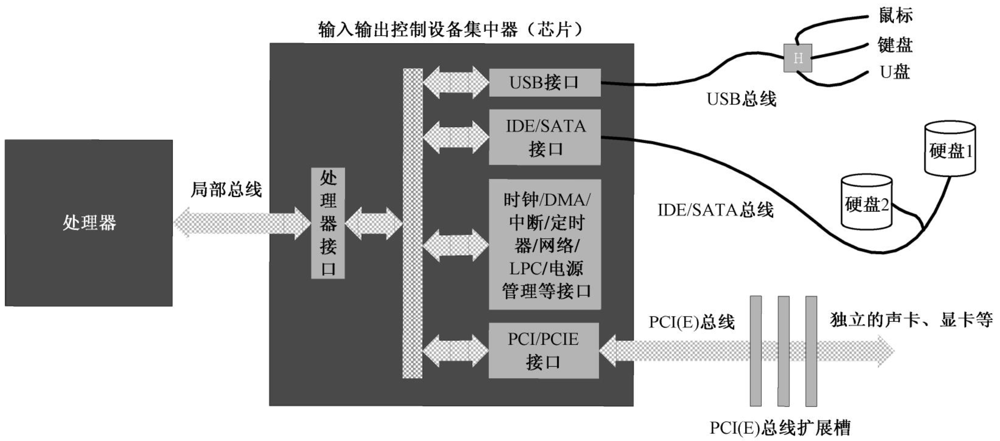

在 ICH 内部，集成了一些常规的外围设备接口，如 USB、PATA（IDE）、SATA、老式总线接口（LPC）、时钟等，这些东西对计算机来说必不可少，故直接集成在 ICH 内。

除了这些常用的、必不可少的设备之外，有些设备你可能暂时用不上，也有些设备还没有发明出来，但迟早有可能连在计算机上。不管是什么设备，都必须通过它自己的 I/O 接口电路同 ICH 相连。为了方便，最好是在主板上做一些插槽，同时，每个设备的 I/O 接口电路都设计成插卡。这样，想接上该设备时，就把它的 I/O 接口卡插上，不需要时，随时拔下。

为了实现这个目的，或者说为了支持更多的设备，ICH 还提供了对 PCI 或者 PCI Express 总线的支持，该总线向外延伸，连接着主板上的若干个扩展槽，就是刚才说的插槽。举个实例，如果你想连接显示器，那么就要先插入显卡，然后再把显示器接到显卡上。

除了局部总线和 PCI Express 总线，每个 I/O 接口卡可能连接不止一个设备。比如 USB 接口，就有可能连接一大堆东西：键盘、鼠标、U 盘等。因为同类型的设备较多，也涉及线路复用和仲裁的问题，故它们也有自己的总线体系，称为通信总线或者设备总线。比如图 8-9 所示的 USB 总线和 SATA 总线。

**当处理器想同某个设备说话时，ICH 会接到通知。然后，它负责提供相应的传输通道和其他辅助支持，并命令所有其他无关设备闭嘴**。同样，当某个设备要跟处理器说话，情况也是一样。

### I/O 端口和端口访问

外围设备和处理器之间的通信是通过相应的 I/O 接口进行的。

具体地说，处理器是通过端口（Port）来和外围设备打交道的。本质上，**端口就是一些寄存器**，类似于处理器内部的寄存器。不同之处仅仅在于，**这些叫做端口的寄存器位于 I/O 接口电路中**。

**端口是处理器和外围设备通过 I/O 接口交流的窗口**，每一个 I/O 接口都可能拥有好几个端口，分别用于不同的目的。比如，连接硬盘的 PATA/SATA 接口就有几个端口，分别是命令端口（当向该端口写入 0x20 时，表明是从硬盘读数据；写入 0x30 时，表明是向硬盘写数据）、状态端口（处理器根据这个端口的数据来判断硬盘工作是否正常，操作是否成功，发生了哪种错误）、参数端口（处理器通过这些端口告诉硬盘读写的扇区数量，以及起始的逻辑扇区号）和数据端口（通过这个端口连续地取得要读出的数据，或者通过这个端口连续地发送要写入硬盘的数据）。

**端口只不过是位于 I/O 接口上的寄存器**，所以，每个端口有自己的数据宽度。在早期的系统中，端口可以是 8 位的，也可以是 16 位的，现在有些端口会是 32 位的。到底是 8 位还是 16 位，这是设备和 I/O 接口制造者的自由。比如，PATA/STAT 接口中的数据端口就是 16 位的，这有助于加快数据传输速率，提高传输效率。

端口在不同的计算机系统中有着不同的实现方式。在一些计算机系统中，端口号是映射到内存地址空间的。比如，0x00000 ～ 0xE0000 是真实的物理内存地址，而 0xE0001 ～ 0xFFFFF 是从很多 I/O 接口那里映射过来的，当访问这部分地址时，实际上是在访问 I/O 接口。

而在另一些计算机系统中，端口是独立编址的，不和内存发生关系。如图 8-10 所示，在这种计算机中，处理器的地址线既连接内存，也连接每一个 I/O 接口。但是，处理器还有一个特殊的引脚 M/IO#，在这里，“#”表示低电平有效。也就是说，当处理器访问内存时，它会让 M/IO#引脚呈高电平，这里，和内存相关的电路就会打开；相反，如果处理器访问 I/O 端口，那么 M/IO#引脚呈低平，内存电路被禁止。与此同时，处理器发出的地址和 M/IO#信号一起用于打个某个 I/O 接口，如果该 I/O 接口分配的端口号与处理器地址相吻合的话。

Intel 处理器，早期是独立编址的，现在既有内存映射的，也有独立编址的。在本章中，我们只讲独立编址的端口。

所有端口都是统一编号的，比如 0x0001、0x0002、0x0003、…。每个 I/O 接口电路都分配了若干个端口，比如，I/O 接口 A 有 3 个端口，端口号分别是 0x0021 ～ 0x0023 ； I/O 接口 B 需要 5 个端口，端口号分别是 0x0303 ～ 0x0307。

一个现实的例子是个人计算机中的 PATA/SATA 接口（图 8-9），每个 PATA 和 SATA 接口分配了 8 个端口。但是，ICH 芯片内部通常集成了两个 PATA/SATA 接口，分别是主硬盘接口和副硬盘接口。这样一来，主硬盘接口分配的端口号是 0x1f0 ～ 0x1f7，副硬盘接口分配的端口号是 0x170 ～ 0x177。

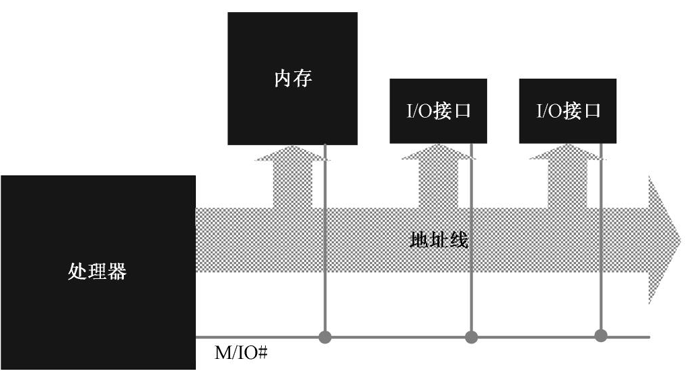

在 Intel 的系统中，只允许 65536（十进制数）个端口存在，端口号从 0 到 65535（0x0000 ～ 0xffff）。因为是独立编址，所以，端口的访问不能使用类似于 mov 这样的指令，取而代之的是 in 和 out 指令。

**in 指令是从端口读**，它的一般形式是

```nasm
in al, dx
```

```nasm
in ax, dx
```

这就是说，**in 指令的目的操作数必须是寄存器 AL 或者 AX**，当访问 8 位的端口时，使用寄存器 AL ；访问 16 位的端口时，使用 AX。

**in 指令的源操作数应当是寄存器 DX**。

`in al,dx` 的机器指令码是 0xEC，`in ax,dx` 的机器指令码是 0xED，都是一字节的。之所以如此简短，是因为 in 指令不允许使用别的通用寄存器，也不允许使用内存单元作为操作数。

也许是为了方便，in 指令还有两字节的形式。此时，前一字节是操作码 0xE4 或者 0xE5，分别用于指示 8 位或者 16 位端口访问；后一字节是立即数，指示端口号。

因此，机器指令 E4 F0 就相当于汇编语言指令

```shell
in al, 0xf0
```

而机器指令E5 03 就相当于汇编语言指令

```shell
in ax, 0x03
```

很显然，因为这种指令形式的操作数部分只允许一字节，故只能访问0～255（0x00～0xff）号端口，不允许访问大于255 的端口号。所以，下面的汇编语言指令就是非法的：

```nasm
in ax, 0x5fd
```

in 指令不影响任何标志位。

相应地，如果要通过端口向外围设备发送数据，则必须通过out 指令。

out 指令正好和 in 指令相反，目的操作数可以是 8 位立即数或者寄存器 DX，源操作数必须是寄存器 AL 或者 AX。下面是一些例子：

```shell
out 0x37,al ;写 0x37 号端口（这是一个 8 位端口）
out 0xf5,ax ;写 0xf5 号端口（这是一个 16 位端口）
out dx,al ;这是一个 8 位端口，端口号在寄存器 DX 中
out dx,ax ;这是一个 16 位端口，端口号在寄存器 DX 中
```

和 in 指令一样，out 指令不影响任何标志位。

### 通过硬盘控制器端口读扇区数据

**硬盘读写的基本单位是扇区**。就是说，要读就至少读一个扇区，要写就至少写一个扇区，**不可能仅读写一个扇区中的几个字节**。这样一来，就使得**主机和硬盘之间的数据交换是成块的**，所以硬盘是典型的块设备。

从硬盘读写数据，最经典的方式是向硬盘控制器分别发送**磁头号、柱面号和扇区号**（扇区在某个柱面上的编号），这称为 **CHS 模式**。这种方法最原始，最自然，也最容易理解。

实际上，在很多时候，我们并不关心扇区的物理位置，所以希望所有的扇区都能统一编址。这就是逻辑扇区，它把硬盘上所有可用的扇区都一一从 0 编号，而不管它位于哪个盘面，也不管它属于哪个柱面。

最早的逻辑扇区编址方法是 LBA28，使用 28 个比特来表示逻辑扇区号，从逻辑扇区 0x0000000 到 0xFFFFFFF，共可以表示 228 ＝ 268435456 个扇区。每个扇区有 512 字节，所以 LBA28 可以管理 128 GB 的硬盘。

硬盘技术发展得非常快，最新的硬盘已经达到几百个吉字节的容量，LBA28 已经落后了。在这种情况下，业界又共同推出了 LBA48，采用 48 个比特来表示逻辑扇区号。如此一来，就可以管理 131072 TB 的硬盘容量了。

在本章中，我们将采用 LBA28 来访问硬盘。

前面说过，个人计算机上的主硬盘控制器被分配了 8 位端口，端口号从 0x1f0 到 0x1f7。假设现在要从硬盘上读逻辑扇区，那么，整个过程如下。

第 1 步，设置要读取的扇区数量。这个数值要写入 0x1f2 端口。这是个 8 位端口，因此每次只能读写 255 个扇区：

```nasm
mov dx, 0x1f2
mov al, 0x01 ;1个扇区
out dx, al
```

注意，如果写入的值为 0，则表示要读取 256 个扇区。每读一个扇区，这个数值就减一。因此，如果在读写过程中发生错误，该端口包含着尚未读取的扇区数。

第 2 步，设置起始 LBA 扇区号。扇区的读写是连续的，因此只需要给出第一个扇区的编号就可以了。28 位的扇区号太长，需要将其分成 4 段，分别写入端口 0x1f3、0x1f4、0x1f5 和 0x1f6 号端口。其中，0x1f3 号端口存放的是 0 ～ 7 位； 0x1f4 号端口存放的是 8 ～ 15 位； 0x1f5 号端口存放的是 16 ～ 23 位，最后 4 位在 0x1f6 号端口。假定我们要读写的起始逻辑扇区号为 0x02，可编写代码如下：

```nasm
mov dx, 0x1f3
mov al, 0x02
out dx, al  ;LBA地址7~0
inc dx  ;0×1f4
mov al, 0x00
out dx, al  ;LBA地址15～8
inc dx  ;0x1f5
out dx, al  ;LBA地址23～16
inc dx  ;0x1f6
mov al, 0xe0  ;LBA模式, 主硬盘, 以及LBA地址27~24
out dx, al
```

注意以上代码的最后 4 行，在现行的体系下，每个 PATA/SATA 接口允许挂接两块硬盘，分别是主盘（Master）和从盘（Slave）。如图 8-11 所示，0x1f6 端口的低 4 位用于存放逻辑扇区号的 24 ～ 27 位，第 4 位用于指示硬盘号，0 表示主盘，1 表示从盘。高 3 位是“111”，表示 LBA 模式。


第 3 步，向端口 0x1f7 写入 0x20，请求硬盘读。这也是一个 8 位端口：

```nasm
mov dx, 0x1f7
mov al, 0x20
out dx, al
```

第 4 步，等待读写操作完成。端口 0x1f7 既是命令端口，又是状态端口。在通过这个端口发送读写命令之后，硬盘就忙乎开了。如图 8-12 所示，在它内部操作期间，它将 0x1f7 端口的第 7 位置“1”，表明自己很忙。一旦硬盘系统准备就绪，它再将此位清零，说明自己已经忙完了，同时将第 3 位置“1”，意思是准备好了，请求主机发送或者接收数据（图 8-12）。完成这一步的典型代码如下:

```nasm
mov dx,0x1f7
.waits:
in al,dx 
and al,0x88
cmp al,0x08
jnz .waits ;不忙, 且硬盘已准备好数据传输
```


来看看指令 and al,0x88。0x88 的二进制形式是 10001000，这意味着我们想用这条指令保留住寄存器 AL 中的第 7 位和第 3 位，其他无关的位都清零。此时，如果寄存器 AL 中的二进制数是 00001000（0x08），那就说明可以退出等待状态，继续往下操作，否则继续等待。

第 5 步，连续取出数据。0x1f0 是硬盘接口的数据端口，而且还是一个 16 位端口。一旦硬盘控制器空闲，且准备就绪，就可以连续从这个端口写入或者读取数据。下面的代码假定是从硬盘读一个扇区（512 字节，或者 256 字节），读取的数据存放到由段寄存器 DS 指定的数据段，偏移地址由寄存器 BX 指定：

```nasm
mov cx,256;总共要读取的字数
mov dx,0x1f0
.readw:
in ax,dx 
mov[bx],ax 
add bx,2
loop .readw
```

最后，0x1f1 端口是错误寄存器，包含硬盘驱动器最后一次执行命令后的状态（错误原因）。

### 过程调用

读写硬盘是经常要做的事，尤其对于操作系统来说。即使是在本章的程序中，也多次发生。如果每次读写硬盘都按上面的 5 个步骤写一堆代码，程序势必很大。

处理器支持一种叫**过程调用**的指令执行机制。过程（Procedure）又叫**例程**，或者子程序、子过程、子例程（Sub-routine）。

处理器可以**用过程调用指令转移到这段代码执行，在遇到过程返回指令时重新返回到调用处的下一条指令接着执行**。

如图 8-13 所示，这是过程和过程调用的示意图。下面结合本章代码清单来具体说明。

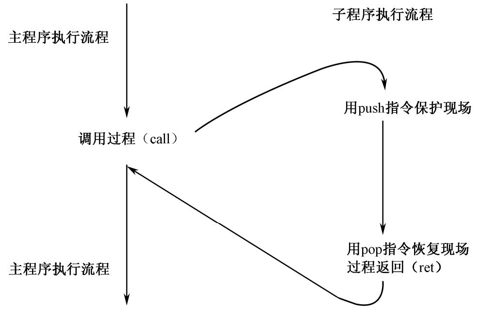

我们已经定义了常量 `app_lba_start`，它代表的值是 100，也就是用户程序在硬盘上的起始逻辑扇区号。现在，代码清单 8-1 的第 24 ～ 27 行用于从硬盘上读取这个扇区的内容。这很好理解，因为不知道用户程序到底有多大，到底占用了多少个扇区，所以，可以先读它的第一个扇区。该扇区包含了用户程序的头部，而用户程序头部又包含了该程序的大小、入口点和段重定位表。所以，通过分析头部，就知道接着还要再读多少个扇区才能完全加载用户程序。

因为要多次读取硬盘，而每次的步骤又都差不多，所以，我们精心设计了一段通用的代码，它从代码清单 8-1 的第 79 行开始，一直到第 131 行结束，这就是我们所说的过程。

要调用过程，需要该过程的地址。一般来说，过程的第一条指令需要一个标号，以方便引用该过程。所以，代码清单 8-1 第 79 行是一个标号“read_hard_disk_0”，意思是读（第一个硬盘控制器的）主盘，当然，什么意思并不重要。

编写过程的好处是只用编写一次，以后只需要“调用”即可。所以，代码的灵活性和通用性尤其重要。具体到这里，就是每次读硬盘时的起始逻辑扇区号和数据保存位置都不相同，这就涉及所谓的参数传递。

参数传递最简单的办法是通过寄存器。在这里，主程序把起始逻辑扇区号的高 16 位存放在寄存器 DI 中（只有低 12 位是有效的，高 4 位必须保证为“0”），低 16 位存放在寄存器 SI 中（没办法，16 位的处理器无法直接处理 28 位的数据）；并约定将读出来的数据存放到由段寄存器 DS 指向的数据段中，起始偏移地址在寄存器 BX 中。

在调用过程前，程序会用到一些寄存器，在过程返回之后，可能还要继续使用。为了不失连续性，在过程的开头，应当将本过程要用到（内容肯定会被破坏）的寄存器临时压栈，并在返回到调用点之前出栈恢复。代码清单 8-1 的第 82 ～ 85 行，用于将过程中用到的寄存器入栈保存。

后面的指令都很好理解，第 87 ～ 89 行，是向 0x1f2 端口写入要读取的扇区数。显而易见，每次读的扇区数是 1 个。

第 91 ～ 101 行，用于向硬盘接口写入起始逻辑扇区号的低 24 位。低 16 位在寄存器 SI 中，高 12 位在寄存器 DI 中，需要不停地倒换到寄存器 AL 中，以方便端口写入。

第 105 行，程序执行到这里时，寄存器 AH 的低 4 位是起始逻辑扇区号的 27 ～ 24 位，高 4 位是全“0”；寄存器 AL 中是 0xe0。执行 or 指令后，将会在寄存器 AL 中得到它们的组合值，高 4 位是 0xe，低 4 位是逻辑扇区号的 27 ～ 24 位。

第118～124 行，用于反复从硬盘接口那里取得512 字节的数据，并传送到段寄存器DS 所指向的数据区中。每传送一个字，BX 的值就增2，以指向下一个偏移位置。
第126～129 行，用于把调用过程前各个寄存器的内容从栈中恢复。
最后，因为处理器是没有大脑的，所以需要一个明确的指令ret 促使它离开过程，从哪里来回哪里去，这条指令稍后就会讲到。
有关过程的情况就是这些，下面回到前面，看看过程调用是如何发生的。
代码清单8-1 第24、25 行，用于指定用户程序在硬盘上的起始逻辑扇区号。我们定义的过程要求用DI:SI 来提供这个扇区号，既然它是常数100，很小的数值，可以直接传送到寄存器SI，并将DI 清零即可。
第26 行用于指定存放数据的内存地址。前面几条指令已经将段寄存器DS 设置好了，现在只需要将寄存器BX 清零，以指向该段内偏移地址为0 的地方，这就是当前指令要做的事。
一切都准备好了，第27 行，开始调用过程read_hard_disk_0。以后，我们将把过程所在的标号做为过程的名字，即过程名。
调用过程的指令是“call”。8086 处理器支持四种调用方式。第一种是16 位相对近调用。近调用的意思是被调用的目标过程位于当前代码段内，而非另一个不同的代码段，所以只需要得到偏移地址即可。
16 位相对近调用是三字节指令，操作码为0xE8，后跟16 位的操作数，因为是相对调用，故该操作数是当前call 指令相对于目标过程的偏移量。计算过程如下：用目标过程的汇编地址减去当前call 指令的汇编地址，再减去当前call 指令以字节为单位的长度（3），保留16 位的结果。举个例子：

```nasm
call near proc_1
```

近调用的特征是在指令中使用关键字“near”。“proc_1”是程序中的一个标号。在编译阶段，编译器用标号proc_1 处的汇编地址减去本指令的汇编地址，再减去3，作为机器指令的操作数。

关键字“near”不是必需的，如果call 指令中没有提供任何关键字，则编译器认为该指令是近调用。因此，上面的指令与这条指令等效：

```nasm
call proc_1
```

因为16 位相对近调用的操作数是两个汇编地址相减的相对量，所以，如果被调用过程在当前指令的前方，也就是说，论汇编地址，它比call 指令的要大，那么该相对量是一个正数；反之，就是一个负数。所以，它的机器指令操作数是一个16 位的有符号数。换句话说，被调用过程的首地址必须位于距离当前call 指令－32768～32767 字节的地方。
在指令执行阶段，处理器看到操作码0xE8，就知道它应当调用一个过程。于是，它用指令指针寄存器IP 的当前内容加上指令中的操作数，再加上3，得到一个新的偏移地址。接着，将IP 的原有内容压入栈。最后，用刚才计算出的偏移地址取代IP 原有的内容。这直接导致处理器的执行流转移到目标位置处。
再看一个例子：

```nasm
call 0x0500
```

很多人认为0x0500 会原封不动地出现在该指令编译后的机器码中，我相信这只是他们一时糊涂。在call 指令后跟一个标号，和跟一个数值没有什么不同。标号是数值的等价形式，是代表标号处的汇编地址。在指令编译阶段，它首先会被转化成数值。
所以，你在call 指令后跟一个数值，只是帮了编译器的忙，帮它省了一个转化步骤，它依然会用这个数值减去当前指令的汇编地址，来得到一个偏移量。第二种是16 位间接绝对近调用。这种调用也是近调用，只能调用当前代码段内的过程，指令中的操作数不是偏移量，而是被调用过程的真实偏移地址，故称为绝对地址。不过，这个偏移地址不是直接出现在指令中，而是由16 位的通用寄存器或者16 位的内存单元间接给出。比如：

```nasm
call cx ;目标地址在 cx 中. 省略了关键字 "near", 下同 
cal1 [0x3000] ;要先访问内存才能取得目标偏移地址 
call [bx] ;要先访问内存才能取得目标偏移地址 
cal1 [bx+si+0 × 02] ;要先访问内存才能取得目标偏移地址
```

以上，第一条指令的机器码为FF D1，被调用过程的偏移地址位于寄存器CX 内，在指令执行的时候由处理器从该寄存器取得，并直接取代指令指针寄存器IP 原有的内容。
第二条指令的机器码为FF 16 00 30。当这条指令执行时，处理器访问数据段（使用段寄存器DS），从偏移地址0x3000 处取得一个字，作为目标过程的真实偏移地址，并用它取代指令指针寄存器IP 原有的内容。
后面两条指令没什么好说的，只是寻址方式不同而已。
间接绝对近调用指令在执行时，处理器首先按以上的方法计算被调用过程的偏移地址，然后将指令指针寄存器IP 的当前值压栈，最后用计算出来的偏移地址取代寄存器IP 原有的内容。
由于间接绝对近调用的机器指令操作数是16 位的绝对地址，因此，它可以调用当前代码段任何位置处的过程。第三种是16 位直接绝对远调用。这种调用属于段间调用，即调用另一个代码段内的过程，所以称为远调用（far call）。很容易想到，远调用既需要被调用过程所在的段地址，也需要该过程在段内的偏移地址。
“16 位”是针对偏移地址来说的，而不是限定段地址，尽管段地址事实上也是16 位的；“直接”的意思是，段地址和偏移地址直接在call 指令中给出了。当然，这里的地址也是绝对地址。比如：

```nasm
call 0x2000:0x0030
```

这条指令编译后的机器码为9A 30 00 00 20，0x9A 是操作码，后面跟着的两个字分别是偏移地址和段地址，按规定，偏移地址在前，段地址在后。

处理器在执行时，首先将代码段寄存器CS 的当前内容压栈，接着再把指令指针寄存器IP 的当前内容压栈。紧接着，用指令中给出的段地址代替CS 原有的内容，用指令中给出的偏移地址代替IP 原有的内容。这直接导致处理器从新的位置开始执行。
处理器是没有脑子的。如果被调用过程位于当前代码段内，而你又用这种指令格式来调用它，那么，处理器也会不折不扣地从当前代码段“转移”到当前代码段。第四种是16 位间接绝对远调用。这也属于段间调用，被调用过程位于另一个代码段内，而且，被调用过程所在的段地址和偏移地址是间接给出的。还有，这里的“16 位”同样是用来限定偏移地址的。下面是这种调用方式的几个例子：

```nasm
call far [0x2000]
call far [proc1]
call far [bx]
call far [bx+si]
```

间接远调用必须使用关键字“far”，这一点务必牢记。
因为是远调用，也就是段间调用，所以，必须给出被调用过程的段地址和偏移地址。但是，段地址和偏移地址在内存中的其他位置，指令中仅仅给出的是该位置的偏移地址，需要处理器在执行指令的时候自行按图索骥，找到它们。
以上，前两条指令是等效的，不同之处仅仅在于，第一条指令直接给出的是数值，而第二条指令用的是标号。但这无关紧要，在编译后，标号也会变成数值。
为了进一步说清间接远调用是怎么发生的，下面是一个实例。
假如在数据段内声明了标号proc_1 并初始化了两个字：

```nasm
proc 1 dw 0x0102,0x2000
```

这两个字分别是某个过程的段地址和偏移地址。按处理器的要求，偏移地址在前，段地址在后。也就是说，0x0102 是偏移地址； 0x2000 是段地址。
那么，为了调用该过程，可以在代码段内使用这条指令：

```nasm
call far [proc_1]
```

当这条指令执行时，处理器访问由段寄存器DS 指向的数据段，从指令中指定的偏移地址（由标号proc_1 提供）处取得两个字（分别是段地址0x2000 和偏移地址0x0102）；接着，将代码段寄存器CS 和指令指针寄存器IP 的当前内容分别压栈；最后，用刚才取得的段地址和偏移地址分别取代CS 和IP 的原值。
至于后面的两条指令call far [bx]和call far [bx+si]，仅仅是寻址方式上有所区别，指令执行过程大体上是一样的。
接着回到代码清单8-1 第27 行，很明显，

```nasm
call read hard disk 0
```

就是我们刚刚讲的16 位相对近调用，编译后的机器指令操作数是一个相对偏移量。由于这是段内调用，处理器执行这条指令时，用指令指针寄存器IP 的内容加上指令中的偏移量，以及当前指令的长度，算出被调用过程的绝对偏移地址。接着，将IP 的现行值压栈。最后，用刚刚计算出的偏移地址替代IP 的当前内容。
过程read_hard_disk_0 的功能和工作流程前面已经讲过了，不再赘述。这里只关心一个最重要的问题，那就是过程返回。
“过程”就是例行公事，可以随时根据需要调用，但过程执行完了呢，还得返回到调用点继续执行下一条指令，这称为过程返回（Procedure Return）。
处理器是个大笨蛋，你不提醒它，它就一直稀里糊涂地闷头工作。幸好，处理器的发明者们设计了返回指令ret 和retf。
ret 和retf 经常用做call 和call far 的配对指令。ret 是近返回指令，当它执行时，处理器只做一件事，那就是从栈中弹出一个字到指令指针寄存器IP 中。
retf 是远返回指令（return far），它的工作稍微复杂一点点。当它执行时，处理器分别从栈中弹出两个字到指令指针寄存器IP 和代码段寄存器CS 中。

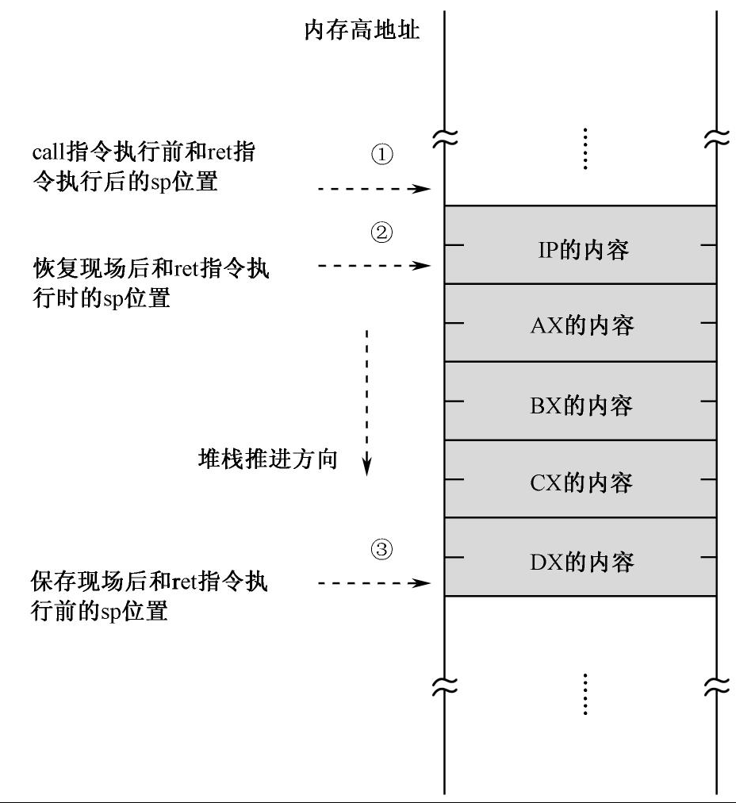

如图8-14 所示，在call read_hard_disk_0 执行前，栈指针位于箭头①所指示的位置；call 指令执行后，由于压入了IP 的内容，故栈指针移动到箭头②所指示的位置处；进入过程后，出于保护现场的目的，压入了4 个通用寄存器AX、BX、CX、DX，此时，栈指针继续向低地址方向推进到箭头③所指示的位置。
在过程的最后，是恢复现场，连续反序弹出4 个通用寄存器的内容。此时，栈指针又回到刚进入过程内部时的位置，即箭头②处。最后，ret 指令执行时，由于处理器自动弹出一个字到IP，故，过程返回后的瞬间，栈指针仍旧回到过程调用前，即箭头①所指示的位置。
需要说明的是，尽管call 指令通常需要ret/retf 和它配对，遥相呼应，但ret/retf 指令却并不依赖于call 指令，这一点你马上就会看到。
call 指令在执行过程调用时不影响任何标志位，ret/retf 指令对标志位也没有任何影响。

### 加载用户程序

第一次读硬盘将得到用户程序最开始的512 字节，这512 字节包括最开始的用户程序头部，以及一部分实际的指令和数据。
为了将用户程序全部读入内存，需要知道它的大小，然后再进一步转换成它所用的扇区数。如图8-15 所示，用户程序最开始的双字，就是整个程序的大小。
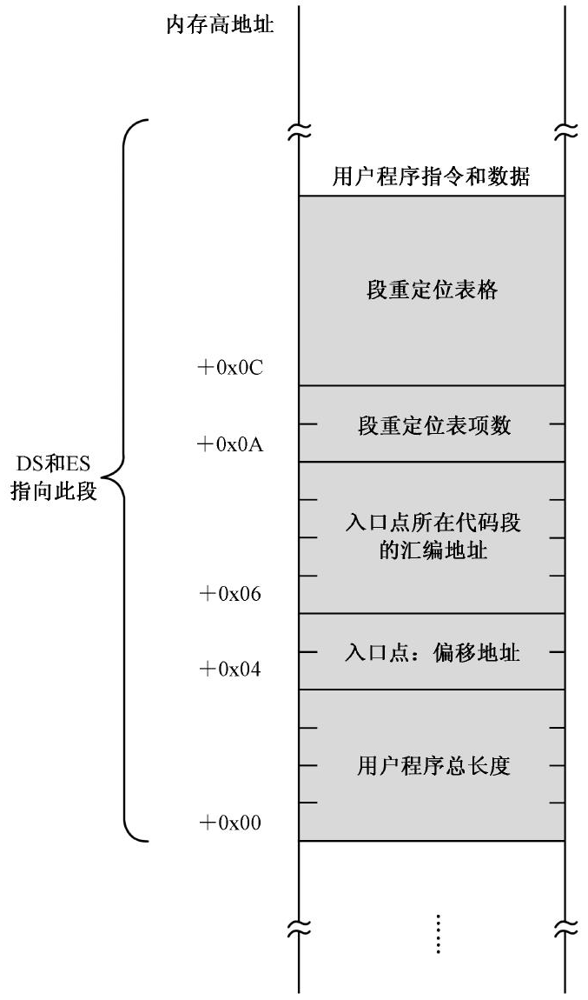

为此，代码清单8-1 第30、31 行，分别将该数值的高16 位和低16 位传送到寄存器DX 和AX。第32 行，因为每扇区有512 字节，故将512 传送到BX 寄存器，并在第33 行用它来做除法运算。
在凑巧的情况下，用户程序的大小正好是512 的整数倍，做完除法后，在寄存器AX 中是用户程序实际占用的扇区数。但是，绝大多数情况下，这个除法会有余数。有余数意味着，最后一个扇区因为没有填满而落下了，没有纳入总扇区数。
关于这个问题，我们稍微解释一下。硬盘的读写是以扇区为单位的，如果要写入513 字节，那么，它将只能填满一个扇区，还剩一字节。硬盘不管这些，它每次总是说：“来，给我512 字节！”为此，软件的责任是，保证给硬盘的是512 字节，如果不够，凑也要凑够。因此，513 字节会占用两个扇区，第二个扇区只有一字节是有用的，其他511 字节都是用来填充的。至于某个扇区里，哪些数据是有用的，哪些是填充的，不是硬盘的责任，是软件的责任。就像本章的用户程序一样，通过构造一个头部，自行来跟踪自己的大小。
所以，代码清单8-1 第34 行，判断是否除尽。如果没有除尽，则转移到后面的代码，去读剩余的扇区；如果除尽了，则总扇区数减一。
为什么？为什么除不尽不管，除尽了还要减一？因为刚才已经预读了一个扇区。
注意，用户程序的长度有可能小于512 字节，或者恰好等于512 字节。在这两种情况下，当程序执行到第38 行时，寄存器AX 中的内容必然为零。所以，第38 行是算术比较指令cmp，第39 行是条件转移指令，当寄存器AX 中的内容为零时，就意味着用户程序已经全部读取，不再继续读了，毕竟用户程序只占用一个扇区，而刚才也已经读过了。
用户程序被加载的位置是由DS 和ES 所指向的逻辑段。一个逻辑段最大也才64KB，当用户程序特别大的时候，根本容纳不下。想想看，段内偏移地址从0x0000 开始，一直延伸到最大值0xffff。再大的话，又绕回到0x0000，以至于把最开始加载的内容给覆盖掉了。
其实，要解决这个问题最好的办法是，每次往内存中加载一个扇区前，都重新在前面的数据尾部构造一个新的逻辑段，并把要读取的数据加载到这个新段内。如此一来，因为每个段的大小是512 字节，即，十六进制的0x200，右移4 位（相当于除以16 或者0x10）后是0x20，这就是各个段地址之间的差值。每次构造新段时，只需要在前面段地址的基础上增加0x20 即可得到新段的段地址。
这种做法好有一比，尺子很短，树很高，想只量一次是不可能的，于是只好分几次量，每量一次，将尺子往下挪一挪。
段地址的改变是临时的，毕竟只是为了读取硬盘，所以，代码清单8-1 第42 行，将当前数据段寄存器DS 的内容压栈保存。
第44 行，将用户程序剩余的扇区数传送到寄存器CX，供后面的loop 指令使用，因为我们准备采用循环的办法来读完用户程序。
第46～48 行，将当前数据段寄存器DS 的内容在原来的基础上增加0x20，以构造出下一个逻辑段，为从硬盘上读取下一个512 字节的数据做准备。
第50 行，将寄存器BX 清零。BX 被用做数据传输时的段内偏移，而且每次传输都是在一个新的段内进行，故偏移地址在每次传输前都应当是零。
第51 行，每次读硬盘前，将寄存器SI 的内容加一，以指向下一个逻辑扇区。
第52～53 行，调用读硬盘的过程read_hard_disk_0，并开始下一轮循环，直到所有的扇区都读完（寄存器CX 的内容为0）。

### 用户程序重定位

用户程序在编写的时候是分段的。因此，加载器下一步的工作是计算和确定每个段的段地址。
如图8-16 所示，用户程序定义了6 个段，在编译阶段，编译器为每个段计算了一个汇编地址。第一个段header 位于整个程序的开头，所以其汇编地址为0。从第二个段开始，每个段的汇编地址都是其相对于整个程序开头的偏移量，以字节为单位。因为我们不知道各个段的汇编地址到底是多少，故用字母来表示。这样，第二个段code_1 的汇编地址是v，第三个段code_2 的汇编地址是w，……，最后一个段stack 的汇编地址是z。
现在，用户程序已经全部加载到内存里了，而且是从物理地址phy_base 开始的。如此一来，每个段在内存中的物理地址都是基于phy_base 的，第一个段header 在内存中的起始物理地址是phy_base（phy_base+0），第二个段在内存中的起始物理地址是phy_base+v，……，最后一个段stack 则是phy_base+z。
用于加载用户程序的物理地址phy_base 是16 字节对齐的，而用户程序中，每个段的汇编地址也是16 字节对齐的。因此，每个段在内存中的起始地址也是16 字节对齐的，将它们分别右移4位，就是它们各自的逻辑段地址。
为此，代码清单8-1 第55 行，从栈中恢复数据段寄存器DS 的内容，使其指向用户程序被加载的起始位置，也就是用户程序头部。
第58～62 行用于重定位用户程序入口点的代码段。请参考图8-15，用户程序头部内，偏移为0x06处的双字，存放的是入口点代码段的汇编地址。加载器首先将高字和低字分别传送到寄存器DX 和AX，然后调用过程calc_segment_base 来计算该代码段在内存中的段地址。
过程calc_segment_base（计算段基址）是在代码清单8-1 的第134 行定义的。它接受一个32位的汇编地址（位于寄存器DX:AX 中），并在计算完成后向主程序返回一个16 位的逻辑段地址（位于寄存器AX 中）。
因为计算过程中要破坏寄存器DX 的内容，因此，第137 行用于将其压栈保存。
在16 位的处理器上，每次只能进行16 位数的运算。第139 行，先将用户程序在内存中物理起始地址的低16 位加到寄存器AX 中。该指令的地址部分使用了段超越前缀“cs:”，而且也没有加上0x7c00。原因前面已经解释过了，在本程序中，数据段和代码段是分离的，而且当前代码段的定义部分使用了“vstart=0x7c00”子句。
然后，第140 行，再将该起始地址的高16 位加到寄存器DX 中。adc 是带进位加法，它将目的操作数和源操作数相加，然后再加上标志寄存器CF 位的值（0 或者1）。这样，分两步就可以完成32 位数的加法运算。
现在，我们已经在DX:AX 中得到了入口点代码段的起始物理地址，只需要将这个32 位数右移4 位即可得到逻辑段地址。麻烦在于它们分别在两个寄存器中，如何移动？
答案是分别移动，然后拼接。代码清单8-1 第141 行，使用逻辑右移指令shr（SHift logical Right）将寄存器AX 中的内容右移4 位。

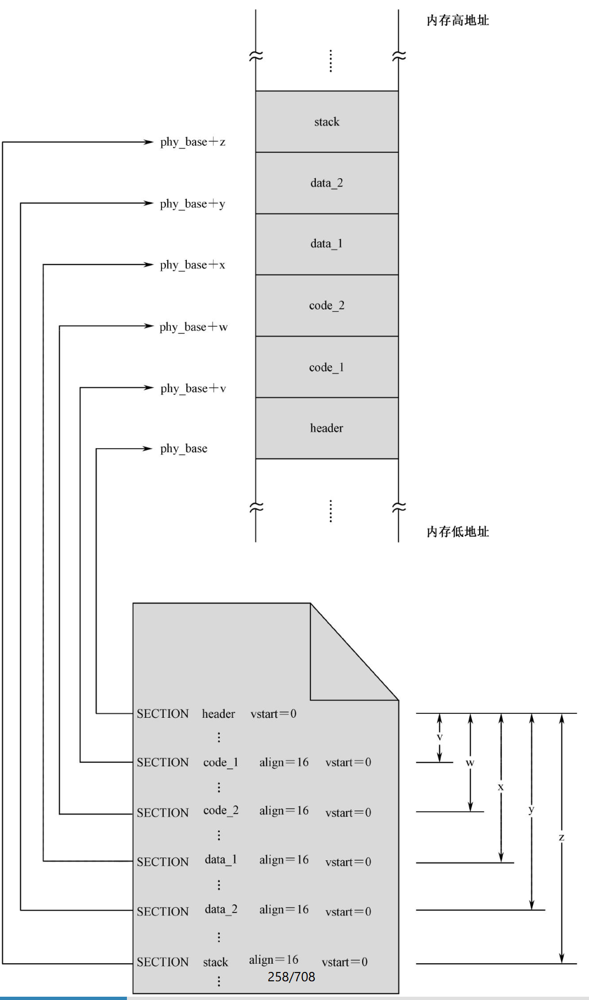

如图8-17 所示，逻辑右移指令执行时，会将操作数连续地向右移动指定的次数，每移动一次，“挤”出来的比特被移到标志寄存器的CF 位，左边空出来的位置用比特“0”填充。

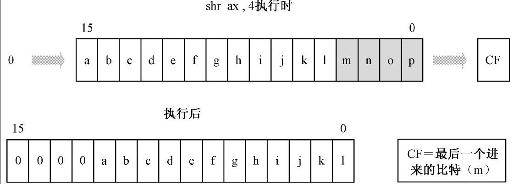

shr 指令的目的操作数可以是8 位或16 位的通用寄存器或者内存单元，源操作数可以是数字1、8 位立即数或者寄存器CL。我们已经介绍过寻址方式，往后，我们要用新的方法来表示指令的格式。就当前指令来说，该指令的格式为：

```nasm
shrr/m8,1 ;目的操作数是 8 位通用寄存器 / 内存单元, 源操作数是 1
shrr/m16,1 ;目的操作数是 16 位通用寄存器 / 内存单元, 源操作数是 1
shrr/m8,imm8 ;目的操作数是 8 位通用寄存器 / 内存单元, 源操作数是 8 位立即数 
shr r/m16,imm8 ;目的操作数是 16 位通用寄存器 / 内存单元, 源操作数是 8 位立即数 
shrr/m8,c1 ;目的操作数是 8 位通用寄存器 / 内存单元, 源操作数是寄存器 CL 
shr r/m16,c1 ;目的操作数是 16 位通用寄存器 / 内存单元, 源操作数是寄存器 CL
```

以上，第一种指令格式的意思是，目的操作数可以是8 位寄存器，或者8 位的内存单元；源操作数是1。对于内存地址的情况，可以使用任何一种我们讲过的内存寻址方式。举三个例子：

```nasm
shr ah,1
shr byte [0x2000],1
shr byte [bx+si+0×02],1
```

第二种指令格式和第一种相似，只是目的操作数的长度不一样。注意，源操作数为1 的逻辑右移指令是特殊设计的优化指令，比如以上的shr ax,1，它的机器码是D1 E8；而类似的指令shr ax,5 则拥有完全不同的机器码C1 E8 05。
第三种指令格式的意思是，目的操作数可以是8 位寄存器，或者8 位的内存单元；源操作数是8 位立即数。下面是两个例子：

```nasm
shral,0x20 ;右移 32(0x20) 次
shr byte [bx+0x06],0x05 ;右移 5 次
```

第四种指令格式和第二种类似，只是数据宽度不同。
第五种指令格式的目的操作数可以是8 位的寄存器，或者8 位的内存单元；源操作数在寄存器CL 中。如果shr 指令的源操作数是寄存器，则只能使用CL。和一般的指令不同，寄存器CL 只用来提供移动次数，而不用于限定和暗示目的操作数的字长。因此，对于目的操作数是内存地址的情况，必须用关键字byte 或者word 等来加以限定。比如：

```nasm
shr al,cl 
shr byte [bx],cl
```

最后一种指令格式适用于目的操作数的长度为字的情况。
注意，和8086 处理器不同，80286 之后的IA-32 处理器在执行本指令时，会先将源操作数的高3 位清零。也就是说，最大的移位次数是31。
shr 的配对指令是逻辑左移指令shl（SHift logical Left），它的指令格式和shr 相同，只不过它是向左移动。
尽管DX:AX 中是32 位的用户程序起始物理内存地址，理论上，它只有20 位是有效的，低16位在寄存器AX 中，高4 位在寄存器DX 的低4 位。寄存器AX 经右移后，高4 位已经空出，只要将DX 的最低4 位挪到这里，就可以得到我们所需要的逻辑段地址。为此，可以使用以下指令：

```nasm
shldx,12
or ax,dx
```

很显然，代码清单8-1 并不是这么做的，为的是演示另一个不同的指令ror（第142 行），也就是循环右移（ROtate Right）。如图8-18 所示，循环右移指令执行时，每右移一次，移出的比特既送到标志寄存器的CF 位，也送进左边空出的位。
ror 的配对指令是循环左移指令rol（ROtate Left）。ror、rol、shl、shr 的指令格式都是相同的。
因为是循环移位，移位后，寄存器DX 的低12 位是我们不需要的。所以，代码清单8-1 的第143 行，用and 指令将其清零。
第144 行，正式将寄存器AX 和DX 的内容合并，这就是我们要的段地址。
过程的最后，第146～148 行，恢复寄存器DX 的原始内容，并返回到调用程序那里。
现在，回到代码清单8-1 的第62 行，那条指令的功能是将刚刚计算出来的逻辑段地址回写到原处，仅覆盖低16 位，高16 位不用理会。
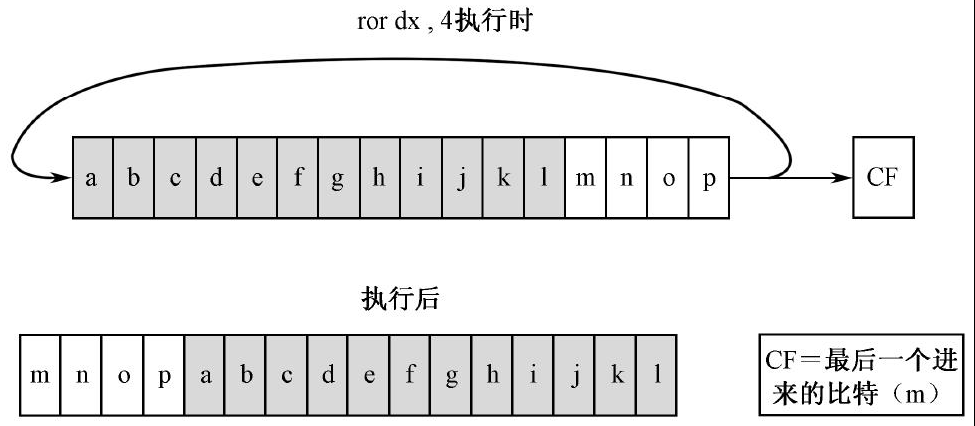
现在仅仅是处理了入口点代码段的重定位，下面开始正式处理用户程序的所有段，它们位于用户程序头部的段重定位表中。
重定位表的表项数存放在用户程序头部偏移0x0a 处，如图8-5 所示。代码清单8-1 第65 行，用于将它从该内存地址处传送到寄存器CX，供后面的循环指令使用。
段重定位表的首地址存放在用户程序头部偏移0x0c 处，因此，第66 行，将0x0c 传送到基址寄存器BX 中。以后，每次只要将BX 的内容加上4，就指向下一个重定位表项。
第68～74 行是循环体，每次循环开始后，BX 总是指向需要重定位的段的汇编地址，而且都是双字，需要分别传送到寄存器DX 和AX。然后调用过程calc_segment_base 计算相应的逻辑段地址，并覆盖到原来的位置（低字），最后将基址寄存器的内容加上4 ，以指向下一个表项。当寄存器CX 的内容为0 时，循环结束，所有的段都处理完毕。

### 将控制权交给用户程序

现在，用户程序已经在内存中准备就绪，剩下的工作就是把处理器的控制权交给它。交接工作很简单，代码清单8-1 第76 行，加载器通过一个16 位的间接绝对远转移指令，跳转到用户程序入口点。
如图8-15 所示，入口点是两个连续的字，低字是偏移地址，位于用户程序头部内偏移为0x04的地方；高字是段地址，位于用户程序头部内偏移为0x06 的地方。而且，因为加载器的辛勤工作，该段地址是已经重定位过的。
处理器执行指令时，会访问段寄存器DS 所指向的数据段，从偏移地址为0x04 的地方取出两个字，并分别传送到代码段寄存器CS 和指令指针寄存器IP，以替代它们原先的内容。于是，处理器就像被洗脑了一样，自行转移到指定的位置处开始执行。
处理器已经跑到用户程序内部去执行了，所以接下来的工作是跟踪用户程序的工作流程。不过，在此之前，还是先总结一下无条件转移指令jmp 的用法。

```nasm
jmp far [0x04]
```

### 8086 处理器的无条件转移指令

#### 相对短转移

相对短转移的操作码为0xEB，操作数是相对于目标位置的偏移量，仅1 字节，是个有符号数。由于这个原因，该指令属于段内转移指令，而且只允许转移到距离当前指令-128～127 字节的地方。相对短转移指令必须使用关键字“short”。例如：

```nasm
mp short infinite
```

在源程序编译阶段，编译器会检查标号infinite 所代表的值，如果数值超过了一字节所能允许的数值范围，则无法通过编译。否则，编译器用目标位置的汇编地址减去当前指令的汇编地址，再减去当前指令的长度（2），保留1 字节的结果，作为机器指令的操作数。
相对短转移指令的汇编语言操作数只能是标号和数值。下面是直接使用数值的情况：

```nasm
jmp short 0x2000
```

但数值和标号是等价的。在编译阶段，都被用来计算一个8 位的偏移量。
在指令执行时，处理器把指令中的操作数加上2，再加到指令指针寄存器IP 上，这会导致指令的执行流程转向目标地址处。

#### 16 位相对近转移

和相对短转移不同，16 位相对近转移指令的转移范围稍大一些。它的机器指令操作码为0xE9，而且，该指令的长度为3 字节，操作码0xE9 后面还有一个16 位（2 字节）的操作数。
因为是近转移，故其属于段内转移。“相对”的意思同样是指它的操作数是一个相对量，是相对于目标位置处的偏移量。在源程序编译阶段，编译器用目标位置的汇编地址减去当前指令的汇编地址，再减去当前指令的长度（3），保留16 位的结果，作为机器指令的操作数。由于这是一个16 位的有符号数，故可以转移到距离当前指令-32768～32767 字节的地方。
16 位相对近转移指令应当使用关键字“near”，比如

```shell
jmp near infinite
jmp near 0x3000
```

在早先的NASM 版本中，关键字near 是可以省略的。若没有指定short 或者near，那么，编译器自动默认是“near”的。但是最近的版本改变了这一规则。如果没有指定关键字short 或者near，那么，如果目标位置距离当前指令-128～127 字节，则自动采用short；否则，采用near。

#### 16 位间接绝对近转移

这种转移方式也是近转移，即只在段内转移。但是，转移到的目标偏移地址不是在指令中直接给出的，而是用一个16 位的通用寄存器或者内存地址来间接给出的。比如：

```nasm
jmp near bx
jmp near cx
```

指令中的关键字“near”可以省略，间接绝对近转移原本就是near 的。以上两条指令执行时，处理器将用寄存器BX 或者CX 的内容来取代指令指针寄存器IP 的当前内容。
以上是目标偏移地址位于通用寄存器的情况。当然，该偏移地址也可位于内存中，而且这是最常见的情况。假如在某程序的数据段中声明了标号jump_dest 并初始化了一个字：

```shell
jump dest dw 0xc000
```

而且假定我们已经知道它是转移目标的起始偏移地址，那么，在该程序的代码段内，就可以使用以下的16 位间接绝对近转移指令：

```nasm
jmp[jump dest] ;省略关键字"near",本小节内下同
```

当这条指令执行时，处理器访问由段寄存器DS 指向的数据段，从指令中指定的偏移地址处取得一个字（在这里是0xc000），并用该字取代指令指针寄存器IP 的当前内容。
当然，既然是间接地寻找目标位置的偏移地址，其他寻址方式也是可以的。比如：

```nasm
jmp [bx]
jmp [bx+si]
```

注意，jmp bx 和jmp [bx]是完全不同的，不要犯迷糊。前者，要转移的绝对偏移地址位于寄存器BX 中；后者，偏移地址位于由BX 所指向的内存字单元中。

#### 16 位直接绝对远转移

很早以前，我们曾经见过这样的指令：

```nasm
jmp 0x0000:0×7c00
```

在这里，0x0000 和0x7c00 分别是段地址和偏移地址，符合“段地址：偏移地址”的表达习惯。在编译之后，其机器指令为

```nasm
EA 00 7C 00 00
```

0xEA 是操作码，后面是操作数。注意，字的存放是按照低端字节序的。而且，在编译之后，偏移地址在前，段地址在后。执行这条指令后，处理器用指令中给出的段地址代替段寄存器CS 的原有内容，用给出的偏移地址代替IP 寄存器的原有内容，从而跳转到另一个不同的代码段中，即执行一个段间转移。
像这种直接在指令中给出段地址和偏移地址的转移指令，就是直接绝对远转移指令。“16 位”仅仅用来限定偏移地址部分，指偏移地址是16 位的。

#### 16 位间接绝对远转移（jmp far）

远转移的目标地址可以通过访问内存来间接得到，这叫间接远转移，但是要使用关键字“far”。假如在某程序的数据段内声明了标号jump_far，并在其后初始化了两个字：

```nasm
jump far dw 0x33c0,0xf000
```

这不是两个普通的数值，它们分别是某个程序片断的偏移地址和段地址。为了转移到该程序片断上执行，可以在使用下面的转移指令：

```nasm
jmp far [jump_far]
```

关键字“far”的作用是告诉编译器，该指令应当编译成一个远转移。处理器执行这条指令后，访问段寄存器DS 所指向的数据段，从指令中给出的偏移地址处取出两个字，分别用来替代段寄存器CS 和指令指针寄存器IP 的内容。
其实，最好的例子还是本章代码清单8-1 的第76 行：

```nasm
jmp far [0x04]
```

16 位间接绝对远转移指令的操作数可以是任何一种内存寻址方式。除了上面的例子外，下面再给出几个：

```nasm
jmp far [bx]
jmp far [bx+si]
```

最后，“16 位”的意思是，要转移到的目标位置的偏移地址是16 位的。

```nasm

```

## 用户程序的结构


```nasm

```

```shell

```

## 用户程序的结构

### 三级

```nasm

```

```shell

```

## 用户程序的结构

### 三级

```nasm

```

```shell

```

## 用户程序的结构

### 三级

```nasm

```

```shell

```

## 用户程序的结构

### 三级

```nasm

```

```shell

```

## 用户程序的结构

### 三级

```nasm

```

```shell

```
